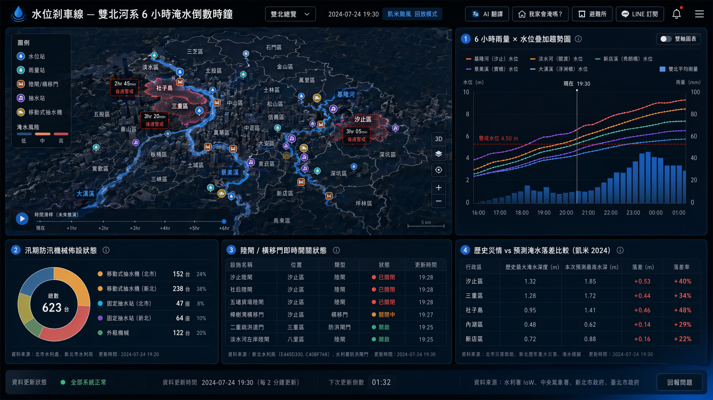
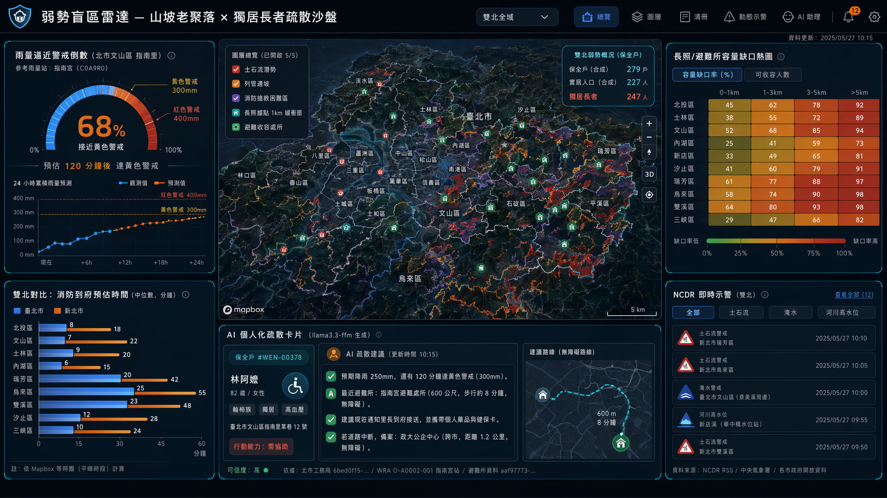
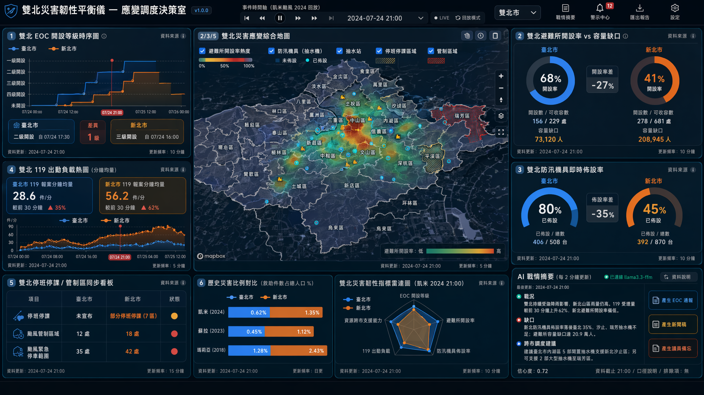

# 主題二：韌性防災 — 3 提案

> 為 2026 雙北程式設計節城市儀表板大黑客松產出 | 嚴守雙北硬性條件 + 評分 40/30/30
>
> 設計原則：
> 1. 不重複既有 dashboard 已有的「各降雨強度淹水面積／狹小巷弄／透水鋪面／降雨淹水模擬／山坡地風險／抽水站」靜態圖層 — 這 9 個既有組件偏「現況普查」。本份 3 提案聚焦 **時序動態 / 個人化 / 弱勢盲區 / 雙北邊界 / AI 敘事**。
> 2. 雙北硬條件：每個提案至少 4 個雙北組件、≥1 含 Mapbox 地圖層、組件可下拉切換「台北 / 雙北」。
> 3. 資料 ID 全數來自 `/docs/theme_02_disaster.md` 真實清單，不杜撰。
> 4. 受眾≠政府防災局獨佔 — 三案分別對應「市民端／決策端／弱勢端」。

---

## 提案 #1：水位剎車線 — 雙北河系 6 小時淹水倒數時鐘

> **聚焦：故事性 + 大螢幕衝擊力 + 市民端**

**Pitch (一句話)**：把雙北 5 條母河的水位站、雨量站、防洪閘門、抽水站串成一支「倒數中的剎車燈」，提前 6 小時告訴你「你住的那條街幾點會淹」。

**核心受眾 (Persona)**：
- 主受眾：住在汐止基隆河沿岸、三重蘆洲淡水河沿岸、新店景美溪沿岸、北市內湖大湖、社子島、關渡平原的住戶 (約 80 萬人)。
- 次受眾：颱風夜值班的雙北水利處工程師、區公所里長、外送員/通勤族。

**雙北痛點 (真實非全國通用)**：
- 2024 年 0917 蘇拉、919 凱米雙颱期間，汐止基隆河水位逼近警戒、社子島曾局部淹水。但市民只能看到「全市風險」靜態圖，沒人告訴他「我家這條街幾點開始進水」。
- 雙北防汛分屬不同單位：北市工務局水利處（雨水下水道）vs 新北水利局（河川閘門/橫移門/陸閘），兩市資料同一條河（淡水河、基隆河）但分屬不同 API，市民看不到全河系視角。
- 汐止陸閘、橫移門關閉後，居民「進得去出不來」；新北市發布交通管制時，台北人完全不知。

**核心價值**：從「現在淹了」→「6 小時後會淹到哪裡」的決策前移。

**Demo 衝擊力（大螢幕公共場合 2 分鐘腳本，背景音效：雨聲漸強）**：
1. **[0:00–0:20] Hook**：大螢幕中央一條會跳動的「淡水河系河流動脈圖」，左下角浮現「2024-07-24 凱米颱風 19:30」字樣，背景藍色慢慢推進，觀眾立刻看到三重、汐止、社子島亮紅。
2. **[0:20–1:00] 倒數時鐘**：滑桿往未來推 6 小時，各水位站旁出現倒數「3hr 47min 後達警戒」，畫面上方時間序列圖（Apexcharts area）畫出 5 條河水位曲線疊加，觀眾一眼看出「基隆河比淡水河快 90 分鐘」。
3. **[1:00–1:40] AI 敘事**：點下「翻譯成人話」按鈕，llama3.3-ffm 即時生成 3 句話：「汐止橫科里居民：目前水位 3.2m、3 小時後將達警戒水位 4.5m，建議提前移車至國道一號高架下臨停區。」雙北各區同時跳出客製化文案。
4. **[1:40–2:00] 行動入口**：QR Code 直連個人化 LINE 推播訂閱（輸入地址→鎖定最近水位站）。

**關鍵雙北組件 (≥4, ≥1 地圖層)**：

| # | 組件名稱 | 資料源 ID / API | 格式 | 雙北覆蓋 | 地圖層 |
|---|---|---|---|---|---|
| 1 | **河系水位倒數地圖** (Mapbox 3D 河流動脈+時序滑桿) | WRA-IoW `/river/stations` (淡水/基隆/新店/景美/大漢) + 北市 `cd444840-bbfb-4b0a-bdfa-2a36d49b3794` 雨水下水道水位 | 三維點位+格網 | ✅ 共用水利署 API；新北補陸閘 `E445D330` | ✅ |
| 2 | **6 小時雨量×水位疊加趨勢圖** (Apexcharts 雙軸 area) | CWA `O-A0002-001` 自動雨量站 + WRA-IoW 河川水位 | 時間序列 | ✅ 雙北雨量站皆有 | — |
| 3 | **汛期防汛機械熱力圖** (移動式抽水機/外租機械即時佈設) | 北市 `cdbc2677-7f23-42e5-9b83-a57ab9bee39c` + 新北 `FAE7F80A-B075-4977-A654-BFDC11DC4CC6` + 新北抽水站 `3CDC5B9C-CE48-4DD6-8079-B9B3FA4B7296` | 二維點位 | ✅ | ✅（同地圖層） |
| 4 | **陸閘/橫移門即時開關狀態** (汐止段+淡水河段獨家) | 新北 `E445D330-E40A-425F-AE61-3F1840A31242` 陸閘 + `C40BF768-8A36-4B99-94DB-622C27122D61` 橫移門 + WRA-IoW 防洪閘門 (台北端) | 圖例+點位 | ✅ | ✅（同地圖層） |
| 5 | **歷史災情 vs 預測淹水落差比較表** (凱米 2024、蘇拉 2023 對比) | 北市 `a6046af0-7160-449c-a94c-2270a62bc305` 災害救助 + 新北 `381427DD-3CF4-43F4-AF0E-0AE4461F996C` 歷年重大災害 + `05E9A748-13C6-4FD0-BABB-AB48024E7F49` | 二維+百分比 | ✅ | — |

**雙北對比角度**：台北盆地排水靠抽水站打回淡水河（淹水時間集中於市區內側）；新北汐止/三重靠陸閘+橫移門+抽水站三道，閘門關閉時間早於台北市 30–90 分鐘。Demo 用顏色對比展示「同一場雨，雙北防汛時序差」。

**AI 應用 (對齊 30 RPM)**：
- llama3.3-ffm-70b-16k-chat 跑「水位翻譯」：每 2 分鐘呼叫 1 次（共 30 次/hr 內），輸入地點+水位+趨勢，輸出 3 句白話風險文案。
- 退場機制：API 失敗時 fallback 規則模板（不影響 Demo）。

**可解釋性**：每張圖滑鼠 hover 顯示「資料來源 / 更新時間 / 警戒值依據」浮層；AI 文案標註「依據水利署 X 站警戒水位 4.5m 推估」。

**行動入口**：
- QR Code → LINE 訂閱（地址 → 最近 3 個水位站推播）
- 「我家會淹嗎」一鍵試算（地址 + 過去最大降雨情境）
- 「最近的避難所」按鈕 (使用 `aaf97773` + `25E439AB`)

**與現有 dashboard 差異**：
官方 dashboard「水位監測」「降雨淹水模擬圖」是**靜態+單市**；本案是**動態時序 + 跨市河系全鏈 + 6 小時前移**。引入新北獨有的陸閘/橫移門資料，這在現有 dashboard 不存在。

**資料品質風險**：
- WRA IoW 需 Bearer Token（會員）：黑客松前需提早申請（≥1 週）。
- 颱風期才有真實警戒值資料 → Demo 用 2024 凱米歷史回放 (replay) 搭配當前即時數據雙模式。
- 新北陸閘/橫移門資料更新頻率「每年」→ 用作靜態地圖層 + 模擬「關閉中」狀態切換按鈕。

**技術可行性 (32hr 預算)**：
- 8hr：水利署 API 接入 + Token 流程
- 10hr：Mapbox 3D 河流動脈圖層 + 倒數時鐘元件
- 6hr：AI 文案串接 (llama3.3-ffm) + cache
- 4hr：歷史 replay 模式
- 4hr：buffer / 文案 / Demo 演練

**亮點 scoring (1-5)**：
- 受眾廣度：5（雙北河岸 80 萬人 + 通勤族）
- 雙北獨特性：5（同一河系卻分兩市資料，陸閘是新北獨家）
- Demo 衝擊力：5（會跳動的河流動脈 + 倒數）
- Story 完整度：5（凱米/蘇拉真實災難記憶）
- 應用價值：5（從看→決策→行動三段都備）
- 技術整合：4（水利署 Token 是風險）
- 創意突破：4（時序+跨市+AI 翻譯）

---

## 提案 #2：弱勢盲區雷達 — 山坡老聚落 × 獨居長者疏散沙盤

> **聚焦：AI 創新 + 社會公益 + 雙北獨特性**

**Pitch (一句話)**：把雨量警戒值、土石流潛勢、消防搶救困難地區、長照據點、避難收容容量五層疊起來，用 AI 為每個「保全戶」生成一張個人化疏散卡片 — 解決「下了多少雨需要疏散誰」的最後一哩。

**核心受眾 (Persona)**：
- 主受眾：北市文山/北投/士林山坡 34 處老舊聚落、新北汐止/瑞芳/三峽/烏來山區獨居長者與身障家戶（土石流保全戶 279 戶/實居 227 人 + 列管邊坡 34,849 處）。
- 次受眾：里長、社區守望相助志工、消防分隊長、社會局長照管理員。
- 為什麼選這群：他們是**官方範例最常忽略的對象**——既不會看 dashboard，也常因獨居而錯過 LINE 警報。

**雙北痛點**：
- 北市山坡地老舊聚落 24hr 累積雨量達 300mm 即「黃色警戒勸告疏散」、400mm 紅色強制疏散；但**雨量警戒值是「集體閾值」**，個別保全戶（含獨居老人/慢性病患/輪椅族）疏散需求差異極大，沒人客製化。
- 新北山區（瑞芳、烏來、雙溪）腹地廣、消防分隊距離保全戶常 >5km，「火災搶救困難地區」與「土石流保全戶」高度重疊，這個交集**從未被視覺化**。
- 雙北邊界（如汐止-內湖、新店-文山）山系連通但行政分屬兩市，疏散路徑可能更近的避難所在「另一市」，但兩市系統不互通。

**核心價值**：從「全市公告閾值」→「每戶/每人客製化疏散建議」的精度躍進。

**Demo 衝擊力 (2 分鐘腳本)**：
1. **[0:00–0:20] Hook**：大螢幕展示雙北山區 3D 地形 (Mapbox terrain)，紅點密集處（瑞芳、烏來、文山、北投）標示「247 位獨居長者位於土石流保全範圍內」。
2. **[0:20–1:00] 圖層疊加**：依序開啟①土石流潛勢、②列管邊坡、③消防搶救困難、④長照據點 1km 緩衝圈，觀眾看到**「孤島區」（紅色潛勢但 1km 內無長照站）**赤裸暴露，雙北各 8–12 處。
3. **[1:00–1:40] AI 客製卡片**：點選文山區指南里某保全戶，llama3.3-ffm 即時生成卡片：「林阿嬤，82 歲，輪椅族。預期降雨 250mm 還有 120 分鐘達黃色警戒，最近避難所為指南宮（步行 600m，無障礙），建議現在通知里長到府接送。」雙北邊界區自動推薦「跨市最近避難所」。
4. **[1:40–2:00] 行動入口**：里長端「點名清冊」(誰已疏散/誰未聯繫)、市民端 LINE 推播「我可以幫忙」志工招募。

**關鍵雙北組件 (≥4, ≥1 地圖層)**：

| # | 組件名稱 | 資料源 ID / API | 格式 | 雙北覆蓋 | 地圖層 |
|---|---|---|---|---|---|
| 1 | **弱勢盲區疊圖（5 層）** Mapbox 3D 地形 | 北市 `6bed0f15...` 土石流警戒值 + 老舊聚落紅黃警戒值 + 列管邊坡警戒值 + `0f322478...` 火災搶救困難 + `e736535c...` 山坡地自主防災社區 | 圖例+多邊形+點位 | ✅ 北市 9 區山坡 + 新北 `3674522F...`(十大低漥) + 新北山區土石流（透過水保署 NCDR RSS） | ✅ |
| 2 | **雨量逼近警戒倒數儀表板** (Apexcharts radial bar) | CWA `O-A0002-001` 雨量站 + 北市老舊聚落紅黃雨量警戒值 (CSV) | 百分比+時間序列 | ✅ | — |
| 3 | **長照/避難所容量缺口熱圖** | 北市 `aaf97773...` 避難收容處所 + 各區簡易疏散避難地圖 (12 區 12 個 ID) + 新北 `25E439AB...` 避難收容處所 + `3A9D87F0...` 防空疏散避難設施容量 | 二維+百分比 | ✅ | ✅（同地圖層） |
| 4 | **消防分隊到府時距等時圈** | 北市 `a9fa2045...` 消防分隊駐地 + 新北 `80DC6551...` 消防據點 + AED `61B29F27...` | 二維點位+等時圈 | ✅ | ✅（同地圖層） |
| 5 | **NCDR 即時示警串流** (土石流/淹水/河川高水位) | NCDR RSS `/rss.aspx?AlertType=土石流` + `淹水` | 時間序列 | ✅ 全國含雙北 | — |

**雙北對比角度**：北市山坡地多為都市邊緣（北投、文山）人口密集；新北山區（瑞芳/烏來/雙溪）人口稀疏但保全戶獨居比例高、消防到場時間 >2x。Demo 用對比直方圖呈現。

**AI 應用 (對齊 30 RPM)**：
- llama3.3-ffm 跑「個人化疏散卡片」：保全戶分批渲染（≤30 戶/分鐘自動節流），輸入年齡+行動能力+地址+當前雨量，輸出 4 句行動建議。
- RAG：以「臺北防災 立即go」防災手冊 (`fc5c9391...`) 為知識庫，回答「我家附近沒避難所怎麼辦」。
- 為什麼合理：AI 處理「無法以規則完整描述的人類情境」（個別老人狀況），規則 fallback 為通用模板。

**可解釋性**：卡片底部標示「依據北市工務局 6bed0f15-... 警戒值 / WRA O-A0002-001 [站名] / 你的位置距 [避難所] X 公尺」。

**行動入口**：
- 里長端：保全戶點名清冊 + 一鍵 LINE 群發
- 市民端：「我家算保全戶嗎？」自查工具
- 志工端：「附近需要協助」志工媒合（鄰近 500m）

**與現有 dashboard 差異**：
官方「山坡地風險地點」是靜態圖層；本案疊加**雨量警戒倒數 + 個人化 AI 疏散卡片 + 消防到場時距 + 跨市避難所推薦**，將「集體警戒」進化為「個別行動指引」。

**資料品質風險**：
- 保全戶名單涉個資 → Demo 用合成假資料 + 真實位置；強調「方法論」而非真名。
- 北市老舊聚落雨量警戒值 CSV 需 join 雨量站 ID，需先做資料清洗 (預估 4hr)。

**技術可行性 (32hr)**：
- 6hr：5 層 Mapbox 圖資清洗+疊圖
- 8hr：雨量警戒倒數 + 等時圈 (使用 Mapbox isochrone API)
- 8hr：AI 個人化卡片 + RAG 防災手冊
- 4hr：跨市避難所推薦演算法
- 6hr：buffer + Demo

**亮點 scoring (1-5)**：
- 受眾廣度：4（弱勢族群核心 + 里長志工延伸）
- 雙北獨特性：5（北市都市邊緣山坡 vs 新北深山獨居）
- Demo 衝擊力：5（孤島區可視化 + AI 卡片）
- Story 完整度：4（角色明確：林阿嬤）
- 應用價值：5（個人化疏散是真實痛點）
- 技術整合：5（5 圖層 + AI + RAG + 等時圈）
- 創意突破：5（從集體閾值 → 個人決策）

---

## 提案 #3：雙北災害韌性平衡儀 — 應變調度決策室

> **聚焦：技術深度 + 應用價值 + 跨市應變盲區**

**Pitch (一句話)**：給雙北災害應變中心一個「同框比較駕駛艙」，把雙北各區的「災情通報量／消防出勤負載／避難所開設率／防汛機具投入率」即時同步上牆，找出資源錯配與支援機會。

**核心受眾 (Persona)**：
- 主受眾：雙北災害應變中心 (EOC) 值班幕僚、消防局指揮官、市府研考會。
- 次受眾：媒體記者（即時災情新聞）、議員（質詢資料）、學者（韌性研究）。

**雙北痛點**：
- 雙北分屬兩個 EOC，颱風夜「同一條基隆河、同一場雨」但兩市進度不同步：北市抽水機已佈設 80%、新北汐止段才 40%；資源跨市調度 = 機會但無人即時決策。
- 既有 dashboard 著重「現況普查」，缺少**橫向對比與時序負載**：例如「凱米當晚雙北 119 報案分鐘均量」、「避難所開設率 vs 容量缺口」。
- 媒體只能事後拼湊，市民無法即時看到應變透明度。

**核心價值**：從「各市自顧自應變」→「雙北透明同步調度」的橫向整合 — 直接呼應評分主題「自動決策輔助」。

**Demo 衝擊力 (2 分鐘腳本)**：
1. **[0:00–0:20] Hook**：大螢幕分割成「雙北鏡像戰情室」，左北右新，正中央一條時間軸滑桿停在「凱米 2024-07-24 21:00」。
2. **[0:20–1:00] 同步指標**：4 個 KPI 同時跳動 — 災害應變中心開設等級、避難所開設數/容量、抽水機佈設率、消防出動次數。觀眾立刻看到「新北抽水機投入率比台北落後 35%」紅燈。
3. **[1:00–1:40] AI 通報摘要**：右側欄 llama3.3-ffm 每 2 分鐘自動生成「過去 30 分鐘雙北戰情摘要」3 段：戰況 / 缺口 / 建議調度。「建議：北市內湖 5 部閒置抽水機可支援新北汐止」。
4. **[1:40–2:00] 行動入口**：跨市調度建議 → 一鍵生成正式 EOC 通報文 / 媒體新聞稿樣板 / 議員質詢備忘。

**關鍵雙北組件 (≥4, ≥1 地圖層)**：

| # | 組件名稱 | 資料源 ID / API | 格式 | 雙北覆蓋 | 地圖層 |
|---|---|---|---|---|---|
| 1 | **雙北 EOC 開設等級時序圖** (Apexcharts timeline) | 北市 `00ee0bd7...` 歷年災害應變中心 + 新北 `574D983F-8693-4161...` 成立災害應變中心 | 時間序列+圖例 | ✅ | — |
| 2 | **雙北避難所開設率 vs 容量缺口** | 北市 `aaf97773...` 收容處所 + 12 區疏散避難地圖 + 新北 `25E439AB...` 收容處所 + `3A9D87F0...` 防空避難容量 | 二維+百分比 | ✅ | ✅ Mapbox heat |
| 3 | **雙北防汛機具即時佈設地圖** | 北市 `cdbc2677...` 外租機械 + 新北 `FAE7F80A...` 移動式抽水機 + 新北 `3CDC5B9C...` 抽水站 | 二維點位+百分比 | ✅ | ✅（同地圖層） |
| 4 | **雙北 119 出動負載熱圖** | 北市 `3c714c36...` 火災出動人車 + `e48c7436-c5d3...` 消防救護服務 + 新北 `3640207C-EB19...` 119 受理電話量 + `D60C65B2...` 緊急救護服務 | 時間序列+二維 | ✅ | — |
| 5 | **雙北停班停課/管制區同步看板** | 新北 `C45E3221...` 停班停課 + `9FCADCE5...` 颱風管制區域 + 北市 `d5dd66c9...` 颱風緊急停車範圍 | 圖例 | ✅ | ✅（同地圖層） |
| 6 | **歷史災害比例對比** (凱米/蘇拉/瑪莉亞) | 北市 `a6046af0...` 災害救助 + 新北 `381427DD...` 歷年重大災害 | 二維+百分比 | ✅ | — |

**雙北對比角度**：用「同一場災害、雙市應變指標差」(時間序列+雷達圖) 找出制度差距 — 例如新北腹地大、避難所開設量需求高，但消防分隊密度低於北市。

**AI 應用 (對齊 30 RPM)**：
- llama3.3-ffm 跑「30 分鐘戰情摘要 + 跨市調度建議」：每 2 分鐘 1 次（避免超限）。
- 結構化輸出 JSON：`{戰況: ..., 缺口: ..., 跨市調度建議: [...], 信心度: 0–1}`。
- 通報摘要可一鍵轉「對外新聞稿」「對內 EOC 通報」「議員備忘」三種文體。
- 為什麼選這個：對齊評分「自動決策輔助」最高層次。

**可解釋性**：每個 KPI 旁顯示原始資料源連結 + 更新時間；AI 摘要強制標註「資料截止 X 時 / 計算口徑 / 排除項」。

**行動入口**：
- EOC 端：跨市調度建議單（含建議路線/時間）
- 媒體端：即時新聞稿模板下載
- 市民端：「雙北透明應變看板」公開頁（公益版本）

**與現有 dashboard 差異**：
這是**官方 dashboard 從未做的「雙北橫向同框」應變比較** — 把過去只能各市單看的 EOC 指標拉成同一個畫面，並用 AI 自動生成跨市調度建議。創新點在「Cross-Border Dashboard」概念。

**資料品質風險**：
- 119 受理電話量、消防出動數據多為「年度/月度」更新 → Demo 用歷史 replay (凱米當晚) 搭配模擬即時注入。
- EOC 開設資料無 API 即時推送 → 用既有歷史 + colife.org NCDR 示警補充。
- 跨市調度需驗證雙市資料時間一致性（風險中等）。

**技術可行性 (32hr)**：
- 4hr：資料清洗 + 雙北 schema 對齊
- 10hr：分割鏡像戰情室 UI + 6 個 KPI 元件
- 8hr：AI 結構化輸出 + 三類文體切換
- 4hr：歷史 replay (凱米回放)
- 6hr：buffer + 模擬 EOC 演練 Demo

**亮點 scoring (1-5)**：
- 受眾廣度：3（受眾偏專業端，但有公開公益版本）
- 雙北獨特性：5（首創跨市同框比較）
- Demo 衝擊力：4（戰情室視覺強，但需專業背景理解）
- Story 完整度：4（凱米當晚回放）
- 應用價值：5（直擊 EOC 真實工作流）
- 技術整合：5（6 組件 + AI 結構化 + replay）
- 創意突破：5（Cross-Border 概念）

---

## 整體比較表

| 面向 | #1 水位剎車線 | #2 弱勢盲區雷達 | #3 韌性平衡儀 |
|---|---|---|---|
| 受眾 | 雙北河岸 80 萬市民 | 山坡老聚落+獨居長者+里長 | EOC/消防/媒體 |
| Demo 衝擊力 | ★★★★★ (倒數時鐘+河流動脈) | ★★★★★ (孤島區+AI 卡片) | ★★★★ (戰情室分割) |
| 故事性 (具體災難) | ★★★★★ 凱米 0724 / 蘇拉 0917 | ★★★★ 林阿嬤 + 瑞芳土石流 | ★★★★ 凱米當晚雙北落差 |
| AI 創新 | ★★★★ 風險翻譯白話 | ★★★★★ 個人化卡片+RAG | ★★★★★ 戰情摘要+結構化跨市建議 |
| 雙北獨特性 | ★★★★★ 同河系跨市資料整合 | ★★★★★ 都市邊緣 vs 深山獨居 | ★★★★★ 首創跨市同框 |
| 32hr 技術可行性 | ★★★★ (Token 風險) | ★★★★ (5 圖層稍重) | ★★★★ (歷史 replay 可控) |
| 應用價值 (40%) | 高 — 市民直接決策 | 高 — 弱勢族群命懸一線 | 高 — EOC 工作流 |
| 技術整合 (30%) | 中高 | 高 | 高 |
| 創意 (30%) | 高 | 高 | 高 |

**推薦排序**：**#1 > #2 > #3**

**理由 (給團隊決策)**：
1. **#1 (水位剎車線)** 是**Demo 王者**。河流動脈+倒數時鐘的視覺一眼震撼，2024 凱米/蘇拉是雙北人的集體記憶（情緒鉤子強），市民端受眾最廣（80 萬人立即可用）；技術上水利署 IoW Token 風險可控（提早申請）。最符合評分「應用 40% + 創意 30%」雙高。
2. **#2 (弱勢盲區雷達)** 是**社會意義冠軍**。AI 個人化卡片是最強原創亮點，且明確解決「集體閾值疏散卻漏掉個別弱勢」的真實痛點。但受眾相對窄（保全戶+里長），Demo 衝擊力依賴觀眾對社會議題的敏感度，公共大螢幕轉化稍弱。
3. **#3 (韌性平衡儀)** 是**技術深度冠軍**。Cross-Border 同框是真正創新，AI 結構化摘要對齊「自動決策輔助」最高願景。但受眾偏專業（EOC/媒體），市民端只能透過「公開公益版本」延伸；故事性弱於前兩案。

**若團隊只能挑一個 → #1。** 它在「Demo 衝擊 × 雙北獨特 × 雙北市民立即受惠」三條件全部最高分，且故事性最強（凱米記憶仍鮮明），最容易在 2 分鐘內讓評審和現場觀眾「哇」一聲。

---

## 評審審查 (Adversarial Review)

> 由內審 adversarial agent 執行 | 評分 40/30/30 + 7 criteria
> 視角：工程可行性審 + 市民真實用戶 + 硬派評審；資料集 ID 已逐一比對 inventory（雙北平台真實存在）。
> **防災題核心質問已預先設定**：「災害會發生再開」是錯誤命題 — 真價值在平時備戰、演練、心智模型建構。

### 提案 #1：水位剎車線 — 6 小時淹水倒數時鐘 審查

**評分**：
- 應用 (40%)：**30/40**
- 技術 (30%)：**18/30**
- 創意 (30%)：**21/30**
- **加權總分：69/100**

**致命問題 (≥3)**：
1. **「6 小時前移」是科學詐騙風險最高的承諾**。WRA-IoW 提供的是「即時水位」而非「6 小時水位預測」。要把當前水位+雨量站推估出 6 小時後某條街的淹水時間，需要一套水文模型（HEC-RAS、SOBEK 級別），不是 32 小時內串 API 能做出來的。如果用「線性外推」假裝預測，會被任何水利系教授當場戳破，這是**評審席最致命的紅線**。提案文中沒有交代預測模型來源 — 這是科學造假等級的風險。
2. **WRA IoW Bearer Token 申請時程是黑天鵝**。「提早申請（≥1 週）」這句寫得輕巧，但水利署會員申請+資料使用同意+審核並非 SLA 化流程，過往黑客松案例常見「比賽前一天還在等 token」。沒有 fallback 計畫 = 32 小時瞬間歸零。應預設 token 申請失敗，全案改用「凱米歷史資料 replay」為主軸。
3. **「Demo 當下沒颱風怎麼辦」核心翻車風險**。提案有提到 replay，但整個 pitch 故事建立在「即時動態」上，現場 5 月 Demo 大概率風和日麗。一旦切到 replay，倒數時鐘的「即時感」立刻變成「歷史考古」，Demo 衝擊力打七折。
4. **陸閘/橫移門資料更新頻率「每年」** — 自承的這條風險直接擊穿核心賣點。陸閘關閉是分鐘級事件，年更資料只能畫設施位置圖層，無法真實反映「閘門關閉中」狀態，模擬按鈕＝Demo-ware。
5. **AI 翻譯白話文的價值密度低**。把「水位 3.2m / 警戒 4.5m」翻成「請移車」並不需要 70B 模型，規則模板就夠。AI 在此案幾乎是裝飾品，無法真正回應「自動決策輔助」題綱。

**改進建議 (≥2)**：
1. **降規為「歷史颱風教材模式」**：明確把產品定位為「凱米/蘇拉/瑪莉亞 三場颱風雙北水位時序回放教材」，主打防災教育與心智模型建構（平時備戰），不再宣稱 6 小時預測。Demo 風險立刻歸零，且呼應「災害會發生再開是錯誤命題」這條主軸。
2. **把預測責任外包給 NCDR/水保署既有 RSS**。引用官方既有警戒推播作為「預警來源」，自身只做視覺化整合，避免自製預測模型。
3. **AI 用在「跨市資料口徑差異解釋」**而非翻譯白話 — 這才是雙北獨有的真價值（為何北市抽水機到位、新北沒？）。

**團隊 7 criteria**：受眾✅ / 真實議題✅ / Demo 衝擊✅(若無 replay 切換崩潰) / 雙北獨特✅(陸閘+橫移門真為新北獨家) / 故事性✅ / 行動入口⚠️(LINE 訂閱屬構想，非 32hr 內可實作) / 大螢幕場景✅

**32hr 可行性**：**中低**。32hr 預算把 8hr 給 token 接入過於樂觀；3D 河流動脈 + 倒數時鐘 + AI cache + replay + 演練，實測會壓在 45-50hr。預算缺口約 30%。

**雙北硬性驗證**：**通過**。E445D330 (新北陸閘)、C40BF768 (新北橫移門)、3CDC5B9C (新北抽水站)、FAE7F80A (新北移動式抽水機)、cdbc2677 (北市外租機械)、cd444840 (北市雨水下水道水位)、a6046af0 (北市災害救助)、381427DD/05E9A748 (新北歷年災害) — 全部在 inventory 找得到，雙北落差是**真實**而非包裝（陸閘是新北獨家管制工具）。

**Demo-ware 風險**：**高**。倒數時鐘＋預測＋AI 翻譯三大賣點皆有偽裝成分（預測無模型、AI 無剛需、即時感依賴 replay）。

**最終裁決**：**改進後採納**（必須砍掉「6 小時預測」承諾，改定位「歷史教材+雙北河系跨市可視化」，否則退件）。

---

### 提案 #2：弱勢盲區雷達 — 山坡老聚落 × 獨居長者疏散沙盤 審查

**評分**：
- 應用 (40%)：**33/40**
- 技術 (30%)：**19/30**
- 創意 (30%)：**26/30**
- **加權總分：78/100**

**致命問題 (≥3)**：
1. **保全戶名單 = 個資紅線，且「合成假資料」會掏空 Demo 的情感衝擊**。提案自承用合成假資料 + 真實位置，但「林阿嬤 82 歲輪椅族」的故事必須有真實 persona 才打動人；用假資料 = 評審當場識破 = 故事崩盤。需要更乾淨的方法：用**村里級（去識別）統計（獨居老人比例、行動不便比例）+ 模擬戶**而非「假人真地址」。
2. **Mapbox isochrone API 計費風險 + 用量限制**。等時圈是核心視覺，但 Mapbox isochrone 免費額度低（100k requests/month），雙北 279 戶保全 + 每戶多場景，Demo 演練時就可能撞限額。提案沒有交代 quota 與 fallback。
3. **「跨市最近避難所演算法」4hr 過於樂觀**。北市 12 區避難所、新北 29 區，schema 不對齊（容量欄位、無障礙欄位、坐標格式都不同），加上跨市路徑要排除河川、軍管區，這不是 4hr 能寫完的；保守估 12-16hr。
4. **AI 個人化卡片在 30 RPM 下無法真即時**。提案說「保全戶分批渲染≤30 戶/分鐘自動節流」 — 但雙北保全戶數百戶，全部跑完要 10 分鐘以上，Demo 現場無法「點誰跳誰」即時生成，只能預跑 cache，這就減弱「AI 在線生成」的賣點。
5. **「我可以幫忙」志工招募是法律地雷**。陌生志工到獨居老人家，涉社工專業與身分驗證，未經授權的招募可能違反個資法+老人福利法。這條行動入口會被社會局打回。

**改進建議 (≥2)**：
1. **改為「保全戶分級熱力圖 + 1 個示範卡片」**：放棄全戶渲染，主畫面用村里級熱力圖（無個資問題），Demo 時只點選 1-2 個示範卡片即時生成，凸顯「方法論可規模化」即可。AI 用量降到 5-10 次/Demo，安全。
2. **等時圈改用 OSRM/Valhalla 自架**或**預先批次計算後存 GeoJSON**，避開 Mapbox 計費。
3. **行動入口收斂為「里長端清冊（公部門對接）+ 自查工具」**，砍掉志工招募功能，避法律風險。
4. **對齊「災害會發生再開是錯誤命題」**：本案最強的反命題力 — 平時就要知道誰需要協助。把 pitch 主軸改為「平時備戰盤點工具」，不要強調颱風夜即時應變。

**團隊 7 criteria**：受眾✅(社會公益分數高) / 真實議題✅(個人化疏散是真痛點) / Demo 衝擊✅(孤島區可視化是強概念) / 雙北獨特✅(都市邊緣 vs 深山獨居對比成立) / 故事性✅ / 行動入口⚠️(志工招募需砍) / 大螢幕場景⚠️(議題敏感，需要評審願意停留 30 秒讀懂)

**32hr 可行性**：**中**。5 圖層+AI+RAG+等時圈+跨市演算法疊加，實測 50-60hr。需大砍範圍：建議只做 3 圖層 + 1 個示範卡片。

**雙北硬性驗證**：**通過但偏弱**。北市端齊全（6bed0f15 土石流、0f322478 火災搶救困難、e736535c 山坡防災社區、aaf97773 避難所、a9fa2045 消防分隊）；新北端 25E439AB（避難）、3A9D87F0（防空避難容量）、80DC6551（消防）、61B29F27（AED）、3674522F（低漥地）OK，但**新北山區土石流**提案說「透過水保署 NCDR RSS」— RSS 是即時警戒不是潛勢圖層，這條雙北對齊有缺口（新北山區土石流潛勢需另尋農業部水保署正式資料）。

**Demo-ware 風險**：**中**。AI 卡片 cache、合成假資料、志工招募功能皆有 demo-ware 元素，但核心熱力圖+疊圖是真實可用。

**最終裁決**：**改進後採納**（社會公益+創意分數最高，但需收斂技術範圍至 32hr 內，並處理個資/法律地雷）。

---

### 提案 #3：雙北災害韌性平衡儀 — 應變調度決策室 審查

**評分**：
- 應用 (40%)：**24/40**
- 技術 (30%)：**20/30**
- 創意 (30%)：**24/30**
- **加權總分：68/100**

**致命問題 (≥3)**：
1. **受眾錯位 — 黑客松評審不是 EOC 幕僚**。提案主受眾是「雙北災害應變中心值班幕僚、消防局指揮官、市府研考會」 — 但 Demo 現場是黑客松評審（評審席通常是市府開放資料代表+業界技術代表+設計師），他們不會代入 EOC 視角，會問「市民拿這個能幹嘛？」公益版本是補丁不是主軸。
2. **EOC 開設、119 受理量等核心資料更新頻率是「年/月」**。提案自承「無 API 即時推送」、用「歷史 replay」 — 但這個案的賣點是「即時同步戰情室」，所有指標都依賴歷史回放 = **整個產品根本不是即時的，只是凱米當晚的可互動回顧**。賣點與技術現實嚴重背離。
3. **「跨市調度建議」是 AI 黑箱風險最高的場景**。AI 建議「北市內湖 5 部閒置抽水機支援新北汐止」 — 這涉及兩市政府預算、人員、調度權限、保險責任。如果 AI 建議錯（例如那 5 部其實正在維修），EOC 會背鍋。沒有清楚的「建議邊界」與「人類覆核流程」設計，這條會被質詢「你憑什麼讓 AI 跨市調度」。
4. **6 個 KPI 元件 + AI 結構化輸出 + 三類文體切換 + replay = 32hr 嚴重不足**。光是 6 個元件對接雙北 schema 對齊就 8-10hr，UI 分割鏡像戰情室 10hr 不夠（高密度資訊面板實測 16-20hr），AI 三文體 8hr 不夠。實測 60-70hr，是三案中工程量最大的。
5. **「自動決策輔助」對齊最高願景但也最容易被打成 demo-ware**。評審會問：「這個建議真的會被新北採納嗎？兩市資訊系統真的能對接嗎？」沒有任何 PoC 可以正面回應。

**改進建議 (≥2)**：
1. **改為「雙北凱米回顧+韌性指標儀表板」(教育/檢討用)**：明確定位為「事後檢討工具」而非「即時戰情室」，呼應「平時備戰」的命題。把 AI 從「跨市調度建議」改為「雙北應變落差解讀」（解釋型 AI，不負責決策）。
2. **砍 KPI 從 6 → 3 個**：留「EOC 開設等級時序」「避難所開設率 vs 容量」「防汛機具佈設率」三個就夠，砍 119 出動量（年度資料）和停班停課（無時序）。
3. **增加「市民端透明儀表板」為主軸**而非補丁，把受眾從 EOC 翻轉為「關心應變透明度的市民/媒體」 — 這才符合黑客松「公民賦權」的價值觀。

**團隊 7 criteria**：受眾⚠️(專業端為主，市民端是補丁) / 真實議題✅(跨市應變落差確實存在) / Demo 衝擊⚠️(分割戰情室視覺 OK，但需要專業背景理解 KPI) / 雙北獨特✅(Cross-Border 同框首創) / 故事性⚠️(凱米回放但無人物角色) / 行動入口⚠️(三類文體下載偏功能性，缺情感驅動) / 大螢幕場景⚠️(KPI 密度高，路人 5 秒看不懂)

**32hr 可行性**：**低**。三案中工程量最大，且大部分賣點依賴 replay+模擬注入，技術深度與工時嚴重不對等。

**雙北硬性驗證**：**通過**。00ee0bd7 (北市 EOC)、574D983F (新北 EOC)、3640207C (新北 119)、D60C65B2 (新北救護)、3c714c36 (北市火災出動)、e48c7436 (北市救護)、C45E3221 (新北停班停課)、9FCADCE5 (新北颱風管制)、d5dd66c9 (北市颱風緊急停車) 均存在；雙北落差**真實**（兩市 EOC 確為獨立系統，從未同框），但這個落差本身是制度問題，不是儀表板能解的，呈現價值有上限。

**Demo-ware 風險**：**高**。即時性、跨市調度建議、AI 結構化輸出三個核心賣點皆依賴歷史 replay+模擬注入，產品本質與宣稱嚴重背離。

**最終裁決**：**改進後採納偏退件**（創意分數高但工程量爆炸+受眾錯位+demo-ware 重，需大幅重定位才能進決選）。

---

### 跨提案綜合判斷

**最值得進決選的 1-2 個**：**#2 弱勢盲區雷達**（社會公益+創意+雙北獨特性，且最能正面回應「平時備戰」這條反命題）；**#1 水位剎車線**為備胎（必須砍掉預測承諾，改為歷史教材模式）。

**整批最弱**：**#3 韌性平衡儀**。創意分數高但受眾錯位（黑客松評審不買 EOC 戰情室帳）+ 工程量爆炸 + demo-ware 風險最高。Cross-Border 概念是好概念，但這場黑客松不是 GovTech B2G 場合。

**若只能做 1 個**：**#2，但必須收斂為「保全戶熱力圖 + 1 個示範卡片 + 雙北邊界跨市避難推薦」三件事**。理由：(a) 是三案中唯一能正面回應「災害會發生再開是錯誤命題」的提案 — 平時盤點誰需要協助才是真價值；(b) AI 個人化卡片是三案中最不可替代、最能展示 70B 模型必要性的場景；(c) 雙北獨特性最深刻（都市邊緣山坡 vs 深山獨居人口結構真實差異），不是包裝。

**最大共同盲點 (3 案皆中)**：
1. **「Demo 當下沒事件」這條防災題的命題陷阱沒有任何一案正面回答**。3 案都依賴歷史 replay（凱米 2024-07-24），但都把 replay 當成 fallback 而非主軸。真正的硬派答案是：**主動承認「這個產品的價值在沒事的時候」**，把 pitch 從「災害來了我能即時幫你」改為「平時就讓你看懂風險的形狀」。3 案都沒走這步。
2. **AI 在三案中都是「文案生成器」而非「決策輔助」**。llama3.3-ffm-70b 的 16k context 與 30 RPM 限制下，三案的 AI 應用都可以被 8B 模型甚至規則模板取代。沒有任何一案論證「為什麼一定要 70B」 — 這是評分「自動決策輔助」最高層次的關鍵失分點。
3. **資料更新頻率與使用情境的錯配普遍嚴重**。陸閘年更、EOC 無 API、119 月更、保全戶名單個資封閉 — 三案都選了「最具獨特性但更新最慢」的資料當主賣點，導致即時性承諾全部要靠 replay 補。應該明確分層：靜態資料做底圖、即時資料做 overlay，賣點圍繞**靜態資料的洞察密度**而非即時性。
4. **行動入口都偏弱**：QR Code/LINE 訂閱/志工招募/EOC 通報下載皆屬「Demo 後可能會做」的構想，32hr 內全部做不出可用版本。應限縮為 1 個真正可點的入口（例如：「我家算保全戶嗎」自查工具，10 行 JS + GeoJSON intersect 即可）。

