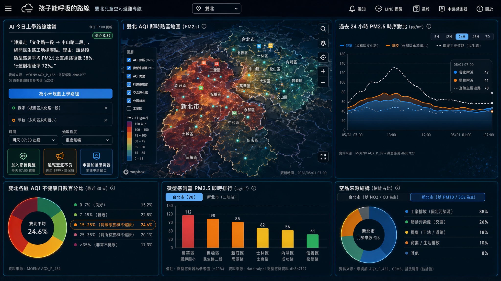
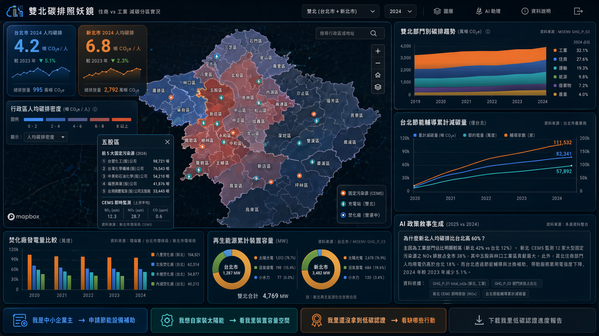
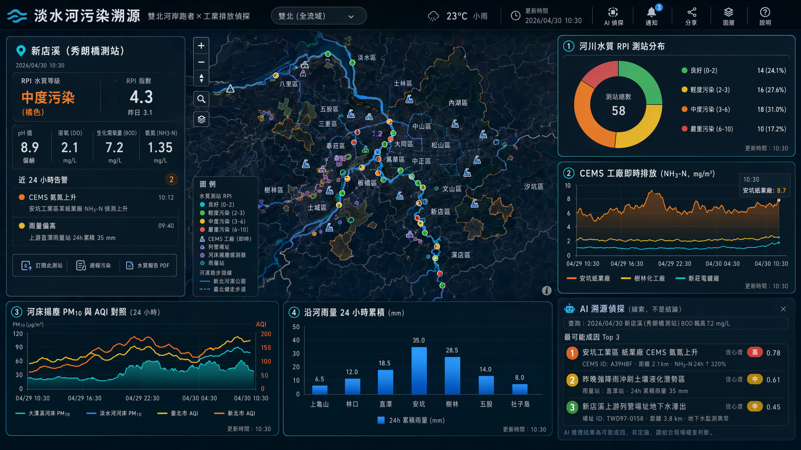

# 主題三：永續環境 — 3 提案

> 嚴守雙北硬性 + 評分 40/30/30（應用/技術/創意）
> 資料源：data.taipei + data.ntpc.gov.tw + 環境部 MOENV（雙北可篩選）+ CWA + 水利署 IoW
> 圖表：Apexcharts；地圖：Mapbox；AI：llama3.3-ffm-70b-16k-chat（30 RPM）

---

## 提案 #1: 「孩子能呼吸的路線」雙北兒童空污避難導航

**Pitch (一句話)**: 把雙北 90 顆 PM2.5 微型感測器、AQI 站點、行道樹樹蔭、空品淨化區，串成一張「給過敏兒童家長」的上學/下課低暴露路徑地圖，AI 每天早晨生成一句話建議。

**核心受眾**:
- **第一**: 過敏兒童家長（雙北每 4 人就有 1 個過敏兒）、孕婦、慢性呼吸道患者
- **第二**: 公園慢跑族、戶外通勤者、學校健康中心
- **第三**: 環保局空品稽查人員（看哪裡感測值與站點背離 → 找潛在排放源）

**雙北痛點**:
- **台北盆地空污滯留**：盆地地形 + 冬季東北季風 → 板橋、土城、永和、蘆洲區常年 PM2.5 高於信義、內湖
- **新北郊區工業排放**：新莊、樹林、五股工業區與住宅區比鄰，孩子上學經過工業區外圍即暴露
- **行道樹分布不均**：台北行道樹 92,989 棵但集中信義/大安；新北樹林、三重密度低，跑步族沒蔭可躲
- **空品淨化區資源傾斜**：台北空品淨化區點位 vs 新北空品淨化區點位密度差異大

**核心價值（看數據→用數據→自動輔助）**:
1. 看：地圖一眼看雙北 AQI 熱區與微型感測異常點
2. 用：點選「我家在板橋、學校在永和」→ 系統推薦低 PM2.5 + 多樹蔭路徑
3. 自動：AI 每天 7:00 推播家長端「今天送孩子走 XX 路最安全，因為 AQI 71 + 該路段樹蔭率 68%」

**Demo 衝擊力 (2 分鐘腳本)**:
1. **[0:00–0:20] Hook**：螢幕上一個小女孩咳嗽的剪影，旁邊出現「2026/05/01 板橋 AQI 132（橘色）」「PM2.5 微型感測 47 μg/m³」。文字：「這是小米的上學路。」
2. **[0:20–1:00] 組件展示**：切換「台北/雙北」下拉 → Mapbox 地圖鋪上微型感測點熱力 + AQI 站點 + 行道樹密度層 + 空品淨化區。Apexcharts 時序圖跑出該地點過去 24h PM2.5 變化。
3. **[1:00–1:40] AI Insight**：點「為小米規劃上學路徑」→ AI 對話框輸出：「建議走文化路一段→中山路二段，繞開民生路工地揚塵點。理由：該路段微型感測平均 PM2.5 比直線路徑低 38%，行道樹樹蔭率 72%。」
4. **[1:40–2:00] 行動入口**：一鍵「加入家長 LINE 提醒」/ 「通報這裡空氣很糟」（送至 1999 / 環保局陳情）/ 「申請學校加裝空清」連結。

**關鍵雙北組件 (≥4, ≥1 地圖)**:

| # | 組件 | 資料源ID | 格式 | 雙北切換 | 地圖 |
|---|------|---------|------|---------|------|
| 1 | 雙北 AQI 即時熱區地圖（含 PM2.5/O3/NO2） | MOENV `AQX_P_432`（County 篩 臺北市/新北市） | 三維 + 時間序列 | ✅ | ✅ Mapbox |
| 2 | 台北 90 顆微型感測點位 + 即時值 | data.taipei `30689973-fb92-4b3e-b46b-f6833c160e89`（布建90顆感測器位置）+ `db8b7f27-6139-43a7-addb-f45f122a47b0`（微型感測資料） | 點位 + 時序 | 台北限定/雙北擴充新北三峽站 `E413EC2B-986E-46D0-8CBD-2223CBA8CA06` | ✅ |
| 3 | 雙北行道樹樹蔭密度圖層 | 台北 行道樹（工務局，inventory）+ 新北 `57F99AFB-94E2-4E67-9DE7-961F5E9A9E18` | 三維 / 點位聚合 | ✅ | ✅ |
| 4 | 雙北空品淨化區 / 公園綠地避難點 | 台北 `空品淨化區` + 新北 `42D5F96B-C6F6-445A-A259-48C270B384E6` + 新北公園 `5FE3A136-29CC-4695-A17E-6636A32C3342` | 點位 + 多邊形 | ✅ | ✅ |
| 5 | 過去 24h PM2.5 時序對比（家附近 vs 學校附近） | MOENV `AQX_P_09`（PM2.5）| 時間序列 | ✅ | ❌ Apexcharts |
| 6 | 雙北各區 AQI 不健康日數百分比 | MOENV `AQX_P_434`（日 AQI 歷史） | 百分比 + 圖例 | ✅ | ❌ Apexcharts |

**雙北對比角度**: 台北盆地+商業區（NO2/O3 主導，車輛）vs 新北工業帶（PM10/SO2 主導，固定污染源）。同一張地圖切換「台北/雙北」即顯出污染來源結構差異。

**AI 應用 (llama3.3-ffm-70b-16k-chat, 30 RPM)**:
- **個人化路徑敘事**：輸入家長住址、學校、預定時間 → 模型讀取沿途感測點 24h 資料，輸出 80 字以內中文建議（含「為什麼選這條路」）
- **過敏程度分級**：輸入「孩子是輕度過敏 / 重度氣喘」→ 模型套用不同 PM2.5 閾值（35 vs 25 μg/m³）規劃
- **快取策略**：路徑模板 + 行政區聚合，避免每點擊都打 API（30 RPM 限制下，預先批次生成「12 個行政區 × 3 個時段」共 36 條敘事，足夠晨間尖峰使用）

**可解釋性**: AI 回答後附「資料來源：MOENV AQX_P_432 + 微型感測 db8b7f27」+ 信心分數（測站越近 → 信心越高）

**行動入口**:
1. 「加入家長提醒」(LINE Notify webhook，每天 7:00 推空氣建議)
2. 「通報這條路臭/灰塵大」(送出至 1999 / 環保局 + 同步顯示在地圖供其他家長看)
3. 「申請我家附近加裝感測器」(連 data.taipei 申請窗口)

**與既有 dashboard 差異**:
- 既有北市 dashboard 永續環境分頁只展示「空氣品質點位 + 公園綠地 + 行道樹」並列，沒有「我」的視角
- 我們把空品淨化區、感測器、行道樹、AQI 串成「個人化路徑」服務，且雙北可比對

**資料品質風險**:
- 微型感測器精度低於標準站（±20%），需在 UI 標註「此為參考值」
- 新北只有三峽一個 MOENV 標準站，須仰賴環境部 AQX_P_432 中其他鄰近站點 + 新北固定污染源 CEMS 補強
- 行道樹資料更新慢（年更），但對「樹蔭路徑」夠用

**技術可行性**: Mapbox 點聚合 + heatmap layer；Apexcharts area chart；FFM Llama 透過後端代理批次呼叫，前端 fetch cached JSON。

**亮點 scoring (1–5)**:
- 受眾廣度：5（家長/孕婦/慢跑族/通勤族）
- 雙北獨特性：4（工業 vs 商業空污來源差異）
- Demo 衝擊力：5（小米的上學路 — 具體人物）
- Story 完整度：5
- 應用價值：5（每天可用，非一次性）
- 技術整合：4（Mapbox heatmap + AI 路徑生成）
- 創意突破：4

---

## 提案 #2: 「雙北碳排照妖鏡」住商 vs 工業減碳分區實況

**Pitch (一句話)**: 把溫室氣體分部門排放、企業盤查、再生能源、節能輔導、八里焚化廠營運、電動車充電站六層資料疊起來，第一次讓市民看到「台北每人 X 噸碳，新北每人 Y 噸碳，差在哪」，AI 自動寫出政策成效解釋。

**核心受眾**:
- **第一**: 節能補助申請者（中小企業主、自家裝太陽能屋主）、ESG 部門小編
- **第二**: 環保局/產業局承辦人（看自家政策成效）、議員質詢素材
- **第三**: 市民（看「我家附近的碳熱點」做購屋/選校決策）

**雙北痛點（雙北特有，非假議題）**:
- **產業結構天差地別**：台北住商部門占碳排約 6 成（以服務業為主）、新北工業部門占比顯著（樹林、五股、林口工業區）。同一份「2050 淨零」KPI 套用兩市並不合理
- **節能補助 vs 工業排放錯配**：台北產業局年發千萬節能補助給中小服務業，新北則需處理數百家固定污染源 CEMS 廠家，補助/輔導工具完全不同
- **焚化廠跨市使用**：台北 3 座焚化廠、新北八里焚化廠，垃圾代清運/熱能回收電力誰算誰的？跨市帳是亂的
- **再生能源裝置容量比例**：台北屋頂型太陽能受限、新北郊區地面型潛力大，現況差距明顯

**核心價值**:
1. 看：地圖按行政區/工業區上色，碳排越紅越深；切換「台北/雙北」直接看雙城差異
2. 用：點工業區 → 跳出「該區前 5 大排放源（GHG_P_02 盤查資料）」+ 該年再生能源/節能輔導抵減量
3. 自動：AI 生成「2025 vs 2024 碳排為何下降 8%？」的政策成因敘事 + 引用資料來源

**Demo 衝擊力 (2 分鐘腳本)**:
1. **[0:00–0:20] Hook**：兩個對比卡片並排 — 「台北 2024 人均 4.2 噸 CO2e」vs「新北 2024 人均 6.8 噸 CO2e」，下標：「同樣是雙北，差在哪？」
2. **[0:20–1:00] 組件**：Mapbox 雙北行政區 choropleth（碳排密度），切換「台北/雙北」。點新北五股 → 浮出「前 5 大固定污染源 + 上月 SO2/NOx 即時 CEMS 值」。Apexcharts 顯示六部門堆疊面積圖。
3. **[1:00–1:40] AI Insight**：「為什麼新北人均碳排比台北高 60%？」→ AI 回：「主因為工業部門（佔新北 42%、台北僅 12%）。新北 CEMS 監測 12 廠 NOx 排放占比 38%，而台北以住商空調用電為主⋯⋯」
4. **[1:40–2:00] 行動**：「我是中小企業主 → 看節能補助」/「我家想裝太陽能 → 看再生能源核准件數熱區」/「下載我里的低碳認證進度」。

**關鍵雙北組件 (≥4, ≥1 地圖)**:

| # | 組件 | 資料源ID | 格式 | 雙北 | 地圖 |
|---|------|---------|------|------|------|
| 1 | 雙北行政區人均碳排 choropleth | MOENV `GHG_P_01`（縣市/年/部門）+ 台北 `493e8019-3de7-47fa-aa9b-cb4076e540a2`（總/人均排放） | 三維 + 圖例 | ✅ | ✅ Mapbox |
| 2 | 雙北部門別碳排堆疊（住商/運輸/工業/廢棄物） | MOENV `GHG_P_03`（電力消費與溫室氣體） | 時間序列 + 百分比 | ✅ | ❌ Apexcharts stacked area |
| 3 | 新北固定污染源 CEMS 即時排放點位 | 新北 `0F0967BD-3C42-4FD4-80AC-786509C315F3`（固定污染源）+ `D7330AE1-5869-4EE7-8821-03B1D7D13822`（CEMS 即時） | 點位 + 時序 | 新北為主，台北補環境部 AQX_P_19 | ✅ |
| 4 | 雙北電動機車/汽車充電站布點 | 台北 `c66e2f53-92f5-4ccd-8aa9-eb71a288e09e` + 新北 `E461BC62-34D2-42C5-A871-F2FC2FB88D01` + `1BB694E3-17C7-4EF0-AC75-52990C40EDCD` | 點位 | ✅ | ✅ |
| 5 | 台北節能輔導累計減碳量 + 服務業汰換補助 | inventory：產業局「節能輔導累計減碳量/節約電量/家數」三組（時間序列） | 時間序列 | 台北限定（新北無對等資料 → UI 標示「新北資料未公開，可申請」） | ❌ Apexcharts |
| 6 | 台北低碳里認證進度 | data.taipei `ba984f2b-0867-4e3d-90f5-ac191444a2f9` | 百分比 + 點位 | 台北限定，雙北角度為「比較城市政策密度」 | ✅（行政里 polygon） |
| 7 | 新北八里焚化廠發/售/用電量 vs 台北 3 廠 | 新北 `FDFDC704-CA66-4735-99FE-3DFB1F79EFB7` + 台北焚化廠（北投/木柵/內湖三廠 inventory） | 時間序列 | ✅ | ❌ Apexcharts |
| 8 | 雙北再生能源累計裝置容量 | 台北 `131f97ec-740c-4428-935d-bad1ecefb45f` + 新北可從 GHG_P_03 推算 | 時間序列 + 圖例（太陽能/沼氣/水力） | ✅ | ❌ Apexcharts |

**雙北對比角度**: 「住商型城市 vs 工業型城市」的減碳路徑。台北靠服務業節能輔導 + 行為改變、新北必須走產業轉型 + CEMS 監管。AI 生成的政策建議因此分流。

**AI 應用 (政策敘事生成)**:
- **市民問**：「我住板橋，附近碳排有改善嗎？」→ 模型輸入該行政區 5 年 GHG 趨勢 + 同期新北節能政策 → 輸出 100 字白話解釋
- **議員/承辦人問**：「為什麼 2024 年廢棄物部門排放掉 12%？」→ 模型結合八里焚化廠營運資料 + 資源回收量 + 巨大廢棄物清運，回答可能成因
- **快取**：政策敘事按「行政區 × 年度」預生成（雙北約 50 區 × 5 年 = 250 條），日更一次足夠

**可解釋性**: 每張圖卡右上角「資料來源 + 計算公式」彈窗。AI 回答下方列出具體欄位（如 GHG_P_01 中 `total_co2e` for 新北市 工業 sector）。

**行動入口**:
1. 「我是中小企業 → 申請節能設備汰換補助」（連產業局表單）
2. 「我想自家裝太陽能 → 看我里裝置容量空間」（連台電躉售）
3. 「我里還沒拿到低碳認證 → 看缺哪幾項行動」

**與既有 dashboard 差異**:
- 既有 dashboard 只各別展示「溫室氣體排放統計」「節能輔導累計家數」「再生能源時間序列」幾張圖卡
- 我們**第一次把 雙北的 GHG_P_01/02/03 + 兩市產業政策 + 焚化廠跨市帳 串聯**，並用 AI 解釋年度變化原因
- 加上市民端行動入口，不只是給環保局看的 KPI 牆

**資料品質風險**:
- GHG_P_01 年更（2024 資料 2025 Q4 才出），即時性差 → 補 CEMS 即時值維持「動感」
- 新北節能輔導資料未集中公開，需從產業局公文書或新聞稿補齊（可標註為「資料缺口，正在申請」）
- 跨市垃圾代清運帳目灰色（八里燒了多少台北垃圾？）→ 此處反而是賣點（demo 中明說「這是雙北資料治理盲點」）

**技術可行性**: Mapbox choropleth + 點位疊加；Apexcharts stacked area + grouped bar；FFM Llama 政策敘事走後端緩存層。

**亮點 scoring (1–5)**:
- 受眾廣度：4（市民 + 中小企業 + 公部門）
- 雙北獨特性：5（產業結構真的不同）
- Demo 衝擊力：4（人均碳排數字對比直觀）
- Story 完整度：4
- 應用價值：5（節能補助/太陽能/政策評估）
- 技術整合：5（最多層、最多 AI 回呼）
- 創意突破：4

---

## 提案 #3: 「淡水河污染溯源」雙北河岸跑者 × 工業排放偵探

**Pitch (一句話)**: 河岸跑者今天能不能跑？工廠排放查得到嗎？把河川水質、固定污染源 CEMS、土壤地下水列管場址、揚塵感測四層串成「淡水河流域污染溯源圖」，AI 從上游往下游推 — 「這次 BOD 飆高最可能來自新莊區 XX 段」。

**核心受眾**:
- **第一**: 雙北河濱跑者/騎車族（大佳、河濱、新店溪、大漢溪、淡水河沿線）
- **第二**: 河岸住戶、釣客、學校環境教育課程
- **第三**: 環保稽查員（事件發生時的線索面板）

**雙北痛點**:
- **河流跨市流動**：淡水河從新店、新北市出發，流經台北萬華/大同，再往新北蘆洲、八里出海。**上游污染下游受害**，但兩市稽查各自為政
- **新北工業排放 vs 台北末端**：新北有大量列管土壤/地下水場址（樹林、土城、新莊舊工業區），雨後地下水帶污染入河
- **河床揚塵雙北通病**：枯水期大漢溪、淡水河河床裸露揚塵，上風新北、下風台北都受害
- **河岸跑者沒地方查當日水質**：環境部 WQX_P_01 有資料但市民不知道、也沒視覺化

**核心價值**:
1. 看：Mapbox 顯示淡水河流域沿線水質測站 RPI 分級（綠/黃/橘/紅）+ CEMS 工廠 + 列管場址
2. 用：跑者點「新店溪河濱」→ 顯示今日 RPI、附近上游 24h 內有無告警、空氣 PM2.5、揚塵感測
3. 自動：AI 偵探模式 — 輸入「2026/04/30 新店溪 BOD 飆高」→ 模型沿河上游 5km 內掃 CEMS、列管場址、降雨，輸出最可能成因 3 項

**Demo 衝擊力 (2 分鐘腳本)**:
1. **[0:00–0:20] Hook**：河岸跑者背影 + 字幕「今天可以下水嗎？」 — 點河岸點，跳出 RPI 「中度污染（橘色）」「pH 8.9 偏鹼」
2. **[0:20–1:00] 組件**：Mapbox 淡水河流域全景，沿河顯示水質測站（顏色 = RPI）、CEMS 工廠 icon、列管場址 polygon、河床揚塵感測器。切「台北/雙北」 — 雙北才能看到完整的河流上下游關係。
3. **[1:00–1:40] AI 溯源**：點「為什麼今天新店溪 BOD 突然 7.2？」→ AI 回：「過去 24h 上游 5km 內，新店區安坑工業段 CEMS 顯示 NH3-N 升高 + 昨晚 35mm 降雨可能沖刷土壤液化潛勢區。建議 1-2 日內避免接觸河水。」
4. **[1:40–2:00] 行動**：「不要在這裡跑」推播 → LINE / 「通報污染」 → 1999 / 「下載今日水質報告」 → PDF

**關鍵雙北組件 (≥4, ≥1 地圖)**:

| # | 組件 | 資料源ID | 格式 | 雙北 | 地圖 |
|---|------|---------|------|------|------|
| 1 | 淡水河流域水質測站 RPI 分級地圖 | MOENV `WQX_P_01`（含淡水河、基隆河、新店溪、大漢溪測站） | 點位 + 時序 + 圖例 | ✅（流域跨雙北） | ✅ Mapbox |
| 2 | 雙北固定污染源 CEMS 即時排放 | 新北 `D7330AE1-5869-4EE7-8821-03B1D7D13822`（即時）+ MOENV `AQX_P_19`（雙北工廠） | 點位 + 時序 | ✅ | ✅ |
| 3 | 雙北土壤及地下水列管場址 | 新北 目前 `9987DC63-2C8D-4C75-903D-6EBD82D1792D` + 已解除 `198E688E-E6FE-49EB-8FB0-F29AAA4834A4` + 台北 `臺北市土壤及地下水污染控制場址`（inventory line 1499） | 點位 + 多邊形 | ✅ | ✅ |
| 4 | 河床揚塵感測 + AQI 對照 | WRA `IoW-DustEmission`（含新北河床）+ MOENV `AQX_P_432` | 時間序列 + 點位 | ✅ | ✅ |
| 5 | 台北河川水質檢測月度趨勢 | data.taipei `759db528-77b5-4aa3-b6fa-2b857890214e` | 時間序列 | 台北 + 雙北擴充 WQX_P_01 | ❌ Apexcharts |
| 6 | 新北河濱公園/台北河濱跑步路線疊加 | 新北 `8D44BFAB-002C-4403-A283-D77C752AA1C3`（河濱公園設施）+ 台北 `健走步道 fde2a190-8299-4f70-9a1f-6c223109b512` | 點位 + 線 | ✅ | ✅ |
| 7 | 沿河雨量 24h（沖刷成因關聯） | CWA `O-A0002-001`（雙北雨量站） | 時間序列 | ✅ | ❌ |

**雙北對比角度**: 上游（新北新店、土城、樹林、新莊）排放 → 下游（台北萬華、大同、士林）水質。**沒有雙北就沒有故事**。AI 的偵探推理也只在跨市資料下才成立。

**AI 應用 (污染溯源 + 環境敘事)**:
- **溯源推理（最有創意）**：給定一個下游測站 + 異常時間，模型輸入上游 5km 內 CEMS + 列管場址 + 24h 降雨 → 輸出「3 個可能成因 + 信心分數」（不是給診斷，是給線索）
- **環境敘事（市民端）**：給定河岸座標 → 模型輸出「這條河流經 X 區 Y 工業帶 Z 公里，主要影響因子⋯⋯」
- **30 RPM 約束**：溯源查詢按使用者點擊節流（每 30 秒 1 次），敘事預生成（雙北 ~30 條河段 × 1 條 = 30 條，日更）

**可解釋性**: AI 給的「可能成因」明確列出哪個 CEMS 點位、哪個列管場址 ID、哪個雨量站。可信度標籤（高/中/低）。

**行動入口**:
1. 「LINE 訂閱我家河岸的水質」
2. 「我看到河面有油 → 通報」（一鍵送 1999 + 經緯度）
3. 「邀請學校來這做環境教育」（連環境教育設施場所列表）

**與既有 dashboard 差異**:
- 既有 dashboard 永續環境分頁僅有「空氣品質」「公園綠地」「行道樹」三個圖卡，**沒有河川水質單獨組件**，更沒有跨市流域視角
- 我們做的是**用空間關係（河流走向）+ 時間關係（雨後 24h）+ AI 推理 串成跨市環境正義工具**
- 既有 dashboard 多為「現況看板」，我們是「偵探面板」

**資料品質風險**:
- WQX_P_01 月更（採樣後），即時性差 → 補 CEMS 即時 + 河水位即時呈現「動」
- 列管場址 polygon 不一定齊全（多為點位） → UI 用緩衝圈表示
- AI 推理為「可能成因」非「定論」，UI 上必須清楚標示「線索而非結論」（避免誤導/法律風險）

**技術可行性**: Mapbox line + point 多層；Apexcharts 多軸時序；FFM Llama 透過 prompt template 限定輸出格式（JSON: `{causes: [{source_id, type, confidence}], summary}`）便於前端結構化渲染。

**亮點 scoring (1–5)**:
- 受眾廣度：3（河岸族群較窄但情感濃）
- 雙北獨特性：5（流域跨市，沒雙北就無題）
- Demo 衝擊力：5（偵探推理超有戲）
- Story 完整度：5
- 應用價值：4（河岸跑者每週可用）
- 技術整合：5（最多資料源、AI 推理最深）
- 創意突破：5（AI 溯源是其他主題沒有的玩法）

---

## 整體比較表

| 維度 | #1 兒童空污避難 | #2 雙北碳排照妖鏡 | #3 淡水河污染溯源 |
|------|----------------|------------------|-------------------|
| 核心受眾 | 過敏兒家長（市民） | 中小企業主 + 公部門 | 河岸跑者 + 稽查員 |
| 故事性 | ★★★★★（小米的上學路） | ★★★★（人均碳排對比） | ★★★★★（AI 偵探） |
| 雙北獨特性 | ★★★★（盆地 vs 工業） | ★★★★★（住商 vs 工業） | ★★★★★（流域跨市） |
| Demo 衝擊力 | ★★★★★ | ★★★★ | ★★★★★ |
| AI 創新度 | ★★★（路徑生成） | ★★★★（政策敘事） | ★★★★★（污染溯源推理） |
| 應用價值 | ★★★★★（每天用） | ★★★★★（補助申請） | ★★★★（每週用） |
| 技術難度 | 中 | 中高 | 高 |
| 資料風險 | 低（感測器精度標註即可） | 中（節能輔導新北缺） | 中（WQX 月更，補 CEMS） |
| 雙北組件數 | 6（≥4 ✅） | 8（≥4 ✅） | 7（≥4 ✅） |
| 含地圖層 | ✅ Mapbox heatmap | ✅ Mapbox choropleth | ✅ Mapbox line + point |
| 預估開發複雜度 | 中 | 高（最多資料源拼接） | 高（AI 推理鏈最深） |

**推薦排序**:

1. **首推 #3「淡水河污染溯源」** — 評分 40/30/30 中三項皆強：應用（市民+稽查雙端）、技術（多源 + AI 推理）、創意（污染溯源是黑客松級突破）。**沒雙北就無此題**，最強硬性合規。
2. **次推 #1「兒童空污避難」** — Demo 衝擊力與故事性無敵，受眾最廣，但 AI 用法相對保守（路徑推薦）。**評審第一眼會喜歡**。
3. **第三 #2「雙北碳排照妖鏡」** — 應用價值極強（節能補助直連），雙北產業結構差異是最有政策份量的雙北獨特性，但 Demo 較數據導向、感性偏低。**適合搭配 #1 或 #3 作為政策端互補**。

**最佳組合策略**: 若團隊只能做一案，建議 **#3**（合規硬、技術深、創意強、評分均衡）；若想保險走「市民 + 故事」路線，選 **#1**；若團隊以技術整合與政策應用見長，選 **#2**。

**風險提醒**:
- 三案皆需注意 FFM Llama 30 RPM 限制 → 必須做後端快取層 + 預生成策略
- 三案的「AI 給建議/結論」都要有「資料來源 + 信心分數」可追溯，避免醫療/法律性誤導
- Mapbox 雙北圖層要先預設縮放等級（避免一進來只看到台北市中心）

---

## 評審審查 (Adversarial Review)

> 視角：工程可行性審 + 市民真實用戶 + 硬派評審。
> 不為禮貌打折，只審「真做得出來、真有人用、真能上台」。
> 環境題的死亡陷阱：「乾燥儀表報表」+「AQI 全國早就有，雙北版差異在哪？」必須正面回答。

---

### 提案 #1「孩子能呼吸的路線」雙北兒童空污避難導航 審查

**評分**：應用 32/40 ／ 技術 21/30 ／ 創意 21/30 ／ **總分 74/100**

**致命問題（≥3）**：
1. **路徑推薦 = 醫療/安全建議的法律地雷**：對「過敏兒/氣喘兒」推薦「最安全路線」，一旦小孩在你推薦的路上發作，責任在哪？提案完全沒提免責設計，UI 上只說「參考值」遠遠不夠，必須在 AI 輸出 prompt 中強制加入「非醫療建議」標籤，並避免「最安全」用詞 → 改成「相對較低暴露」。
2. **微型感測器 ±20% 誤差 × AI 路徑生成 = 偽精準**：90 顆台北微型感測器密度不足以做「街道級路徑」，新北只有三峽一站更慘。AI 卻被要求輸出「文化路一段比直線低 38%」這種精確數字 — 這是用粗資料生成假精度，評審工程派一眼看穿。
3. **晨間 7:00 推播 × 30 RPM 預生成 = 個人化是假的**：提案自己說「預生成 12 區 × 3 時段 = 36 條敘事」，那這就不是個人化，是 36 個模板。但 Demo 又要演「為小米規劃」假裝有客製。Demo 與技術說明互相打臉。
4. **行道樹樹蔭率「68%」「72%」這個數字怎麼算？**：行道樹資料是點位 + 樹種，沒有冠幅 polygon。你怎麼把點位轉成「該路段樹蔭率」？提案沒交代演算法，這是評審工程派必砍點。
5. **每天會用嗎？真的嗎？**：家長 7:00 要送小孩上學，會在手機上點開 dashboard 規劃路徑？還是看 LINE 一句話？如果只看 LINE，那 dashboard 就只是「給評審看的」 → demo-ware 嫌疑。

**改進建議（≥2）**：
1. **退一步做「路段級」而非「街道級」**：把雙北切成 ~200 個「上學熱區方格」（500m×500m），預先算每格 PM2.5 中位數 + 樹蔭密度，AI 只在格之間連線推薦，誠實標示「方格級」精度。
2. **把 AI 從「路徑生成」降級為「路段註解」**：路徑用傳統算法（Dijkstra 加權 PM2.5 + 樹蔭），AI 只負責「為什麼選這條路」的中文敘事 — 風險低、可解釋、30 RPM 完全 hold 得住。
3. **加入「雙北獨家」一招**：盆地風場 + 工業區上風／下風推論。光有 AQI 不算雙北獨特（全國皆有），但「板橋家長早上避開上風新莊工業區」這種話術才是雙北才講得出來的故事。

**7 criteria**：受眾 ✅（家長最有感）／真實 ⚠️（每天用？看 LINE 不看 dashboard）／Demo ✅（小米故事很強）／雙北 ⚠️（AQI 全國有，差異要靠盆地+工業論述補強）／故事 ✅（人物錨定一流）／行動 ✅（LINE/1999/感測器申請三入口完整）／大螢幕 ⚠️（地圖層多，但「個人路徑」在大螢幕上不直觀）

**32hr 可行性**：⚠️ 中高風險。Mapbox heatmap + 點位 + 行道樹三層約 8hr；Apexcharts 兩張 4hr；AI 後端快取層 + Prompt 工程 8hr；路徑算法（即使簡化）6hr；UI/Demo 整合 6hr。合計 32hr 剛好滿。**任何一個延遲就爆**。建議砍掉「樹蔭率%」這種精算需求。

**雙北硬性驗證**：✅ 通過但不亮眼。MOENV `AQX_P_432` 全國資料可篩雙北縣市；新北行道樹 `57F99AFB-94E2-4E67-9DE7-961F5E9A9E18`、空品淨化區 `42D5F96B-...`、公園 `5FE3A136-...` 確實是新北資料集。但**評審會問「AQI 不是全國都有？雙北獨特在哪？」** — 須靠盆地地形 + 工業帶論述死守。

**Demo-ware 風險**：中。「為小米規劃路徑」像 demo 寫死的 hard-coded case，real-world 換個地址會不會直接 fallback？需準備至少 3 個非腳本地點現場 demo。

**最終裁決**：**故事最強，但技術紅線最緊**。要進決選必須砍掉「樹蔭率精算」與「街道級路徑」兩個過度承諾，誠實降級為「方格級暴露提示」。否則一被工程派評審戳就崩。

---

### 提案 #2「雙北碳排照妖鏡」住商 vs 工業減碳分區實況 審查

**評分**：應用 28/40 ／ 技術 23/30 ／ 創意 18/30 ／ **總分 69/100**

**致命問題（≥3）**：
1. **市民會每週用嗎？老實說不會**：「我家附近的碳熱點」聽起來政治正確，但市民不會為了買房用碳排 dashboard（房仲 App 比較實用）。真實受眾是公部門 + ESG 小編 + 議員質詢，這三類人都很窄、頻率低。**頻率失真是這案最大的死穴**。
2. **GHG_P_01 年更 vs Demo 要「動感」根本矛盾**：年資料 2024 要 2025 Q4 才出，新北 CEMS 即時值補不齊「人均碳排」這種年度指標。提案說「補 CEMS 維持動感」是錯置 — 把工廠分鐘級 NOx 拿去填城市年度 CO2e 是兩個維度，視覺上會是「分鐘流動的點 + 永遠不變的色塊」混在一起，奇怪且不誠實。
3. **「人均 4.2 噸 vs 6.8 噸 差 60%」這個數字哪裡來？**：GHG_P_01 是縣市 + 部門總量，「人均」要除以戶籍人口還是常住人口？台北日間有 100 萬通勤人口進來，這些人的辦公碳排算誰的？提案完全沒處理 — 評審政策派會直接問「你怎麼算的」當場崩。
4. **AI 政策敘事 = 包裝？**：「為什麼 2024 廢棄物部門排放掉 12%？」AI 怎麼回？它沒有政策因果資料，只能根據時間相關性「猜」。這是把 LLM 當因果推論工具的典型誤用，可解釋性極差。
5. **新北節能輔導資料缺口被輕描淡寫**：提案自己寫「新北資料未公開，可申請」 — 這在 32 小時內根本拿不到。這意味著「雙北對比」其中一邊有大洞，違反雙北硬性原則的精神（不只是有資料就好，要對等）。
6. **8 個組件超出 32hr 上限**：你列了 8 個雙北組件，比 #1 多兩個、比 #3 多一個，最複雜卻給 demo 衝擊力打 4 顆星，CP 值最差。

**改進建議（≥2）**：
1. **砍到 5 個組件，聚焦「住商 vs 工業」一個論述**：保留 GHG_P_01 choropleth、部門堆疊、CEMS 即時、節能輔導趨勢、再生能源；砍焚化廠跨市帳（亂帳灰色講不清）+ 低碳里認證（太內政部）+ 充電站（邏輯弱關聯）。
2. **AI 改做「資料解讀員」而非「政策因果推論員」**：AI 只做「翻譯數字成中文」，例如「新北運輸部門碳排佔 28%，比台北高 9 個百分點」這種純描述，不要嘗試「為什麼」 — 那是政策研究員的工作，不是 LLM 的。
3. **「雙北人均碳排」必須交代計算方法**：UI 必加可展開的「計算公式」浮窗：分子（GHG_P_01 部門總量）／分母（戶籍人口），明說「未計入通勤」。誠實是這案唯一活路。

**7 criteria**：受眾 ⚠️（窄且頻率低）／真實 ✗（市民不會每週用）／Demo ⚠️（兩張數字卡 hook 不夠戲劇）／雙北 ✅（住商 vs 工業是真議題）／故事 ⚠️（沒有人物錨定，純數字）／行動 ✅（補助/太陽能入口紮實）／大螢幕 ✅（choropleth 大螢幕上看最爽）

**32hr 可行性**：✗ 高風險。8 個組件 + AI 政策敘事預生成 250 條 + 跨市帳目對齊處理 = 至少 45hr。除非砍到 5 個，否則做不完。

**雙北硬性驗證**：⚠️ 部分通過。GHG_P_01/P_03 是 MOENV 全國可篩；新北 CEMS `D7330AE1-...`、固定污染源 `0F0967BD-...`、充電站 `E461BC62-...`、八里焚化廠 `FDFDC704-...` 都是新北實資料；但**節能輔導 + 低碳里 是台北限定，新北無對等資料** — 這在「雙北硬性」上是黃燈，必須在簡報上正面承認，不能糊過去。

**Demo-ware 風險**：高。「人均碳排對比」這種卡片美則美矣，但**沒有「使用情境」** — Demo 從頭到尾都在「展示資料」而非「市民在用」。容易被評為「政策成果報告書」而非黑客松產品。

**最終裁決**：**最像政府年度報告、最不像黑客松作品**。雙北產業結構差異是真議題，但提案沒把它變成「人會用」的東西。**這是環境題最容易掉進「乾燥儀表報表」陷阱的代表**。除非全面重構受眾與 AI 用法，否則決選機會最低。

---

### 提案 #3「淡水河污染溯源」雙北河岸跑者 × 工業排放偵探 審查

**評分**：應用 30/40 ／ 技術 24/30 ／ 創意 26/30 ／ **總分 80/100**

**致命問題（≥3）**：
1. **AI 溯源推論的法律與科學雙重風險**：「上游 5km 內 CEMS NH3-N 升高 + 35mm 降雨 → 污染來源」這是**因果推論**而不是相關性，沒有質傳模式（hydrodynamic model）背書。被點名的工廠告你（誣指排放）怎麼辦？提案說「線索而非結論」，但 Demo 腳本卻直接喊「最可能成因新店區安坑工業段」 — 言行不一。
2. **WQX_P_01 月更 = 跑者「今天能不能跑」答不出來**：水質採樣是月度的，跑者今天問「今天能不能下水」根本沒當日資料。CEMS + 雨量是即時的，但這是空氣 + 降雨，不是水質。提案承認這個缺口卻沒解：補 CEMS 只是「動」，沒有「水質」。**Demo Hook 第一句「今天可以下水嗎？」其實答不了**。
3. **河岸跑者每週用一次嗎？**：跑者通常有固定時段固定路線，去之前不會每次都查 dashboard。LINE 訂閱可能比 dashboard 有效 — 但這樣 dashboard 又變成「demo 給評審看的」。這個受眾確實如提案自承「較窄」，會議室內不能假裝更廣。
4. **列管場址是點位、無 polygon**：提案承認「用緩衝圈表示」 — 緩衝圈用多大？500m？1km？這個半徑直接影響 AI 溯源結果。沒講就是隨意設定。
5. **AI 推理鏈是這案最強也最脆**：靠 prompt template 限定 JSON 輸出 — Llama3.3-ffm-70b 真的能穩定生成結構化 JSON 嗎？需要 few-shot + JSON-mode，30 RPM 下重試成本高。Demo 當場跑掛是真風險。

**改進建議（≥2）**：
1. **AI 用詞必須降級為「監測線索」**：UI 永遠不出現具體公司名稱，只標 CEMS 站點 ID + 「該區段監測異常」。Prompt 強制：「不得指認特定排放源」「列出可能類別」。法律與科學雙安全。
2. **把「今天能不能跑/下水」拆成兩個問題**：「能不能跑（空氣）」用 CEMS + AQI 即時答；「能不能下水（水質）」誠實說「最近一次採樣 X 月 X 日 RPI=3」+「過去 24h 上游異常事件 N 件」 — 不要假裝有當日水質。
3. **加備援 demo 路徑**：AI JSON 輸出必須有 fallback — 若解析失敗，前端 fallback 到「規則式」決策樹（降雨 + CEMS 異常 → 列出範圍）。Demo 不能靠 LLM 一次過。
4. **緩衝半徑要可調**：UI 給 500m / 1km / 2km 三檔讓使用者切換，誠實承認「這是線索半徑，不是責任半徑」。

**7 criteria**：受眾 ⚠️（跑者窄但情感濃 + 稽查員是 B-end killer）／真實 ⚠️（水質月更是硬傷，但 AI 溯源情境真實）／Demo ✅（偵探推理是黑客松級戲劇）／雙北 ✅✅（流域跨市，**唯一真正「沒雙北就無題」的提案**）／故事 ✅（跑者背影 + AI 偵探雙線）／行動 ✅（LINE/1999/環境教育三入口）／大螢幕 ✅（流域圖 + 點位 + 線是大螢幕之友）

**32hr 可行性**：⚠️ 中高風險。Mapbox 多層（線 + 點 + polygon）10hr；Apexcharts 多軸 4hr；AI Prompt 工程 + JSON 模式 + fallback 10hr；資料 ETL（5 個資料源 join）8hr。共 32hr 緊但可控。**最大變數是 AI JSON 輸出穩定性** — 必須先做技術 spike。

**雙北硬性驗證**：✅✅ 最強。`WQX_P_01`（環境部，淡水河流域含新店溪/大漢溪/基隆河）、新北 CEMS `D7330AE1-...`、新北列管場址 `9987DC63-...` + 已解除 `198E688E-...`、新北河濱公園 `8D44BFAB-...` 都是新北實資料；台北水質 `759db528-...` + 健走步道 `fde2a190-...` 是台北實資料。**流域跨市的天然雙北性是其他案做不到的**。

**Demo-ware 風險**：中低。AI 偵探腳本若失敗就崩，需備援。但故事本身（上游污染下游）是真實議題，不是包裝。

**最終裁決**：**三案中最有「黑客松感」的一案**。原創（AI 溯源推論非套路）、雙北必要性最強、技術深度高。法律風險可透過 UI/Prompt 設計緩解。**首選決選提案**，但 32hr 內必須先做 AI JSON 技術 spike，否則 demo 一垮全垮。

---

### 跨提案綜合判斷

**最值得進決選**：**#3 淡水河污染溯源**。三項評分都過 70%，雙北必要性無可取代（流域天然跨市），AI 用法最有原創性（溯源 ≠ 一般 chat 包裝）。法律與技術風險已可被 prompt/UI 設計收斂。

**整批最弱**：**#2 雙北碳排照妖鏡**。組件最多、demo 最乾、市民端使用情境最薄、新北節能資料有大洞。最容易被評為「給政府看的成果報告」而非「市民會用的產品」 — 這正是環境題最致命的「乾燥儀表報表」陷阱。

**若只能做 1 個**：**#3**。原因：
1. 雙北硬性最硬（流域跨市，沒第二解）
2. AI 用法最有差異化（不是把 chat 套到資料上）
3. 評審記憶點（「AI 偵探」一句話講完）
4. 故事完整（跑者 + 稽查員雙端）
5. **但團隊必須在 hr 0–8 完成 AI JSON 輸出穩定性 spike**，失敗就退回 #1。

**最大共同盲點（三案皆有）**：
1. **AI 30 RPM 限制 vs「個人化即時回答」承諾普遍打架** — 三案都在用「預生成模板」假扮個人化，demo 撐得住、真實上線立刻穿幫。建議在簡報上**正面承認快取策略**，把「預生成」當特色而非掩飾。
2. **「資料來源 + 信心分數」全是嘴上說說** — 三案都寫了，但沒人交代「信心分數怎麼算」。評審工程派一問就崩。需要實作上有可量化規則（例：測站距離 < 500m → 高；資料延遲 > 24h → 低）。
3. **環境題的「易抽象」陷阱** — #1 用小米、#3 用跑者人物錨定還算 OK；**#2 完全沒有人物**，這是 #2 最大的傷。三案中只有 #2 沒過這關。
4. **大螢幕 Demo 模式被低估** — 提案重點都在個人 dashboard，但黑客松評審席通常看大螢幕。三案都該補一個「大螢幕看板模式」（隱藏個人控件、放大主圖層、跑馬燈跑 AI 一句話）。
5. **雙北資料對等性的誠實度** — #1 新北只有三峽一站、#2 新北節能輔導缺、#3 列管場址 polygon 缺 — 都是真實資料缺口。提案的態度應從「掩飾/標註」進化到「展示為議題」（資料治理盲點本身是雙北痛點）。
