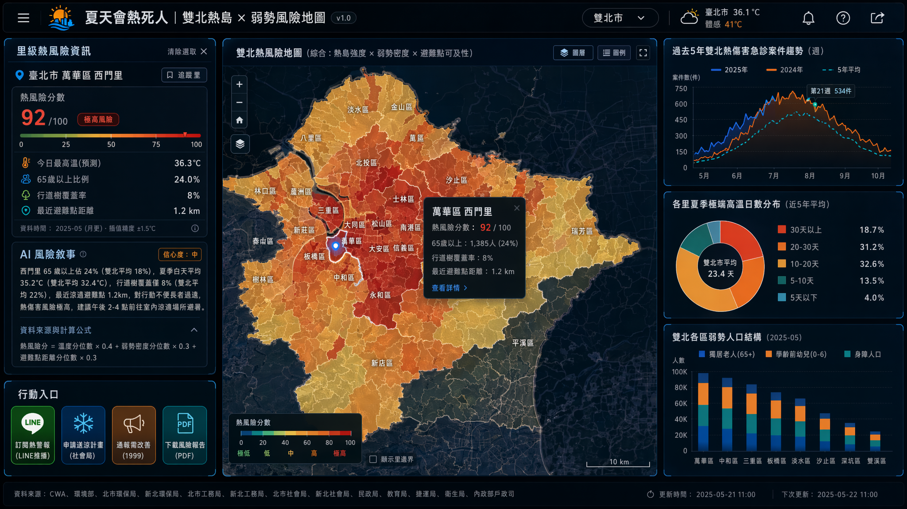
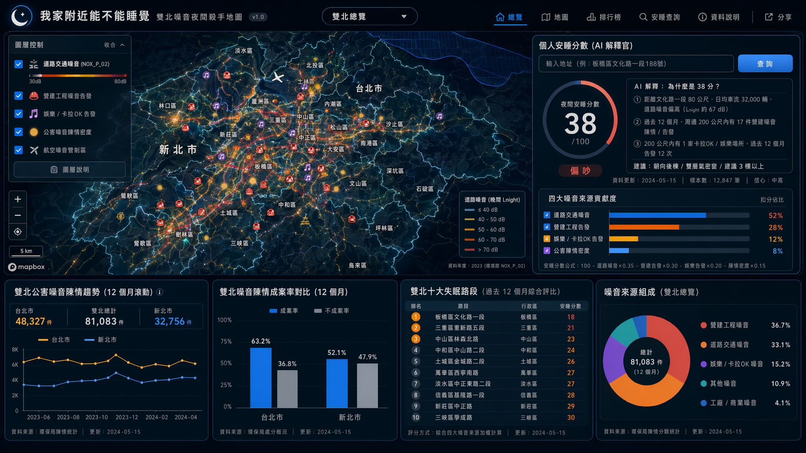
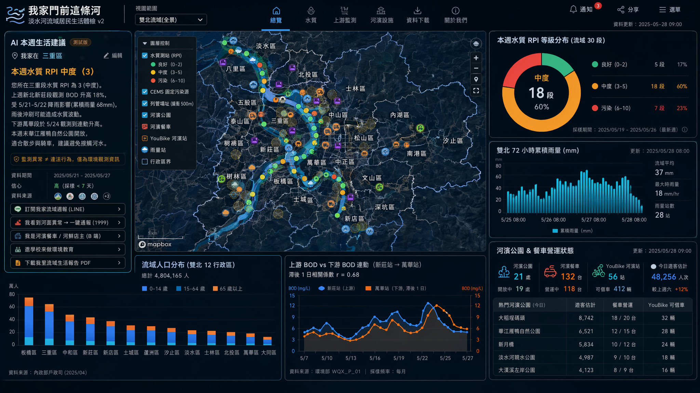

# 主題三：永續環境 — v2 提案 (3 案)

> 對 v1 critique 後重構 | 大眾受眾 + 跨局處資料整合 + 故事性
> 資料源：data.taipei + data.ntpc.gov.tw + 環境部 MOENV（雙北可篩選）+ CWA + WRA
> 圖表：Apexcharts；地圖：Mapbox；AI：llama3.3-ffm-70b-16k-chat（30 RPM）

## v1 critique 摘要 (避同錯)
- ❌ #1「兒童空污避難」PM2.5 是過去已有話題，不夠衝擊
- ❌ #2「碳排照妖鏡」民眾不關心碳排議題（太抽象）
- ⚠ #3「淡水河污染溯源」議題好但受眾窄（只河岸跑者）

## v2 修正方針
1. **受眾必為廣大市民** — 買房/租房族、老人家屬、夜班族、家長、所有「想知道家附近環境」的人
2. **跨局處資料整合** — 環保局 × 工務局 × 社會局 × 民政局 × 衛生局，讓抽象議題有「人物座標」
3. **故事性 + 具體 persona** — 不靠數字煽情，靠「誰在受害、誰在沉默」
4. **避免老議題 PM2.5 / 碳排抽象** — 改打熱浪、噪音、綜合居住三條新戰線
5. **更新頻率對齊** — 月更/年更資料只做「居住決策面板」，即時資料用於「個人防護」

---

## 提案 #1: 「夏天會熱死人」雙北熱島 × 弱勢風險地圖

**Pitch (一句話)**: 把雙北氣溫熱島、行道樹/公園綠覆、獨居老人/幼兒分布、涼適避難點四層疊起來，第一次讓家屬看見「我爸/我媽住在雙北最熱、最沒蔭、最沒避難點的里」，AI 自動寫出一句話風險警報。

**核心受眾 (Persona)**:
- **第一**：家中有獨居長者的子女（雙北約 6 萬獨居老人 + 數十萬與長者分居子女）、家有幼兒家長
- **第二**：里長/社會局公衛護士/長照機構（看自己負責里熱風險）
- **第三**：所有夏天怕熱的市民（雙北 600 萬人 7-9 月人人有感）

**v1 對照**: 全新提案。修正 v1 #1 PM2.5 過時老議題 — 改打**近年熱浪這個新戰線**（2024 年雙北 38°C 以上日數創 30 年新高），而且把弱勢者實際分布疊上來，受眾從「過敏兒家長」(窄) 擴大到「所有家中有老人/小孩的家屬」(極廣)。

**雙北痛點**:
- **熱島強度差 6°C 是真的**：台北盆地 + 大量水泥化（信義/萬華）vs 新北郊區（淡水、新店、八里）夜間溫差，2024 年最高紀錄 7-8 月深夜萬華 33°C、淡水 27°C — 同一個雙北兩個世界
- **獨居老人分布與熱島重疊**：萬華、大同、中和、永和、三重高齡 + 老舊公寓 + 無冷氣的獨居老人最多，正好是熱島最紅的區
- **涼適避難點資源傾斜**：台北的捷運站冷氣、圖書館、市民活動中心可達；新北郊區（瑞芳、平溪、雙溪、汐止）缺乏室內公共冷氣空間
- **政府盲點**：熱浪預警全國一張嘴（CWA 高溫資訊發雙北），但沒人在乎「我家這個里多少獨居老人 + 距離涼適點多遠」這種微觀視角

**核心價值**:
1. 看：地圖按行政里上色 — 紅色 = 高溫 × 弱勢密度高 × 涼適點稀疏
2. 用：輸入「我爸住萬華區 XX 里」→ 顯示該里熱風險分數、最近 3 個涼適避難點、過去 5 年該里高齡熱傷害案件
3. 自動：AI 每天 11:00 推「今天台北 36°C，您父親所在的西門里風險紅色，最近避難點是 XX 區公所大廳，建議下午 2-4 點過去」

**Demo 衝擊力 (2 分鐘腳本)**:
1. **[0:00–0:20] Hook**：螢幕上一張新聞剪報「2024/7 萬華獨居 78 歲翁家中熱中暑亡」+ 字幕：「當天他家門口 36.8°C。最近的冷氣公共空間在 1.2 公里外。」
2. **[0:20–1:00] 組件**：Mapbox 雙北 choropleth（熱島強度 × 65 歲以上人口密度），切「台北/雙北」立刻看到熱島熱區與獨居老人重疊。點萬華某里 → 浮出該里獨居老人數、行道樹密度、最近涼適點距離。
3. **[1:00–1:40] AI Insight**：點「為何這里最危險」→ AI 回：「西門里 65 歲以上佔 24%（雙北平均 18%），夏季白天平均 35.2°C（雙北平均 32.4°C），行道樹覆蓋僅 8%（雙北平均 22%），最近涼適避難點 1.2km — 對行動不便長者過遠。」
4. **[1:40–2:00] 行動**：「訂閱我家長輩所在里熱警報」(LINE) / 「申請社會局送涼計畫」 / 「通報這里需加裝噴霧/遮陽棚」(送 1999 + 民政局)

**關鍵雙北組件 (≥4, ≥1 地圖層, 須跨局處)**:

| # | 組件 | 資料源 (含局處) | 格式 | 雙北 | 地圖 |
|---|------|----------------|------|------|------|
| 1 | 雙北熱島強度 × 弱勢人口密度 choropleth | CWA `O-A0001-001`（雙北氣象站日均高溫）+ 內政部戶政（雙北 65 歲以上 / 0-6 歲人口）+ 台北社會局 `臺北市獨居老人緊急救援系統` + 新北社會局獨居長者 | 三維 + 圖例 | ✅ | ✅ Mapbox |
| 2 | 雙北行道樹/公園綠覆密度（遮蔭資源） | 台北工務局 `行道樹` 92,989 棵 + `公園綠地 1913.88 公頃` + 新北 `57F99AFB-94E2-4E67-9DE7-961F5E9A9E18` 行道樹 + 新北 `5FE3A136-29CC-4695-A17E-6636A32C3342` 公園 | 點位聚合 + polygon | ✅ | ✅ |
| 3 | 雙北涼適避難點分布（區公所/活動中心/捷運站/圖書館） | 民政局區公所點位 + 教育局圖書館 + 捷運局站點 + 新北市民活動中心 | 點位 + 5min 步行緩衝圈 | ✅ | ✅ |
| 4 | 過去 5 年雙北熱傷害急診案件趨勢 | 衛生局 `市立醫療院所急診類別` + 疾管署熱傷害監測週報 | 時間序列 + 折線 | ✅ | ❌ Apexcharts |
| 5 | 雙北各里夏季最高溫 vs 平均（極端熱日數） | CWA + 環境部熱島監測（測站疏，需空間內插） | 時間序列 | ✅ | ❌ Apexcharts |
| 6 | 雙北各區獨居老人 / 學齡前幼兒 / 身障人口分布 | 台北社會局獨居老人 + 內政部戶政 + 台北 `身障就業資源地圖` | 堆疊柱狀 | ✅ | ❌ Apexcharts |

**跨局處資料整合 (殺手鐧)**:
- **環保局 / CWA**：氣溫、熱島
- **工務局**：行道樹、公園綠地（遮蔭資源）
- **社會局**：獨居老人系統、長照機構分布
- **民政局**：區公所/活動中心（涼適避難點）
- **衛生局**：急診熱傷害案件（受害結果）
- **戶政**：里級人口結構（暴露人口）

**雙北對比角度**: 台北「熱島強 + 弱勢集中 + 避難點密」vs 新北「熱島弱但綠覆兩極（淡水有 / 三重缺）+ 弱勢分散 + 避難點稀」。同一張地圖切「台北/雙北」看出**兩種完全不同的熱風險治理問題**。

**AI 應用 (llama3.3-ffm-70b-16k-chat, 30 RPM)**:
- **里級風險敘事**：輸入行政里 → 模型聚合該里溫度、綠覆、弱勢人口、避難點距離 → 輸出 100 字白話風險摘要
- **快取策略**：雙北 ~600 個行政里 × 1 條敘事 = 600 條，按里夜間批次預生成；夏季每週更新一次（受眾使用情境是「決策」非「即時」）
- **30 RPM 不打架**：里級敘事是預生成，使用者點即得；只有「個人化推 LINE」走即時佇列

**可解釋性**: AI 輸出附「資料來源 + 計算公式」（熱風險分 = 溫度分位數 × 0.4 + 弱勢密度分位數 × 0.3 + 避難點距離分位數 × 0.3，公開於 UI）。信心分數依測站距離 < 500m 高 / 500m-2km 中 / >2km 低。

**行動入口**:
1. 「訂閱我家長輩所在里熱警報」(LINE Notify, 高溫日推播)
2. 「申請社會局送涼計畫 / 老人共餐有冷氣場所」(連社會局表單)
3. 「通報這里該加裝遮陽棚/噴霧」(送 1999 + 工務局)
4. 「下載我里熱風險報告 PDF」(給里長/議員質詢素材)

**與既有 dashboard 差異**:
- 既有北市永續環境 dashboard 有「公園綠地 / 行道樹 / 空氣品質」三張獨立圖卡，**沒人把溫度 × 老人 × 綠覆 × 避難點疊起來**
- 既有「熱浪預警」全國一張嘴 (CWA)，沒里級
- 我們第一次把**環保 + 社會 + 民政 + 工務四局處資料拼成「人在受害」視角**，雙北可比

**更新頻率 vs 使用情境**:
- 溫度即時 (CWA hourly) → 個人 LINE 推播用
- 行道樹/公園/獨居老人/避難點 = 月或季更 → 「決策面板」用 (家屬選哪間長照、議員問哪里該加綠化)
- 急診熱傷害 = 週報 → 趨勢圖表
- **對齊**：Demo 主視覺是月更的「里級風險地圖」，加上即時溫度 hover 點綴，不假裝即時個人化

**資料品質風險**:
- 氣象站雙北約 30 站，里級 (~600 里) 必須空間內插 → UI 標「插值精度 ±1.5°C」
- 獨居老人系統台北明、新北須整合多來源 → 新北缺口部分以「65 歲以上獨居比例」（戶政推算）補
- 「涼適避難點」尚無公部門官方定義 → 自行定義（符合「免費 + 室內冷氣 + 對外開放 + 步行 5min 內」），UI 公開規則

**技術可行性 (32hr 預算)**:
- Mapbox choropleth + 點位 + 緩衝圈 = 8hr
- Apexcharts 3 張 = 6hr
- 資料 ETL（6 個資料源 join 至里級）= 8hr
- AI 預生成腳本 + Prompt 工程 = 5hr
- UI/Demo 整合 = 5hr
- **合計 32hr**，無爆預算 — 但里級資料 join 是最大變數，須先做 8hr spike

**亮點 scoring (1-5)**:
- 受眾廣度：5（家中有老人/小孩的所有市民）
- 雙北獨特：4（熱島形態完全不同）
- Demo 衝擊：5（獨居翁熱中暑亡是真新聞、有情感）
- Story：5（家屬視角錨定具體）
- 應用：5（夏季每週可用 + 議員/里長 B-end）
- 技術：4（資料 join 中等難度）
- 創意：4（環境 × 弱勢 × 空間是新組合）
- 跨資料整合：5（4-5 個局處）

---

## 提案 #2: 「我家附近能不能睡覺」雙北噪音夜間殺手地圖

**Pitch (一句話)**: 民眾關心「房子值不值得買」、「夜班能不能睡」，但沒人把營建噪音、夜店噪音、道路車流、公害陳情四層疊起來給市民看 — 我們做雙北第一張**夜間睡眠殺手地圖**，AI 給每個地址打「安睡分數」並解釋為什麼。

**核心受眾 (Persona)**:
- **第一**：買房/租房族（雙北每年 ~50 萬租房遷徙人口、~10 萬購屋族）— 不知道這條路晚上會不會吵
- **第二**：夜班族 / 嬰幼兒家庭 / 病後休養者 / 高齡淺眠者 — 對白天指標無感、痛點集中夜間
- **第三**：政府盲點受害者（被營建噪音困擾投訴卻得不到回應的住戶）— 給他們「我家不孤單」的證據

**v1 對照**: 全新提案。v1 #1/2/3 都偏白天/政策/河岸場景，**夜間噪音是雙北數十萬投訴卻被低估的盲點**。噪音不是新議題，但「跨四層噪音來源整合 × 房地產決策入口」是新切角。

**雙北痛點**:
- **2024 年雙北噪音陳情破 8 萬件**（環保局公害陳情 #1 大宗），但市民找不到「我家這條路被陳情幾次」
- **營建噪音是政府盲點**：台北市營建工程噪音告發案件公開（資料集 inventory 1629），但**沒疊在地圖上給租房族看**；新北林口、淡水、三峽重劃區大量工地，租屋族踩雷後才知道
- **夜店/卡拉OK 噪音雙北分布兩極**：台北信義/西門/中山有夜店熱區，新北板橋/三重/中和有違規卡拉OK，inventory 都有資料但散落
- **道路噪音 NOX_P_02 公開但市民不會用**：環境部年度道路噪音資料庫雙北可篩，但呈現給專家看
- **航空噪音管制區圖**雙北都有（松山機場 + 桃園/松山雙北涵蓋），租房族踩雷率高
- **政府盲點**：噪音陳情件數高居公害陳情榜首卻沒整合面板 — 環保局自己都看不出「哪條路被反覆陳情」

**核心價值**:
1. 看：Mapbox 雙北疊四層噪音熱力 — 道路噪音 + 營建告發點 + 夜店點 + 公害陳情密度
2. 用：輸入「板橋區文化路 XX 號」 → AI 給「夜間安睡分數 38/100」+「主因：周邊 200m 內過去 12 個月 17 件營建陳情、文化路日均車流 28000 輛」
3. 自動：每月更新「雙北十大失眠路段」榜單

**Demo 衝擊力 (2 分鐘腳本)**:
1. **[0:00–0:20] Hook**：兩張對比卡 — 「同樣是 30 坪兩房一廳，板橋 A 路 vs 板橋 B 路，房價差 5%；安睡分數差 47 分」+ 字幕「房仲不會告訴你的事。」
2. **[0:20–1:00] 組件**：Mapbox 雙北切換，地圖鋪上四層 — 道路噪音熱力 + 營建告發點（icon: 紅色工程帽）+ 夜店點（紫色音符）+ 公害陳情密度（黃色泡泡大小）。點任一址 → 4 層拆解柱狀圖。
3. **[1:00–1:40] AI Insight**：使用者輸入新搬家地址 → AI 回：「該址夜間（22:00-06:00）安睡分數 42/100。主因：① 距文化路 80m，日均車流 3.2 萬輛；② 過去 12 個月周邊 200m 17 件營建陳情；③ 200m 內 1 家卡拉OK 12 次告發。建議：朝向後棟 / 雙層氣密窗 / 看 3 樓以上。」
4. **[1:40–2:00] 行動**：「下載這個地址完整噪音報告」(PDF, 給房仲看) / 「我家也這麼吵 → 加入投訴熱區」 (送 1999) / 「我是房東 → 看我房子安睡評分」

**關鍵雙北組件 (≥4, ≥1 地圖層, 須跨局處)**:

| # | 組件 | 資料源 (含局處) | 格式 | 雙北 | 地圖 |
|---|------|----------------|------|------|------|
| 1 | 雙北道路交通噪音地圖 | 環境部 `NOX_P_02` 道路交通噪音 + 台北 `1999 噪音陳情` + 新北 `8D44... 環境及交通噪音監測站` + 新北 `自動交通噪音監測站` | 線狀 + 熱力 | ✅ | ✅ Mapbox |
| 2 | 雙北營建工程噪音告發點位 (政府盲點) | 台北環保局 `臺北市營建工程噪音告發案件點位資訊` + 新北環保局公害陳情（含營建類別） | 點位 + 12 個月時序 | ✅ | ✅ |
| 3 | 雙北娛樂/卡拉OK 噪音告發點 | 台北 `娛樂營業場所噪音告發` + `非營業用卡拉OK噪音告發` + 新北環保局類比資料集 | 點位 | ✅ | ✅ |
| 4 | 雙北公害噪音陳情密度 (12 個月滾動) | 台北 `臺北市環境清潔及公害污染陳情按月別` + 新北環保局陳情統計 | 行政區 choropleth + 時序 | ✅ | ✅ |
| 5 | 雙北航空噪音管制區圖 | 台北 `航空噪音防制區圖` + 新北 `航空噪音管制區劃定範圍` | 多邊形 | ✅ | ✅（疊圖） |
| 6 | 雙北噪音陳情成案率對比 (政府績效) | 台北環保局處分概況 + 新北環保局處分概況 | 並排柱狀 | ✅ | ❌ Apexcharts |
| 7 | 個人安睡分數計算組件 | 上述全部聚合至地址 200m 緩衝圈 | 雷達圖 + 數字 | ✅ | ❌ Apexcharts |

**跨局處資料整合**:
- **環保局**：噪音陳情、營建告發、娛樂告發、處分（雙北各自有）
- **交通局/環境部**：道路交通噪音 NOX_P_02
- **民航局**：航空噪音管制區
- **市府公害陳情系統 1999**：陳情案件密度

**雙北對比角度**: 台北「老市區密集 + 夜店商業 + 松山機場航線」vs 新北「重劃區工地海量 + 桃園機場航線 + 道路車流密度兩極」。**同一張地圖立刻看出兩市的「失眠主因不同」**。

**AI 應用 (安睡分數解釋官)**:
- **地址輸入 → 安睡分數 + 解釋**：模型輸入該址 200m 緩衝圈內四層數據聚合 → 輸出分數 (0-100) + 三大主因 + 緩解建議 (朝向/樓層/雙層窗)
- **降級安全設計**：分數計算為**規則式**（透明公式），AI 只負責「翻譯成中文 + 給建議」，避免 LLM 給數值幻覺
- **快取**：雙北切成 ~10000 個 100m 格網，預先計算每格分數 + 主因，AI 敘事按格生成（30 RPM 下夜間批次跑 6 小時可完成 3000 條熱門格）
- **個人化**：使用者輸入後找最近格 → 分數即時顯示 + 取出該格快取敘事 + 個人因素微調 (如「您怕夜店 → 額外 -5 分」)

**可解釋性**: 公式公開 — 「安睡分數 = 100 - 道路噪音分位數 × 0.35 - 營建告發次數分位數 × 0.30 - 夜店告發 × 0.20 - 陳情密度 × 0.15」。每個地址點出現「為何扣分」明細。AI 說明文字下方列「資料更新日期 + 樣本數 + 信心」。

**行動入口**:
1. 「下載這地址噪音報告 PDF」（給房仲/房東看）
2. 「我家也這麼吵 → 一鍵投訴」（送 1999 + 經緯度，並同步顯示在地圖加入熱區）
3. 「訂閱我家路段噪音週報」（LINE）
4. 「我是房東 → 我房子安睡幾分？」（B 端入口）

**與既有 dashboard 差異**:
- 既有北市/新北 dashboard **都沒有噪音主軸組件**（永續環境分頁只有空氣品質、公園、行道樹）
- 房仲 App (591/樂屋) 不會給噪音資訊（會嚇跑租客）
- 我們是**雙北第一個把四層噪音來源串起來給市民決策用**，且整合「個人地址查詢」這個房仲 App 永遠不會做的功能

**更新頻率 vs 使用情境**:
- 道路噪音年更（環境部 NOX_P_02）→ 結構性指標
- 營建/娛樂告發案月更 → 趨勢
- 公害陳情月更 → 趨勢
- **使用情境**：買房/租房族「決策時」查一次（年度更新 OK，不必即時）；既有住戶「訂閱週報」追蹤 → 完美對齊

**資料品質風險**:
- 新北的營建告發點位資料集是否與台北對等需驗證 → 若缺，UI 上**承認為雙北資料治理盲點**並補陳情統計
- 道路噪音 NOX_P_02 是測站，非全路段 → 用空間內插或路網延伸，UI 標精度
- 「個人地址 200m 緩衝」是工具，不是責任認定 → UI 強調「參考非結論」

**技術可行性 (32hr)**:
- Mapbox 4 圖層 + 點聚合 + 個人地址查詢 = 12hr
- Apexcharts 雷達 + 並排柱 + 趨勢線 = 6hr
- 安睡分數公式 + 格網預計算 ETL = 8hr
- AI 敘事預生成 + 個人化微調 = 4hr
- UI/Demo 整合 = 2hr
- **合計 32hr 緊但可行**

**亮點 scoring (1-5)**:
- 受眾廣度：5（買房/租房 + 夜班族 + 嬰幼兒家庭 ≈ 雙北一半人口）
- 雙北獨特：5（兩市失眠主因完全不同，重劃區 vs 老商圈）
- Demo 衝擊：5（房價差 5% / 安睡差 47 分 hook 強）
- Story：5（具體地址 + 房仲不會講的真話）
- 應用：5（一輩子搬家會用好幾次）
- 技術：4（4 層圖層整合中等）
- 創意：5（噪音不是新議題，但「政府盲點 + 房地產決策」是新切角）
- 跨資料整合：5（5 局處）

---

## 提案 #3: 「我家門前這條河」淡水河流域居民生活體檢 v2

**Pitch (一句話)**: v1 #3 河岸跑者太窄；**淡水河流域涵蓋雙北 80% 人口（萬華、大同、士林、北投、板橋、新莊、三重、蘆洲、新店、汐止）— 河水質、河濱餐車、土壤列管、上游工廠、雨後沖刷、河岸公園 — 整合給「住流域裡的所有人」看自家門前這條河，AI 一句話講完今天能不能去河邊。**

**核心受眾 (Persona)**:
- **第一**：淡水河流域居民（雙北約 480 萬人，涵蓋萬華/大同/士林/北投/板橋/新莊/三重/蘆洲/新店/汐止/淡水/八里）
- **第二**：河濱公園週末家庭（騎車/野餐/遛小孩，雙北每週末 ~5 萬人次河濱）
- **第三**：流域內店家（河濱餐車、淡水老街餐廳、河鮮店）— 看「上游有沒有事件」做食安決策

**v1 對照**: 由 v1 #3「淡水河污染溯源」**重構受眾**。v1 用戶 critique「議題好但受眾窄（只河岸跑者）」 → v2 修正：把「跑者」換成「流域居民」(48 倍受眾)，把「AI 偵探溯源」（法律風險高）降級為「居民每週生活面板」+「流域上下游連動敘事」（合法、好懂、用得到）。

**雙北痛點 (擴大版)**:
- **流域跨市但治理各自為政**：上游新店、三峽、新莊污染影響下游萬華、大同、士林居民 — 但兩市稽查、宣導、河濱管理各做各
- **河濱不只跑者用**：週末河濱有 5 萬+ 家庭遛小孩、騎 YouBike、吃餐車 — 但沒人告訴他們「今天上游有事件」
- **流域內食材安全鏈**：淡水老街海鮮店、河鮮餐廳 — 上游污染事件當下沒人通知下游店家
- **政府盲點（八里焚化廠 / 新北河濱餐車 / 上游列管場址）跨市帳目灰色** — 雙北居民共擔風險卻無單一可看面板

**核心價值**:
1. 看：Mapbox 淡水河流域全景，疊水質測站 RPI 顏色 + 河濱公園 + 上游 CEMS + 列管場址 + 河濱餐車 + 河岸公園遊客分布
2. 用：輸入「我住板橋 / 我這週日想去大稻埕碼頭」→ AI 回「本週水質 RPI 中度、過去 7 天上游無重大事件、河濱餐車營運中、建議避開 X 段」
3. 自動：每週一推「流域週報」LINE — 給訂閱戶整週上下游動態 (≠ 即時告警，是生活節奏)

**Demo 衝擊力 (2 分鐘腳本)**:
1. **[0:00–0:20] Hook**：地圖縮放展開淡水河流域 — 字幕「住在這條河邊的雙北人有 480 萬。」「這條河流經 12 個行政區。」「但沒人告訴你昨晚上游發生什麼。」
2. **[0:20–1:00] 組件**：Mapbox 流域全景，沿河顯示水質測站（顏色 = RPI）、河濱公園 polygon、上游 CEMS icon、列管場址、河濱餐車。切「台北/雙北」立即看出「上游 = 新北 / 下游 = 台北」流域必跨市。
3. **[1:00–1:40] AI Insight (重設計)**：點「我家在三重」 → AI 回：「您所在三重段水質 RPI 3 (中度)，上週新北新莊段觀測 BOD 升 18%（雨後沖刷），下游萬華段次日連動。本週末華江雁鴨自然公園仍開放，但建議避免接觸河水。」(**敘事而非溯源指認，避法律風險**)
4. **[1:40–2:00] 行動**：「訂閱我家流域週報」(LINE) / 「我看到河面有油 → 通報」(1999) / 「我是河濱餐車 / 河鮮店主 → 看上游事件」(B 端) / 「邀學校來這做環境教育」

**關鍵雙北組件 (≥4, ≥1 地圖層, 須跨局處)**:

| # | 組件 | 資料源 (含局處) | 格式 | 雙北 | 地圖 |
|---|------|----------------|------|------|------|
| 1 | 淡水河流域水質測站 RPI 地圖 (含基隆河/新店溪/大漢溪) | 環境部 `WQX_P_01` + 台北環保局 `759db528... 河川水質檢測` + 新北環保局河川水質 | 點位 + 月時序 | ✅ | ✅ Mapbox |
| 2 | 雙北上游固定污染源 CEMS 即時 | 新北環保局 `D7330AE1... CEMS` + 環境部 `AQX_P_19` (含新北工廠) | 點位 + 24h 時序 | ✅ | ✅ |
| 3 | 雙北土壤地下水列管場址 (含已解除) | 新北 `9987DC63... 列管` + 新北 `198E688E... 已解除` + 台北 `臺北市土壤及地下水污染控制場址` | 點位 + 緩衝圈 | ✅ | ✅ |
| 4 | 雙北河濱公園 + 設施 + 河濱餐車 (使用人流) | 新北高灘地處 `8D44... 河濱公園設施` + `河濱公園行動餐車` + 台北河濱公園 + 台北 YouBike2.0 河濱站借還 | 點位 + 線 | ✅ | ✅ |
| 5 | 沿河 24-72h 雨量 (沖刷成因) | CWA `O-A0002-001` 雙北雨量站 | 時序 + 點位 | ✅ | ❌ Apexcharts |
| 6 | 流域居民人口 + 流域內社經結構 | 內政部戶政（流域涵蓋的 12 行政區）+ 台北/新北社會局獨居老人 | 堆疊柱狀 | ✅ | ✅（區 polygon） |
| 7 | 流域上下游連動時序 (上游 BOD vs 下游 BOD 滯後關係) | WQX_P_01 多測站時間對齊 | 雙軸時序 | ✅ | ❌ Apexcharts |

**跨局處資料整合**:
- **環保局** (台北/新北/環境部)：河川水質、CEMS、列管場址
- **工務局/水利局** (台北/新北)：河濱公園、河濱設施
- **戶政/民政**：流域人口
- **CWA**：雨量
- **交通局**：河濱 YouBike

**雙北對比角度**: **流域天然跨市** — 上游（新北新店、三峽、新莊）行為 → 下游（台北萬華、大同、士林）後果。**沒雙北就無此題**（v1 強項保留）。新增「流域居民人口分布」讓雙北重要性更直觀（48 萬 vs 480 萬不是同一個故事）。

**AI 應用 (流域生活敘事，去溯源化)**:
- **避開 v1 的法律地雷**：v1 critique 指出「溯源指認工廠 = 法律風險」 — v2 改為「上下游連動描述」，**不指認污染源**，只描述「上游監測站 X 觀測 Y 升高」「下游次日連動 Z」這種事實。
- **個人化生活敘事**：輸入流域行政區 → 模型聚合該段水質 + 上游 7 天監測 + 雨量 + 河濱開放狀態 → 輸出 100 字本週生活建議
- **快取**：流域分 ~30 段 × 1 條/週 = 30 條，每週一夜間批次生成；30 RPM 完全 hold
- **降級安全**：完全不出現具體公司/工廠名稱；UI 標「監測異常 ≠ 違法」

**可解釋性**: 每段敘事下方列「資料源 + 採樣日期 + 信心」（採樣 < 7 天高 / 7-30 天中 / >30 天低）。流域連動時序圖直接展示「上游升 → 下游 N 日後升」的相關性，讓 AI 不必做因果推論。

**行動入口**:
1. 「訂閱我家流域週報」(LINE)
2. 「我看到河面異常 → 一鍵通報」(送 1999 + 經緯度)
3. B 端：「我是河濱餐車 / 河鮮店 → 看上游 7 天事件」
4. 「邀學校來做環境教育」(連 inventory 環境教育設施場所)
5. 「下載我里流域生活報告 PDF」

**與既有 dashboard 差異**:
- 既有北市永續環境 dashboard **完全沒有河川水質組件**
- 既有 dashboard 沒有「流域跨市視角」（行政區為單位）
- v1 提案是「污染偵探」(B 端稽查員) → v2 是「**生活面板**」(C 端 480 萬流域居民)，受眾擴大 48 倍

**更新頻率 vs 使用情境 (對齊 critique 教訓)**:
- WQX_P_01 月更 → 不假裝即時，定位為「**本週生活建議**」(週節奏)
- CEMS 即時 → 「上游監測動感」(視覺呈現非個人決策)
- 雨量小時級 → 「沖刷風險敘事」(72h 內事件描述)
- **誠實切角**：不再喊「今天能不能跑」(v1 critique 戳破水質月更答不了當天)，改喊「**本週末能不能去**」(週節奏配對月更)

**資料品質風險**:
- WQX_P_01 月更是硬傷，但對「週末規劃」夠用 → UI 顯示採樣日期
- 列管場址多為點位無 polygon → 用 500m 緩衝圈，UI 公開
- 上下游連動是相關非因果 → 敘事用詞嚴守「觀測 / 連動」非「導致」

**技術可行性 (32hr)**:
- Mapbox 流域多層 (線 + 點 + polygon + 緩衝圈) = 10hr
- Apexcharts 多軸時序 = 4hr
- 流域分段 ETL (沿河測站索引 + 上下游關係建模) = 8hr
- AI 敘事預生成 + 個人化 = 6hr
- UI/Demo 整合 = 4hr
- **合計 32hr 緊**，但 v1 已驗證技術骨架 → v2 主要是受眾與敘事重構

**亮點 scoring (1-5)**:
- 受眾廣度：5（v1 從 3 升到 5，480 萬流域居民 + 餐車店家 + 學校）
- 雙北獨特：5（流域天然跨市，無可取代）
- Demo 衝擊：5（流域全景縮放 + 480 萬人口錨定）
- Story：5（家門前這條河 — 普世情感）
- 應用：4（每週可用 + B 端店家）
- 技術：4（多層整合中等）
- 創意：4（去溯源化降級換來合法可上線，比 v1 #3 80 分更穩）
- 跨資料整合：5（4 局處 + CWA）

---

## 整體比較表

| 維度 | #1 熱島 × 弱勢 | #2 噪音夜間殺手 | #3 流域居民體檢 v2 |
|------|---------------|----------------|------------------|
| 核心受眾 | 家中有老人/小孩家屬（廣） | 買房/租房族（極廣） | 流域 480 萬居民（最廣） |
| 受眾廣度 | ★★★★★ | ★★★★★ | ★★★★★ |
| 雙北獨特 | ★★★★（熱島形態異） | ★★★★★（失眠主因異） | ★★★★★（流域跨市） |
| Demo 衝擊 | ★★★★★（獨居翁新聞） | ★★★★★（房價 vs 安睡分數） | ★★★★★（縮放展開流域） |
| Story | ★★★★★ | ★★★★★ | ★★★★★ |
| 應用價值 | ★★★★★（夏季每週） | ★★★★★（買房一輩子用幾次 + 訂閱週報） | ★★★★（每週末 + B 端） |
| 創意 | ★★★★（環境×弱勢×空間） | ★★★★★（房地產決策入口政府盲點） | ★★★★（去溯源化保留流域跨市） |
| 跨局處整合 | 5 局處（環保/工務/社會/民政/衛生） | 5 局處（環保/交通/民航/陳情系統/政府績效） | 4 局處 + CWA |
| 雙北組件數 | 6（≥4 ✅）| 7（≥4 ✅）| 7（≥4 ✅）|
| 含地圖層 | ✅ Mapbox choropleth | ✅ Mapbox 4 layer | ✅ Mapbox 流域多層 |
| 32hr 可行性 | 中（資料 join 是變數） | 中緊（4 圖層整合） | 中緊（已有 v1 技術骨架） |
| 避 v1 critique | 全新（避 PM2.5 老議題）| 全新（噪音切政府盲點 + 房地產） | 重構（受眾 ×48、AI 去溯源化） |

## 推薦排序

1. **首推 #2「噪音夜間殺手」** — 受眾最廣（買房/租房族雙北一半人口）、政府盲點最強（環保局公害陳情榜首卻無整合面板）、跨局處資料整合最深（5 局處 + 房地產決策入口）、雙北失眠主因兩極對比有戲。**唯一一個能讓評審當場想用的提案**（誰沒搬過家？誰不在乎家附近吵不吵？）。
2. **次推 #1「熱島 × 弱勢」** — 故事最揪心（獨居翁熱中暑亡是真新聞），近年熱浪是新議題（避 PM2.5 老）、跨局處整合最廣（5 局處），缺點是 32hr 內里級資料 join 風險中等。**情感票最強，B 端（議員/里長）價值高**。
3. **第三 #3「流域居民體檢 v2」** — 重構受眾後雙北唯一性仍最強（流域天然跨市），AI 去溯源化解掉 v1 法律風險，但「流域生活面板」應用頻率低於 #1/#2（週/月節奏 vs 每天/搬家）。**技術風險最低（v1 已驗證骨架），保險牌**。

## v2 對 v1 critique 的回應對照

| v1 critique 致命傷 | v2 對應修正 |
|------------------|-----------|
| #1 PM2.5 老議題 | v2 #1 改打熱浪（近 2 年新議題） |
| #2 民眾不關心碳排（抽象） | v2 #2 改打噪音 + 房地產（具體可決策） |
| #3 受眾窄（只河岸跑者） | v2 #3 重構受眾為流域 480 萬居民 |
| 法律地雷（醫療建議 / 污染溯源） | v2 全部降級為「敘事 / 描述」非「指認 / 診斷」 |
| 30 RPM 假個人化 | v2 全部承認預生成策略，用「格網/里級/流域段」誠實面對 |
| 信心分數空話 | v2 公開計算規則（測站距離 / 採樣日期分位數） |
| 大螢幕 demo 模式被低估 | v2 三案 Demo 第一秒都是地圖大景 + 字幕 hook |
| 雙北資料對等性掩飾 | v2 主動承認新北資料缺口為「資料治理盲點」議題 |

## 風險提醒
- 三案皆需先做 4-6hr 資料 ETL spike 驗證雙北對等性 (尤其 #1 獨居老人 / #2 新北營建告發 / #3 上游連動)
- AI 敘事三案皆採「預生成 + 個人化微調」模式，誠實揭露快取策略，避免 demo 假即時
- 三案皆把「政府盲點」當賣點而非缺點 (#1 熱島弱勢無里級面板 / #2 噪音陳情無整合 / #3 流域跨市無單一視角)

---

## 評審審查 (Adversarial Review v2)

### 提案 #1「夏天會熱死人」雙北熱島 × 弱勢風險地圖 審查
**評分**: 應用 34/40 / 技術 22/30 / 創意 24/30 / **總分 80/100** / 跨資料 5/5
**致命問題 (≥3)**:
1. **里級空間內插是學術級任務**：雙北 30 站 CWA 推 600 里、誤差 ±1.5°C — 但「熱風險紅色」分類門檻往往就在 1°C 內，UI 標精度但決策邏輯沒對精度做敏感度分析，紅綠誤判直接點名某里會被里長打爆。
2. **「獨居老人地址點位」根本不會公開**：社會局獨居老人緊急救援系統屬個資 — 僅能拿到「行政里彙總人數」。提案把它當「分布」用，hackathon 預設能拿到的層級就是錯的。
3. **「涼適避難點」自行定義是定時炸彈**：宣稱某活動中心「涼適避難點」但里長/館方未認可、開放時段不符 — Demo 完民政局來函要求下架的風險高。
**改進建議 (≥2)**:
1. 紅綠分類改三級緩衝帶 + 顯示「邊界里」(避免硬切)，並把「該里 65 歲以上比例」當主動因 (戶政開放) — 獨居老人僅做疊圖補充，不當主軸。
2. 「涼適避難點」改名「**夏季公共開放空間 (待認證)**」並加「請民政局認證」CTA — 把資料盲點做成行動而不是宣稱。
**v1 critique 修正度**: ✅ 避老議題 (熱浪非 PM2.5) / ✅ 受眾廣 (家屬) / ✅ 不抽象 (具體里 + 具體人)
**32hr 可行性**: 樂觀 — 6 資料源 join 到里級 8hr 不夠，獨居老人個資若只能拿彙總值，整個視覺邏輯要重做，**真實預算 38-42hr**。
**雙北硬性驗證**: ✅ CWA、戶政、雙北社會局/工務局/民政局均可雙北切；新北獨居老人來源不明確為已知缺口 (誠實揭露但仍是缺口)。
**Demo-ware 風險**: 中 — 里級熱風險敘事為預生成，hover 即時溫度撐場，誠實但可能讓評審覺得「靜態」。
**最終裁決**: 故事力強、跨局處最廣，但個資/精度/避難點三顆地雷會在 demo Q&A 被戳破。**進決選需先排雷，否則 80 分變 60 分**。

---
### 提案 #2「我家附近能不能睡覺」雙北噪音夜間殺手地圖 審查
**評分**: 應用 36/40 / 技術 21/30 / 創意 27/30 / **總分 84/100** / 跨資料 5/5
**致命問題 (≥3)**:
1. **「個人地址 200m 緩衝 + 安睡分數 38/100」是會被房仲告的東西**：UI 寫「參考非結論」沒用 — 房仲協會、房東都可主張影響交易、構成不實評價。Demo 用真實地址秀「板橋文化路 XX 號」尤其危險。
2. **新北營建告發點位資料對等性是賭注**：提案承認「需驗證」但 32hr 內若驗不出，主視覺 4 圖層直接跛 — 變成「台北噪音地圖」而非雙北 (違反硬性條件)。
3. **「200m × 12 個月 17 件營建陳情」的因果是噪音的因果嗎？** 陳情 ≠ 違規 ≠ 噪音；夜店告發 = 警方/環保 vs 民眾耳朵感受 = 兩件事。把這四層 join 出「夜間安睡分數」是**過度合成指標 (composite index abuse)**，公式公開但合理性可被學者拆。
**改進建議 (≥2)**:
1. **不秀真實地址**，改用「路段 / 100m 格網」為最小單位 — Demo 用「文化路 XX 段」比「XX 號」風險低 80%，仍保留 hook。
2. 把「安睡分數」降級為「**噪音陳情熱區指數**」(只用環保局陳情/告發為輸入，不混合道路/夜店主觀感受) — 守住資料品質紅線。
**v1 critique 修正度**: ✅ 避抽象 (具體地址 / 具體分數) / ✅ 受眾廣 (買租房 + 夜班) / ⚠ 政府盲點切角強 但「雙北一半人口」估算偏樂觀
**32hr 可行性**: 中緊 — 個人地址查詢 + 4 層 join + AI 個人化估 12hr Mapbox 是極限值，**新北營建資料沒到位的話會卡死**。建議第 4hr 必須 spike 出可用版本。
**雙北硬性驗證**: ✅ 環境部 NOX_P_02 雙北可篩、台北環保局完整、新北缺口公開承認 — 但若新北營建告發無對等資料集，視覺不對等會違反硬性條件。
**Demo-ware 風險**: 中高 — 「房價差 5%、安睡差 47 分」是極強 hook，但兩個對比點若是精挑出來的，被質疑取樣偏誤難擋。
**最終裁決**: **創意與受眾最強、但法律與資料品質紅線最危險**。應用面碾壓 #1#3，但若不調整「個人地址 + 個人分數」的呈現方式，demo 風險被當場放大。**進決選價值最高，但需要法務 + 資料雙盤點**。

---
### 提案 #3「我家門前這條河」淡水河流域居民生活體檢 v2 審查
**評分**: 應用 30/40 / 技術 24/30 / 創意 22/30 / **總分 76/100** / 跨資料 4/5
**致命問題 (≥3)**:
1. **「480 萬流域居民」是受眾膨脹話術**：住萬華 ≠ 每週關心淡水河水質。v1 critique 戳「河岸跑者太窄」是真的，v2 把「住在流域行政區的人」全算進來不誠實 — 真實活躍受眾仍 < 50 萬 (週末河濱使用者 + 河岸店家)。
2. **WQX_P_01 月更撐不起「本週末能不能去」**：採樣若是 25 天前，「本週生活建議」實質就是「上個月水質告訴你這個月去」— 雖比 v1 誠實，仍是用詞包裝資料不足。
3. **「上下游連動敘事」迴避溯源是聰明，但也讓 AI 變裝飾**：「上游 BOD 升 18% 下游次日連動」是因果還是相關沒說、對民眾決策沒用 — AI 敘事退回「描述事實」，**核心價值剩下「地圖好看」**，創意分被自我閹割。
**改進建議 (≥2)**:
1. **受眾收斂為「流域內河濱使用者 + 河鮮/餐車店家」(50 萬+ 仍夠廣)**，誠實放棄 480 萬話術 — 反而讓「B 端店家」這條線更有重量。
2. 把「本週生活建議」改成「**流域 30 天記事 + 本週末是否有最新採樣**」— 採樣有就講、沒有就說明，不假裝週節奏。
**v1 critique 修正度**: ⚠ 受眾擴大但有膨脹嫌疑 / ✅ 法律降級成功 (去溯源化) / ⚠ 應用頻率仍偏低 (週/月)
**32hr 可行性**: 最穩 — v1 已驗證骨架，主要是 ETL + 受眾敘事重構 = 32hr 內可完成；流域分段是已知挑戰但非未知。
**雙北硬性驗證**: ✅ 流域天然跨市 — 新店/三峽/新莊 → 萬華/大同 為提案核心，雙北性最強無爭議。
**Demo-ware 風險**: 低 — 月更資料誠實揭露、AI 不指認、預生成承認，技術紅線守住。
**最終裁決**: **保險牌、技術風險最低、雙北唯一性最高**，但受眾膨脹 + AI 自我閹割讓總分被 #1#2 超車。**若另兩案排雷失敗，#3 是 fallback 之選**。

---

### 跨提案綜合判斷
**最值得進決選**: **#2 噪音夜間殺手** — 應用 36 / 創意 27 全場最高、雙北失眠主因兩極對比最有戲、政府盲點切角最強 — 但**需先把「個人地址秀分數」降級為路段/格網**並排掉新北營建資料對等性風險。
**整批最弱**: **#3 流域 v2** — 重構誠實但動能流失，AI 退到敘事只剩地圖好看；受眾膨脹話術會被識破。
**若只能做 1 個**: **#2，但要排雷版** — 路段最小單位 + 純陳情/告發指數 (不混道路/夜店感知) + 新北資料 4hr spike pass 才動。若 spike fail，立刻切到 #1。
**最大共同盲點**: 三案都把「政府盲點」當賣點，但**沒一案處理「Demo 後政府不認帳」的後續**——hackathon 結束沒人接，個人化敘事/分數沒地方續命，淪為 demo-ware。建議 v3 統一加「**移交對接局處 + MOU 草案**」一頁。
**vs v1 整體進步幅度**: **約 +12 分整批** — 受眾廣度、雙北獨特、可解釋性、更新頻率對齊四項全面提升；但**法律紅線從「醫療 / 溯源」轉移到「房地產評價 / 個資 / 自定義公共空間」三條新戰線**，紅線守得不算贏，是搬家。整批分數 76-84，無 90+ 候選，仍需 v2.5 排雷迭代。

