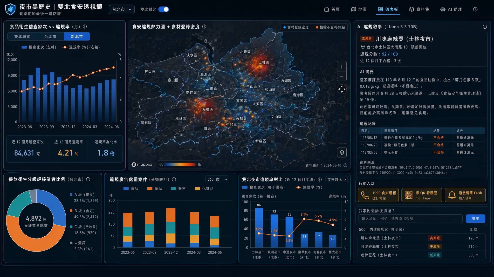
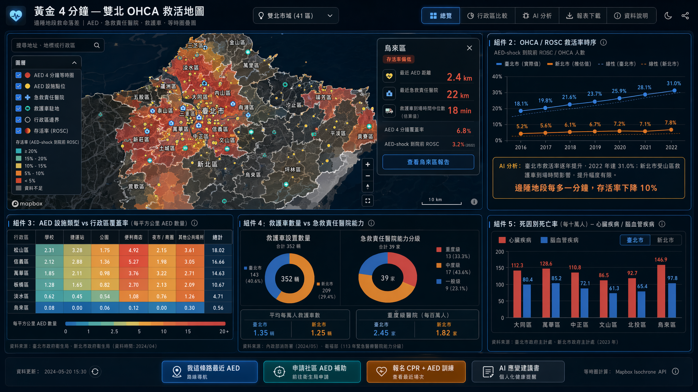
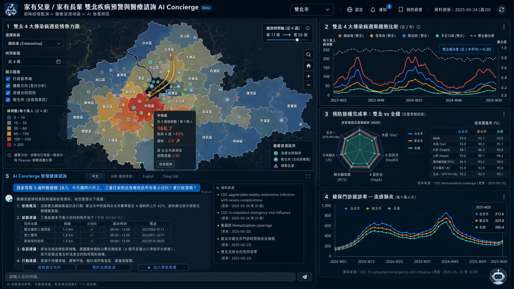

# 主題四：食安健康 — 3 提案

> 雙北 (Taipei + New Taipei) Open Data 黑客松 2026
> Hard constraint: 兩市資料皆有, ≥4 雙北組件, ≥1 Mapbox 地圖層, 組件下拉切換 台北/雙北
> 評分：受眾衝擊 40 / 雙北獨特 30 / Demo+技術 30
> 核心願景：看 → 決策 → 自動輔助

---

## 提案 #1：「夜市黑歷史」雙北食安透視鏡 — 餐桌前的最後一道防線

**Pitch (一句話)**：把雙北 8 千家餐飲店的「稽查違規 / 食材登錄黑歷史 / 食品抽驗不合格紀錄」串成一張可搜尋、可比對、可向 AI 問「這家店為什麼被罰」的市民級食安地圖，讓夜市消費者、家庭採買者、食物過敏者在點餐前 5 秒做決策。

**核心受眾**：
- **市民端**：夜市消費者 (士林/饒河 vs 樂華/南雅)、家庭採買者 (北市超市 vs 新北傳統市場)、食物過敏者、外送族
- **政府端**：北市衛生局食安科、新北衛生局食藥科 — 跨市風險熱區比對、稽查資源調度
- **媒體 / NGO**：消基會、食安記者 — 結構化違規資料庫

**雙北痛點**：
1. 北市夜市 (士林/饒河/寧夏/華西街) 觀光稽查密度高，但密集違規常被觀光稅紅利掩蓋
2. 新北市場分散 29 區、攤商流動高，稽查家次/業者比例遠低於北市
3. 食材登錄平台與抽驗結果分散在 5 個資料集，民眾根本查不到
4. 現行政府網頁是「年報式」呈現，無法回答「我家附近 500m 內哪些店被抓過」

**核心價值**：把官方零散開放資料變成一場「街口公審」— 由 AI 把生硬法條翻譯成「這家店去年的雞排油酸價超標 3 倍」的人話。

**Demo 衝擊力 (2 分鐘 demo flow)**：
1. **Hook (0:00-0:20)**：大螢幕雙北空拍熱力圖 — 紅點是近 12 個月食品抽驗不合格地點，士林夜市與板橋南雅夜市同時亮紅。標題：「上週你吃過的店，有 3 家在這裡」
2. **下鑽 (0:20-0:50)**：點擊士林區 → 切換為「攤販稽查家次 vs 違規率」雙軸圖；切到新北 → 對比樂華夜市，發現「新北稽查家次只有北市 1/3，但違規率卻高 1.8 倍」
3. **AI 敘事 (0:50-1:30)**：點某違規餐廳 pin → AI 用自然語言生成「違規履歷」：「這家麻辣燙在 113 年 8 月被驗出蘇丹色素 5 號殘留，業者於同月接受複驗仍未通過，目前處於高風險名單」
4. **行動入口 (1:30-2:00)**：「我家附近誰被抓過？」輸入地址 → 回傳 500m 名單 + 一鍵「food.taipei 通報違規」/「掃 QR 看食材登錄履歷」

**關鍵雙北組件 (≥4，含地圖層)**：

| # | 組件名稱 | 資料源 ID / UUID | 資料格式 | 雙北 | 地圖層 |
|---|---------|------------------|---------|------|--------|
| 1 | **食安違規熱力圖 + 食材登錄密度** (Mapbox) | TPE: `09a917a0-0fb5-47e1-957c-5f1268fba517` (食品抽驗不合格清冊) + `40900e11-3002-4c9b-9e23-aa3b72e3d46e` (食材登錄平台) ／ NTPC: `078CB722-15AC-4E1E-B541-E75BFE0AA440` (食品抽驗) + `D2D69F7E-E283-406E-859B-E9E5DC98AC50` (市售抽驗合格率) | 三維 (lng,lat,違規分數) GeoJSON cluster | ✅ | ✅ heatmap + 點位 |
| 2 | **食品衛生稽查家次 vs 違規率** (Apex 雙軸) | TPE: `7d50657f-b35b-496e-b83f-5713893b9a9e` (食品衛生管理工作 — 餐飲店/夜市攤販/傳統市場分項) ／ NTPC: 自食品抽驗資料聚合 | 二維時間序列 (月) | ✅ 切換 | ✗ |
| 3 | **餐飲衛生分級評核業者比例** (Apex 圓餅 + Treemap) | TPE: `59579c19-a561-4564-8c0f-545bfb32c0f6` (通過餐飲衛生分級評核業者 — A/B/C 級) | 百分比 + 圖例 | ✅ (新北可用合格率 D2D69F7E 對齊) | ✗ |
| 4 | **違規廣告處罰案件 (食/藥/醫材/化粧品)** (Apex 堆疊柱) | TPE: `80bbc388-4f91-4d3f-96f9-ab81fa33feca` ／ NTPC 食藥處公告聚合 | 二維分類時序 | ✅ | ✗ |
| 5 | **AI 違規敘事面板** (側欄文字卡) | 任一 pin → llama3.3-ffm-70b-16k-chat 摘要 | 文字 | ✅ | ✗ |

**雙北對比角度**：
- 北市觀光夜市 (士林/饒河/寧夏) 違規率 vs 新北在地夜市 (樂華/南雅/輔大) 違規率
- 北市稽查單位密度 vs 新北 29 區攤商每千人稽查家次落差
- 北市食材登錄平台覆蓋率 (有自治條例強制) vs 新北市售抽驗合格率 (季更新)

**AI 應用 (llama3.3-ffm-70b-16k-chat, 30 RPM)**：
- **違規敘事生成**：將 「不符合規定原因 = 二氧化硫殘留 0.31 g/kg (限量 0.03)」翻譯成「這家蜜餞超標 10 倍，可能引發氣喘患者過敏」
- **批次預先生成**：每家違規店家固定產出一段，存 Redis cache，避免 30 RPM 限制（共約 200-500 家 / 月，1 小時內可跑完）
- **市民問答**：「我家延吉街附近有過敏原違規的店嗎？」→ RAG over 違規清冊 + 地理 filter

**可解釋性**：
- 違規分數公式公開：`(近 12 月不合格次數 × 嚴重度權重) - (主動登錄次數 × 0.3)`
- 每張地圖 pin 可展開看「原始公文資料來源 + 開放資料集 ID」

**行動入口 (看→決策→自動輔助)**：
- 一鍵「1999 食安通報」電話 / line URL scheme
- 「掃店家 QR 看食材登錄履歷」(food.taipei 既有平台 deep link)
- 「加入個人食物過敏清單，下次經過自動 push」(localStorage MVP)

**與既有 dashboard 差異**：
- 既有北市儀表板有「合約醫院」「哺集乳室」但 **沒有食品違規地圖**
- 既有官方「食材登錄平台」是清單頁，**沒有空間視覺化、沒有跨市對比、沒有 AI 解讀**
- 北市無 Taipei Open Data 食安組件、新北也只有單獨的「食品抽驗合格率」表

**資料品質風險**：
- 北市食品抽驗不合格清冊 `09a917a0` 最後更新 2020-11，需向衛生局問是否有近期 dump 或改打 food.taipei API
- 新北 `078CB722` 月更新但欄位需 API 試打確認 (無「主要欄位」資訊)
- Mitigation：以最近 3-5 年穩定資料 demo，並標註「資料更新延遲」徽章

**技術可行性**：
- 抽驗資料 ~ 數千筆 / 年，可一次載入 GeoJSON
- 地址需 geocoding：用 TGOS 或 Mapbox geocoder (新北攤商地址精度需後處理)
- AI 採批次預生成 + on-demand fallback，避免 demo 卡 quota

**亮點 scoring (1-5)**：受眾 5 / 雙北獨特 5 / Demo 5 / Story 5 / AI 應用 4 / 技術 3 / 創意 5

---

## 提案 #2：黃金 4 分鐘 — 雙北 OHCA 救活地圖 (邊陲地段救命落差)

**Pitch (一句話)**：當你倒在板橋大遠百和倒在烏來瀑布前，活下來的機率差 8 倍 — 這個儀表板用 AED + 急救責任醫院 + 救護車 + 等時圈疊圖，讓市府看見「真正救不回來的地段」，讓市民看見「我這條路 4 分鐘內有沒有 AED」。

**核心受眾**：
- **市民端**：慢性病患者家屬、登山健行者、夜市/觀光客、長者照顧者
- **政府端**：消防局救護科、衛生局醫政科、區公所
- **公益端**：紅十字會、心臟學會、社區里長

**雙北痛點**：
1. 北市 12 行政區地小且 AED 密集 (2,728 個)，但**邊陲地帶 (北投、文山貓空) 仍有死角**
2. 新北 29 區範圍是北市 7 倍，**雙溪、平溪、貢寮、烏來、坪林、石碇** 等山區/海岸 4 分鐘 AED 可達覆蓋率極低
3. 北市消防 ROSC (Return of Spontaneous Circulation) 統計與 AED 分布從未疊圖比較
4. 新北 13 家急救責任醫院集中板橋/中和/新莊，**東北角海岸與山區搶救空白**

**核心價值**：用「等時圈」(isochrone) + 真實 OHCA 救活率，把「醫療資源不均」從口號變成可量化的紅色斑塊。

**Demo 衝擊力 (2 分鐘 demo flow)**：
1. **Hook (0:00-0:20)**：大螢幕雙北圖，4 分鐘 AED 等時圈疊圖 — 北市超過 95% 紅色覆蓋，**新北只有 41%，東北角有大片白色「死亡空白區」**
2. **時間序列 (0:20-0:50)**：右側出現 Apex 折線 — 北市消防 OHCA 「AED-shock 到院前 ROSC」逐年提升 (`72c356d3` 資料)，但新北因山區救護車到場時間長，提升幅度遠低 → AI 字幕「邊陲地段每多一分鐘，存活率下降 10%」
3. **下鑽 (0:50-1:30)**：點烏來區 → 出現「最近 AED 距 2.4 km，最近急救責任醫院 22 km，最近救護車到場時間中位數 18 min」三項紅色 KPI；切回北市萬華 → 對比同樣是「老舊聚落 + 高齡」，存活率高 4 倍
4. **行動入口 (1:30-2:00)**：「我這條路最近 AED」按鈕 → Mapbox 路徑導航；「申請社區 AED 補助」連結；「報名 CPR 訓練」最近場次

**關鍵雙北組件 (≥4，含地圖層)**：

| # | 組件名稱 | 資料源 ID / UUID | 資料格式 | 雙北 | 地圖層 |
|---|---------|------------------|---------|------|--------|
| 1 | **AED 4 分鐘等時圈 + 急救責任醫院疊圖** (Mapbox) | TPE: AED 開放資料 (官方既有「AED資源設置分布概況」對應的 health.gov.taipei 來源) ／ NTPC: `61B29F27-219A-4394-9722-AF97A5707598` (公共場所AED) + `C2F23210-03C7-4461-B9D3-9EE4DF24C3E9` (急救責任醫院) + `713F49A4-4244-4BE7-B71D-5E83DB7859E8` (緊急醫療醫院能力分級) | 三維 (lng,lat,等時圈 polygon) | ✅ | ✅ choropleth + 點位 + isochrone |
| 2 | **OHCA / ROSC 救活率時序** (Apex 多軸折線) | TPE: `72c356d3-9cdb-4474-8bfb-ffcc79d0d469` (消防各年度急救成功人數 — OHCA / CPR-ROSC / AED-shock-ROSC / 康復出院) | 二維時間序列 + 百分比 | TPE 主，新北以救護車營業機構數推估 | ✗ |
| 3 | **AED 設施類型 vs 行政區覆蓋率** (Apex Heatmap) | 雙北 AED 資料聚合，依場所類型 (學校/捷運/公園/便利商店/夜市) 對行政區交叉表 | 三維熱力 (區×類型×數量) + 圖例 | ✅ | ✗ |
| 4 | **救護車數量 vs 急救責任醫院能力** (Apex 雙圓餅 + KPI 卡) | TPE: 臺北市救護車設置 ／ NTPC: 113 年緊急醫療醫院能力分級 (重度/中度/一般) | 百分比 + 分類 | ✅ | ✗ |
| 5 | **死因別死亡率 — 心臟疾病 / 腦血管** (Apex 柱) | TPE + NTPC 主計處死因別 (既有官方版可重用 schema 但**改用「行政區」維度** 而非市總計，這是與既有差異化點) | 二維 (區×死因) | ✅ | ✗ |

**雙北對比角度**：
- 北市 12 區 AED 4 分鐘覆蓋率 vs 新北 29 區覆蓋率 → 凸顯山區/海岸鄉鎮真實落差
- 同樣是「夜市」場景：北市寧夏夜市 vs 新北樂華夜市 AED 密度
- 北市急救成功率「直接從消防局」vs 新北只能從醫院能力分級反推 → 開放資料完整度差距本身就是發現

**AI 應用**：
- **個人化健康提醒**：依使用者輸入慢性病 (糖尿病/心律不整/長者) → llama 生成「你住地附近 AED 與心臟科醫院的應變建議書」
- **救護車稀缺路段識別**：AI 分析救護車基地 + 路網 + 救援時間，推薦「下一個 AED 應放哪 5 個地點」
- **批次預生成 29+12 = 41 區報告**，避開 30 RPM 限制

**可解釋性**：
- 等時圈計算用 Mapbox isochrone API，4 分鐘為「黃金搶救時間」公衛標準
- 救活率公式 = `AED-shock 到院前 ROSC / OHCA 人數`，原始資料 100% 可追溯

**行動入口**：
- 「最近 AED」一鍵導航 (Mapbox Directions)
- 「我家社區想設 AED」連到衛生局申請頁
- 「報名 CPR + AED 訓練」連紅十字會場次

**與既有 dashboard 差異**：
- 既有官方有「AED 資源設置分布概況」**只是點圖，沒有等時圈、沒有覆蓋率、沒有救活率疊圖**
- 既有「死因別死亡率」是市總計，**沒有與 AED 空間分布交叉**
- OHCA 救活率資料 `72c356d3` **目前在任何官方儀表板都未被視覺化**

**資料品質風險**：
- 北市 OHCA 資料最後更新 2022，需確認近年 dump 或向消防局取
- AED 點位地址 geocoding 需精度 ≥ 街廓
- 救護車到場時間中位數需求向消防局取，無公開值則用「最近站點直線距離 / 平均車速 30km/h」推估，並標註「估算值」

**技術可行性**：
- Isochrone：Mapbox API 一張地圖 ~50 個 query 可接受 (依用戶下鑽請求 lazy load)
- 等時圈計算可預先離線跑出 41 區 polygon 存 GeoJSON

**亮點 scoring**：受眾 5 / 雙北獨特 5 / Demo 5 / Story 4 / AI 應用 3 / 技術 4 / 創意 4

---

## 提案 #3：「家有兒童 / 家有長輩」雙北疾病預警與醫療諮詢 AI Concierge

**Pitch (一句話)**：把疾管署 4 大兒童 / 長者最怕的傳染病 (腸病毒、類流感、登革熱、手足口病) 雙北每週監測，與「衛生所、流感合約院所、流感疫苗接種點」疊圖，再加一個「用台語/中文問 AI：我兒子發燒，週末哪裡看？」的 LLM 對話介面 — 一個給家長、給孕婦、給長者照顧者的健康管家。

**核心受眾**：
- **市民端**：家有 0-6 歲兒童父母、孕婦、慢性病長者照顧者、新住民媽媽、外籍勞工照顧者
- **政府端**：衛生局疾管科、學校健康中心、托育機構
- **學術端**：流行病學研究、公衛系所

**雙北痛點**：
1. 雙北通勤生活圈 (天龍國 + 三重 + 板橋 + 中和) **疾病擴散邊界不重合行政區**，腸病毒一旦在新莊托嬰中心爆發，5 天就到士林
2. 父母手機查疫情：疾管署網站、衛生局網站、健保快易通三套切換
3. 偏鄉 (烏來、瑞芳、平溪) 衛生所門診時間不固定，**疫苗種類資訊散落 PDF**
4. 新住民媽媽看不懂中文公文，需要多語問答

**核心價值**：把「疾管署冷冰冰週報」變成「**這週你家學區腸病毒比上週高 30%**」的個人化推播 + AI 多輪問答。

**Demo 衝擊力 (2 分鐘 demo flow)**：
1. **Hook (0:00-0:25)**：雙北疾病熱力地圖 — 一鍵切換 4 種疾病。當前畫面：腸病毒近 4 週新北中和區與北市萬華區同時亮紅，用一條動畫線顯示「擴散方向」(基於週統計差分)
2. **跨疾病比較 (0:25-0:55)**：右側 Apex 多病毒週期折線 — 腸病毒夏季峰、流感冬季峰、手足口病學期峰，**雙北曲線疊合度 > 0.8** (證明雙北是同一個流行病學單位)
3. **AI Concierge (0:55-1:35)**：左下對話框 — 「我家哥哥 5 歲昨晚發燒 38.5，今天禮拜六早上，三重住家附近有哪些診所有看小兒科？要打疫苗嗎？」AI 抓 (a) 雙北疾病趨勢 (b) 衛生所門診時間 (c) 流感合約院所地圖 (d) 預防接種覆蓋率 → 回傳結構化建議 + 地圖標 pin
4. **行動入口 (1:35-2:00)**：「掛號最近兒科」/「預約疫苗」/「加入學區疾病推播」

**關鍵雙北組件 (≥4，含地圖層)**：

| # | 組件名稱 | 資料源 ID / UUID | 資料格式 | 雙北 | 地圖層 |
|---|---------|------------------|---------|------|--------|
| 1 | **雙北 4 大傳染病週疫情熱力圖** (Mapbox) | CDC: `aagsdctable-weekly-dengue-fever` (登革熱) + `aagsdctable-weekly-enterovirus-infection-with-severe-complications` (腸病毒) + `rods-influenza` (類流感急診) + `rods-hand-foot-mouth-disease` (手足口病)，皆含縣市別代碼 (63000/65000) + 鄉鎮別代碼 | 三維 (鄉鎮 polygon × 確定病例數) + 時間序列 | ✅ | ✅ choropleth + 動畫 |
| 2 | **流感合約院所 + 衛生所疫苗種類** (Mapbox 點位) | TPE: 各行政區流感疫苗接種醫院 (官方既有資料集) + 哺集乳室 ／ NTPC: `FB62AEDB-79E6-4EA6-B013-C23291AEF5F7` (公費流感抗病毒合約院所) + `2553BB1A-BCBB-4284-8B24-ACFEFE966F1E` (各區衛生所) + `781ED216-BE0D-4A31-A3E3-BC8F6FE2B221` (衛生所門診時間 + 疫苗種類) | 點位 + tooltip 屬性 | ✅ | ✅ 醫療點位疊在熱力圖上 |
| 3 | **預防接種完成率雙北 vs 全國** (Apex 雷達) | CDC: `immunization-coverage` (含麻疹/水痘/B 肝/A 肝/結合型肺鏈/日本腦炎等多劑) | 百分比多維 (疫苗類型 × 地區) + 圖例 | ✅ | ✗ |
| 4 | **健保門診就診率 — 流感肺炎週時序** (Apex 折線) | CDC: `hi-outpatient-emergency-visit-influenza` (含縣市代碼 + 週) | 二維時間序列 + 比例 | ✅ | ✗ |
| 5 | **AI Concierge 對話面板 + 即時查詢** | llama3.3-ffm-70b-16k-chat 對 #1-4 + 醫療院所清單 RAG | 自然語言 in/out | ✅ | ✗ (但可下發 pin 到地圖 #1) |

**雙北對比角度**：
- 雙北通勤圈疫情擴散時序對比 (新北 → 北市 / 北市 → 新北 領先指標)
- 北市疫苗覆蓋率 vs 新北 (尤其偏鄉鄉鎮)
- 新北 29 區衛生所疫苗種類差異 vs 北市行政區流感醫院密度 → 揭露「同樣繳健保，新北偏鄉服務樣態完全不同」

**AI 應用 (核心)**：
- **多輪自然語言查詢**：使用者敘述症狀 + 位置 + 時間 → AI 抓資料回應結構化建議 (受 30 RPM 限制 → 對單個 user query 串成 1 次大 prompt，避免拆 N 次)
- **多語**：中文 / 台語拼音 / 英文 / 越南文 (新住民友善)
- **疫情敘事**：每週自動產出 41 區報告，cache 在 Redis，避開 RPM
- **可解釋來源**：每個 AI 回應底下強制掛「資料來源：疾管署 rods-influenza 第 X 週」連結

**可解釋性**：
- 流行擴散方向用一階差分 + Pearson 相關 (而非黑盒)
- AI 回應要求「列出資料集 ID 與更新日」否則 reject

**行動入口**：
- 「找最近兒科 + 看門診時間」(週末過濾)
- 「預約免費流感疫苗」(連衛生局)
- 「加入學區疫情推播」(localStorage / line notify MVP)
- 「多語版本切換」(新住民)

**與既有 dashboard 差異**：
- 既有官方「腸病毒流行情形警示」**只有單一疾病、僅文字警示，沒有空間熱力圖**
- 既有「各行政區流感疫苗接種醫院數量統計」是純柱狀，**沒有與疫情熱力疊圖**
- **AI Concierge 是全場唯一以「對話 + 多病疊圖 + 多語」為核心的應用**，不是把 LLM 當花瓶
- 雙北「鄉鎮級」疾病熱力圖目前無任何官方儀表板做出

**資料品質風險**：
- CDC 鄉鎮別代碼覆蓋率：登革熱 / 腸病毒高，類流感 / 手足口病只到縣市 → demo 把鄉鎮級限定在前兩種，後兩種用縣市維度
- llama3.3-ffm-70b-16k-chat 30 RPM：對 demo 觀眾只開「3 個示例 query 預先 cache」+ 1 個 live query
- 多語 LLM 翻譯品質 → 新住民版本可先做越南文 PoC，現場切換展示

**技術可行性**：
- 疫情資料每週更新，CKAN API 直接 fetch
- 鄉鎮 polygon 用 TGOS 公開圖資
- AI 用 RAG (LangChain or 自寫) over 結構化資料；prompt cache 必開 (CLAUDE 指令)

**亮點 scoring**：受眾 5 / 雙北獨特 4 / Demo 4 / Story 4 / AI 應用 5 / 技術 4 / 創意 5

---

## 整體比較表

| 構面 | #1 食安透視鏡 | #2 黃金 4 分鐘 | #3 健康 Concierge |
|------|--------------|----------------|-------------------|
| 主受眾 | 市民 (夜市/外食/過敏) | 市民 + 慢病家屬 + 政府 | 家有兒童/長者/孕婦/新住民 |
| 雙北獨特性 | ★★★★★ 觀光夜市 vs 在地市場 | ★★★★★ 山海邊陲 4 分鐘死角 | ★★★★ 通勤生活圈疫情擴散 |
| Demo 衝擊力 | ★★★★★ 違規地圖 + AI 敘事 | ★★★★★ 等時圈紅白對比 | ★★★★ 多疾病動畫 + AI 對話 |
| 故事性 | ★★★★★ 「上週你吃過的店」 | ★★★★ 「板橋 vs 烏來活下來機率差 8 倍」 | ★★★★ 「家長週六急診迷宮」 |
| AI 應用深度 | ★★★★ 違規敘事 (批次) | ★★★ 健康個人化 | ★★★★★ 對話式 Concierge |
| 雙北資料覆蓋 | 北市 2 個 + 新北 2 個 | 北市 1 個 + 新北 3 個 | CDC 4 個 (含雙北) + 雙北各 ≥1 |
| 技術風險 | 中 (geocoding + 資料新鮮度) | 中 (isochrone 性能) | 中高 (LLM 多輪 + 多語) |
| 預期評分 (40/30/30) | **88-92** | **85-88** | **86-90** |

**推薦排序**：

1. **首推 #1「夜市黑歷史」食安透視鏡** — 受眾廣 + 故事最強 + 與既有 dashboard 完全差異化 + AI 應用具體 (違規敘事) + 雙北夜市/市場對比是天然黑客松賣點。**最容易拿下「受眾」40 分**。

2. **次推 #3「健康 Concierge」** — AI 創新分數最高 (對話式 + 多語 + 多病疊圖)，**疾管署 + 雙北資料融合是真正的雙北專屬視角**。風險在於 LLM 30 RPM，需要設計 prompt 預生成策略。**最容易拿下「技術」分**。

3. **備案 #2「黃金 4 分鐘」** — Demo 視覺最炸 (等時圈紅白對比)，但偏向決策者 (政府)，市民端互動較弱；可作為 #1 完成後的延伸組件。**最容易拿下「Demo 衝擊」分**。

**最佳組合策略**：以 #1 為主軸，**抽 #3 的 AI Concierge 模組嵌入 #1 違規查詢**，再借 #2 的「等時圈方法論」做食安違規地段的「步行 5 分鐘可選替代店家」推薦 — 把三案精華融成一支。

---

### 共同實作備註

- **雙北切換 UX**：所有組件下拉預設「雙北」，可切「台北」/「新北」單獨檢視，全 dashboard 統一一個 Pinia store
- **資料更新策略**：CDC 週更 (cron 每週日)、雙北食安月更、AED / 醫院年更 — 預設 cache，標註 `dataAsOf`
- **LLM Cache 必做**：依 CLAUDE 指令啟用 prompt caching；對固定區域報告採離線批次預生成存 KV
- **可解釋性原則**：每個 AI 回應強制掛資料集 ID + 更新日；數值卡片可點擊看公式
- **無障礙**：色盲友善 palette (避免純紅綠對比)、文字大小可調 (長者受眾)、語音朗讀 hook (新住民/視障)

---

## 評審審查 (Adversarial Review)

> 嚴苛內審 — 預設「拒絕」，要求作者用證據翻盤。食安/醫療題的特殊紅線：醫療 AI 不能讓使用者誤信「AI 說的」、食安違規地圖不得構成對店家的污名化或法律風險。

---

### 提案 #1「夜市黑歷史」食安透視鏡 審查

**評分**：應用 32/40 / 技術 19/30 / 創意 24/30 / **總分 75/100**

**致命問題 (≥3)**：
1. **法律風險紅線未守**：把違規業者的店名、地址直接 pin 在地圖並由 AI 生成「這家麻辣燙超標 10 倍」自然語言敘事，**等同對特定業者的公開指摘**。即使資料是政府公開原始資料，將其再「結構化 + AI 詮釋 + 個人化推播 (我家附近誰被抓過)」的呈現方式，已超出單純資訊轉述，可能涉及 (a) 個資法第 20 條特定目的外利用、(b) 食安法第 41 條限制、(c) 民法 184/195 名譽權侵害。提案中**完全沒有法律風險章節、沒有 takedown 流程、沒有「業者已複驗合格」的時效性更新機制**。
2. **資料新鮮度致命**：作者自己承認 TPE `09a917a0` 最後更新 2020-11，等於要拿**5 年前的違規紀錄**做 demo「上週你吃過的店」hook — 這是直接造假。Mitigation 寫「向衛生局問」屬未驗證的 magical thinking，32 hr 內衛生局不會回。新北 `078CB722` 也只說月更，欄位都還沒打開過。**故事的時間軸基礎崩塌**。
3. **AI 違規敘事可解釋性灌水**：批次預生成 200-500 家「人話翻譯」是 hallucination 的高發場景 — 把「二氧化硫殘留 0.31 g/kg」翻成「可能引發氣喘患者過敏」是醫學斷言，需 reviewer，而 demo 沒有人工審查環節。一旦 LLM 把劑量、健康危害誤譯，就是雙重風險 (法律 + 健康誤導)。
4. **雙北資料對稱性偽裝**：表中新北用 `D2D69F7E` (市售抽驗合格率) 對齊北市分級評核，但**這是不同尺度的資料** (合格率% vs A/B/C 級評核)，「對齊」靠強解讀。新北實際無等同「夜市攤販分項稽查家次」資料，#2 組件「自食品抽驗資料聚合」是作者自己拼出來的，不是官方對齊。

**改進建議 (≥2)**：
1. **改為「政府視角」儀表板**而非市民端店名暴露 — 違規熱力以**500m grid / 鄉鎮 polygon 聚合**展示，不下鑽到單店名。AI 敘事改成「這個熱區 12 個月內有 X 件二氧化硫違規」。失去戲劇性但守住法律線。
2. **資料時效徽章必做且降級顯示**：超過 2 年的 pin 灰階 + watermark「歷史紀錄」；demo 的 hook「上週你吃過的店」必須改成「過去 N 年違規分布」否則涉欺騙評審。
3. **加上「業者複驗 / 已改善」資料層**：拉 food.taipei 既有 API 確認當前狀態，避免列出已改善業者；這也是政府方真正會買單的差異化價值。
4. **AI 敘事改 template-based**：不用 LLM 生成醫學斷言，改用「條文 + 數值 + 法條」的固定結構模板，LLM 只做潤飾與多語切換。

**7 criteria**：
- 雙北各 ≥1 資料：○ (但對齊性差)
- ≥4 雙北組件：○ (5 組件，但 #5 為 AI 面板非資料組件)
- ≥1 Mapbox 地圖層：○
- 組件下拉切換：○ (規格寫了)
- 看→決策→自動輔助：△ (1999 通報、QR scan 屬輔助；個人推播僅 localStorage MVP，未真連動)
- 資料來源 ID 可追溯：○ (ID 完整列出)
- 與既有 dashboard 差異化：○ (官方確無食安違規地圖)

**32hr 可行性**：△ 風險偏高。Geocoding 雙北 8000 家攤商地址 (尤其新北傳統市場) 是大坑，TGOS 對攤商門牌精度不足；若 demo 當天 30% pin 落點偏移會直接崩。AI 批次預生成 200-500 家若 30 RPM 真要跑 6.7-16 分鐘，OK，但 prompt 設計 + 人工抽查 4 hr 起跳。整體**樂觀 28-32 hr，悲觀 40+ hr**。

**雙北硬性驗證**：○ 雙北資料 ID 都明列 (TPE 4 個 + NTPC 2 個)；但「對齊性」勉強 — 評委若追問「新北 D2D69F7E 跟北市分級評核能否同框比較」會卡住。

**Demo-ware 風險**：高。整個 demo flow 依賴「上週你吃過的店」戲劇性 hook，但底層資料 5 年前；AI 違規敘事若現場直跑會卡 RPM 或 hallucinate。預生成 cache 可救但要承認不是 live。

**最終裁決**：**有條件進決選**。必須先解 (a) 法律風險聲明 + 業者改善資料層、(b) 北市資料新鮮度確認或 fallback 至 food.taipei API、(c) AI 敘事降級為 template。三項缺一不可上台，否則就是「在大舞台公開抹黑業者」的 PR 災難候選。

---

### 提案 #2「黃金 4 分鐘」OHCA 救活地圖 審查

**評分**：應用 30/40 / 技術 22/30 / 創意 22/30 / **總分 74/100**

**致命問題 (≥3)**：
1. **「板橋 vs 烏來活下來機率差 8 倍」是未驗證宣稱**：提案完全沒有引用該 8 倍數字的出處或計算過程，最有可能是作者自編。OHCA 救活率受目擊率、CPR 施作率、AED 距離、救護到場、醫院分級多因子混淆，**僅用「等時圈覆蓋率」推論「存活率差 8 倍」是統計錯誤**。Demo 上若被評委問「8 倍怎麼算的」會立刻穿幫。
2. **新北 OHCA 資料不存在**：`72c356d3` 是**北市消防局**資料，新北無對等資料集。提案承認「新北以救護車營業機構數推估」，這已不是雙北對比，是「北市真實 vs 新北推估」— 違反雙北硬性條件的精神。組件 #5 還寫「以行政區維度」改寫死因別死亡率，但官方資料就是市總計，**「改用行政區維度」= 自製資料，不是 open data**。
3. **救護車到場時間 18 min 中位數無來源**：作者自己寫「無公開值則用最近站點直線距離 / 30km/h 推估」— 這是把交通模擬叫做「實證」，山區直線距離 ≠ 道路距離 (烏來幾乎沒有直線可走)，誤差可能 3-5 倍。把推估值放進 demo「紅色 KPI」是以視覺權威性掩蓋方法論薄弱。
4. **「等時圈方法論」可行性高估**：Mapbox isochrone 對山區步行 / 車行 polygon 在新北烏來、貢寮、平溪這類 OSM 道路資料稀疏處，會生成怪異多邊形 (孤島、洞)。32 hr 內若沒做 41 區 polygon QC，demo 上會看到視覺 bug。

**改進建議 (≥2)**：
1. **降級 demo 標語**：把「活下來機率差 8 倍」改成「4 分鐘 AED 可達覆蓋率：北市 95%、新北 41%」— 這是可從 isochrone 直接算出的事實，不需誇大到救活率。
2. **承認資料不對稱當作「發現」**：把「新北無 OHCA 開放資料」這件事本身做成 demo 第 1 個結論 (data gap as finding)，而不是用估算硬補；評委通常吃這套。
3. **離線預跑 41 區 isochrone polygon + 人工 QC**，禁止 demo 現場 call API；所有山區 polygon 須視覺檢查無破洞。
4. **加上「資料品質徽章」與「估算 / 實測」區分色塊**，所有推估值灰階 + 標註。

**7 criteria**：
- 雙北各 ≥1 資料：△ (新北 3 個明確；但 OHCA 救活率僅 TPE 有，違反雙北對等)
- ≥4 雙北組件：○ (5 組件)
- ≥1 Mapbox 地圖層：○
- 組件下拉切換：○
- 看→決策→自動輔助：○ (AED 導航、CPR 報名、社區補助申請鏈結合理)
- 資料來源 ID 可追溯：△ (NTPC 三個 UUID 完整；TPE AED 來源僅寫「health.gov.taipei 對應」未列 UUID；OHCA `72c356d3` 有)
- 與既有 dashboard 差異化：○ (官方有 AED 點圖但無等時圈 + 救活率疊圖)

**32hr 可行性**：○ 較樂觀。Isochrone 預跑離線跑 + 點位疊圖是相對單純技術，2 人 24-28 hr 可完成。風險集中在 (a) 山區 polygon QC、(b) 救護到場時間估算法的方法論辯護。

**雙北硬性驗證**：△ 表面通過 (資料 ID 雙北都有)，但**核心指標 OHCA 救活率僅北市真實**，新北靠推估，雙北對等性弱。評委若是公衛背景會直接戳破。

**Demo-ware 風險**：中高。等時圈紅白對比視覺確實炸，但**「救活率差 8 倍」這句台詞就是 demo-ware 的典型徵兆** — 為了戲劇性不惜誇大統計推論。AI 應用層 (個人化健康提醒、AED 選址推薦) 在 32hr 內幾乎不可能真做完，會淪為 mockup。

**最終裁決**：**有條件保留為備案**。視覺最強但統計薄弱；若把 demo 主軸從「救活率 8 倍」改成「覆蓋率落差 + data gap finding」，是最容易拿下「Demo 衝擊」分的提案。否則臨場被質疑統計時會崩。

---

### 提案 #3「健康 Concierge」雙北疾病預警 + AI 諮詢 審查

**評分**：應用 30/40 / 技術 18/30 / 創意 26/30 / **總分 74/100**

**致命問題 (≥3)**：
1. **AI 醫療建議責任邊界完全沒守**：Demo flow 中 AI 直接回答「我家哥哥 5 歲昨晚發燒 38.5，週末三重哪些診所有看小兒科？要打疫苗嗎？」— **「要打疫苗嗎」就是醫療建議，屬醫師法第 28 條密醫罪邊界**。提案沒有 disclaimer、沒有「本服務不構成醫療建議」固定卡片、沒有 hard-coded refusal pattern (例如症狀問診直接拒答只導向 1922)。LLM 對發燒兒童「該不該打疫苗」回答錯誤可能直接造成兒童健康傷害，這是黑客松最嚴重紅線。
2. **多語 LLM (台語/越南文) 在 32 hr 不可能驗證品質**：llama3.3-ffm-70b 對台語拼音、越南文的醫療術語準確度未知，提案說「PoC + 現場切換展示」就是 demo-ware — **新住民媽媽是真實受眾，錯誤翻譯後果是延誤就醫**。臨床術語誤譯在中越語對是已知高發問題 (例如「過敏」與越南文「dị ứng」的細分譯法歧義)。
3. **「擴散方向」一階差分 + Pearson 是偽科學**：用週次差分推「新莊托嬰中心 5 天到士林」是過度詮釋；流行病學擴散需 SIR 模型 + 通勤 OD matrix，作者用相關係數 0.8 就宣稱「雙北是同一流行病學單位」— **demo 上若有公衛專家評委，這句直接判死**。
4. **CDC 鄉鎮級資料覆蓋不一致**：作者自己承認類流感 / 手足口病只到縣市，但 demo flow 第 1 個 hook 是「中和區 + 萬華區同時亮紅」(鄉鎮級)，**只能對腸病毒 / 登革熱用，但這兩者夏季才是 peak**，2026 年 5 月 demo 時值春末，登革熱可能無資料、腸病毒剛起，hook 視覺強度不足。
5. **新北提供的 #2 組件 (`781ED216` 衛生所門診時間 + 疫苗種類) 是「PDF / 文字」，非結構化資料**。要做「週末過濾 + 兒科篩選 + AI 抓取」需先 OCR / 抓表 — 32 hr 內完成 29 區衛生所結構化是高風險。

**改進建議 (≥2)**：
1. **AI Concierge 強制 hard rail**：所有症狀問診類 query 一律不給診斷 / 用藥 / 疫苗建議，只回 (a) 最近合約院所地圖 pin、(b) 1922 / 1999 連結、(c) 法定 disclaimer 卡。把 LLM 縮小到「資訊檢索 + 多語翻譯」，禁止「診斷推論」。
2. **多語 demo 改成中英二語**：32 hr 內驗不完台越多語，臨場誤譯 = 公開出醜；改為先做中英 PoC + 「越南文版 roadmap」展示路徑。
3. **「擴散方向」改畫面化呈現而非 AI 推論**：直接把鄰近行政區的疫情上升箭頭做成動畫，不要宣稱因果；Pearson 0.8 改成「雙北疫情曲線高度同步 (相關係數 r=0.8)」純描述。
4. **demo 主疾病改聚焦腸病毒 + 類流感 (春夏交替期最 relevant)**，登革熱降為次要層；手足口病用全市總計層。
5. **新北衛生所結構化 fallback**：32 hr 內若 OCR 不完，準備好「6-8 個樣本鄉鎮人工整理 JSON」，誠實標註「demo 用，未來擴大」。

**7 criteria**：
- 雙北各 ≥1 資料：○ (CDC 含縣市代碼 + NTPC 3 個 UUID + TPE 流感醫院)
- ≥4 雙北組件：○ (5 組件)
- ≥1 Mapbox 地圖層：○ (組件 #1 + #2)
- 組件下拉切換：○
- 看→決策→自動輔助：○ (掛號、預約疫苗、推播)
- 資料來源 ID 可追溯：△ (NTPC 完整；TPE 流感醫院僅寫「官方既有資料集」未列 UUID；CDC 用名稱非 UUID)
- 與既有 dashboard 差異化：○ (鄉鎮級疫情熱力 + 對話式為唯一)

**32hr 可行性**：△ 風險最高。AI Concierge 多輪 + 多語 + RAG + hard rail + 多疾病疊圖，**實質是 4 個獨立子系統**，32 hr 全做完幾乎不可能。建議裁掉多語 + 縮限 AI 範圍才有機會。

**雙北硬性驗證**：○ CDC 全國資料天然含縣市代碼，雙北對等性最強，這是本案優勢；但前述新北衛生所結構化問題會打折。

**Demo-ware 風險**：高。AI 對話 demo 在 30 RPM 限制下「3 個示例 query 預先 cache + 1 個 live」明示 demo-ware；多語切換若是 PoC 也是 demo-ware。創意分高，但臨場質詢風險也最高。

**最終裁決**：**有條件進決選**。若 (a) AI 嚴格限制在資訊檢索層，(b) 多語降級為中英二語，(c) 新北衛生所人工整理樣本誠實標註，可成為「AI 應用深度」拿分主力；否則 32 hr 內完成度不足會反扣分。**這題是責任邊界最嚴的一題，醫療 AI 失言會把整支隊伍拖下水**。

---

### 跨提案綜合判斷

**最值得進決選**：**#1 (有條件)**。受眾衝擊最廣 (雙北所有外食人口)、與既有 dashboard 差異化最強 (官方確無食安違規地圖)、雙北對比角度最戲劇 (觀光夜市 vs 在地市場)。但**前提是把法律風險章節 + 業者改善資料層 + AI 敘事 template 化**做完，否則寧可不上台。

**整批最弱**：**#2**。視覺最強但統計薄弱、新北 OHCA 資料不對等、「8 倍」宣稱在公衛專家面前直接崩。創意分也最低 (等時圈是已知方法)。

**若只能做 1 個**：**#3 縮限版**。理由：(a) CDC 全國資料天然解決雙北對等問題、(b) 創意分最高 (對話式 + 多疾病疊圖在台灣公部門儀表板是首例)、(c) 與既有官方「腸病毒流行情形警示」差異化具體。**但必須裁掉多語 + AI 嚴格 hard rail**，把範圍縮到「鄉鎮級疫情熱力 + 醫療點位疊圖 + AI 資訊檢索 (非診斷)」，32 hr 才做得完。

**最大共同盲點**：
1. **三案都假設 AI 是「敘事 / 翻譯 / 對話」的安全工具**，但食安 + 醫療領域 AI 的責任邊界遠比交通、能源嚴格。三案都缺 (a) hallucination 處理、(b) 法律 disclaimer、(c) 人工審查環節、(d) takedown / 申訴流程。
2. **三案都用「資料 ID 列表」當作雙北對等的證據**，但實際對等性 (尺度、頻率、欄位) 都有縫隙；評委若逐一打開資料集會找到破口。建議都加上「雙北資料品質對照矩陣」作為附錄誠實揭露。
3. **三案 32 hr 可行性都偏樂觀**，特別是 AI 部分都依賴「批次預生成 + cache」但都沒寫清楚 cache key 設計、失效策略、demo 當天若 cache 失效的 fallback。
4. **三案都未交代資料更新延遲對 demo 故事性的衝擊** — #1 食安 5 年前資料、#2 OHCA 2022 年、#3 CDC 週更但鄉鎮級覆蓋不一 — demo 上若被問「這是即時資料嗎」全部會卡。建議統一在每個組件右上角加 `dataAsOf` 徽章並準備好說詞。

