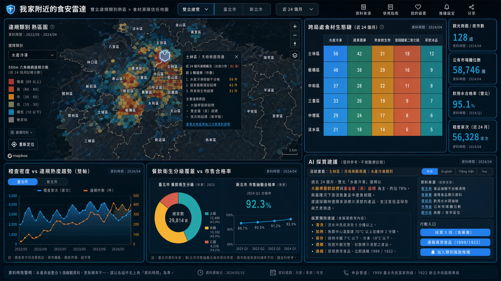
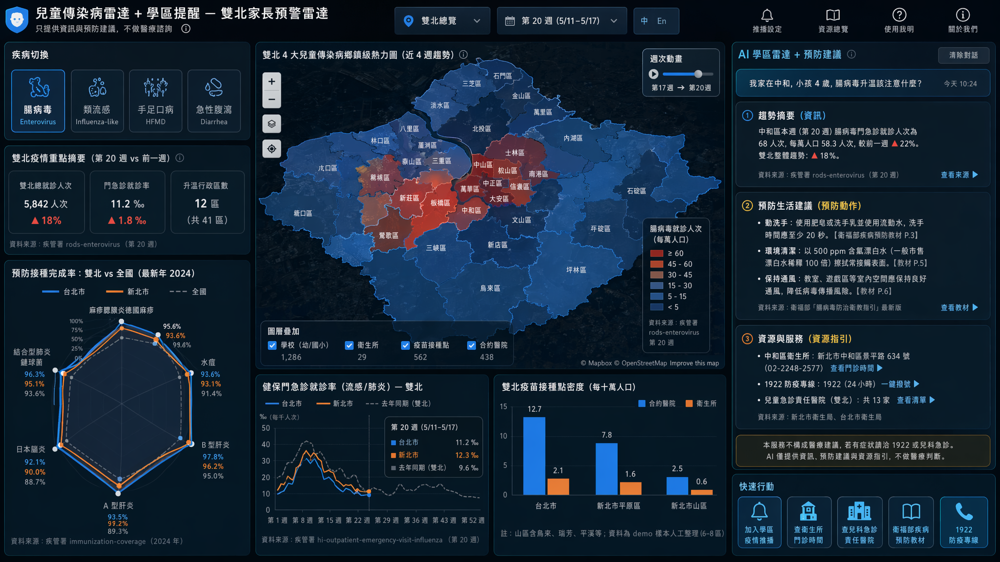
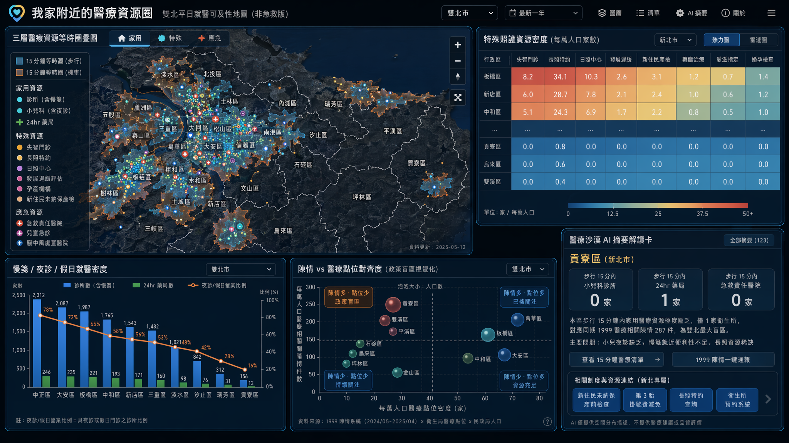

# 主題四：食安健康 — v2 提案 (3 案)

> 對 v1 critique 後重構 | 大眾受眾 + 跨資料整合 + 不釘店 / 不醫療諮詢
> 雙北 (Taipei + New Taipei) Open Data 黑客松 2026
> Hard constraint: 兩市資料皆有, ≥4 雙北組件, ≥1 Mapbox 地圖層, 組件下拉切換 台北/雙北
> 評分：受眾衝擊 40 / 雙北獨特 30 / Demo+技術 30
> v2 三大紅線: (1) 不釘特定店家 (僅顯示類別/熱區/趨勢); (2) 不做醫療諮詢 (僅資訊+預防+資源指引); (3) 必須跨局處資料整合 ≥3 個來源

---

## 提案 #1：「我家附近的食安雷達」— 雙北違規類別熱區 × 食材源頭信任地圖

**Pitch (一句話)**：把雙北食安拆成「我家門口買得到的東西」— 用 500m 格網 / 行政區彙總顯示「這區近 24 個月最常違規的是哪 3 類食品」(熟食調味料 / 蔬果農藥 / 水產冷凍 / 蜜餞糖果...), 疊上飲用水/泳池水質與市場稽查密度, 讓家庭採買者在出門前 10 秒看懂「今天去這個市場 / 商圈買菜要小心什麼」, 完全不出現任何單一店名。

**核心受眾 (Persona)**：
- **主受眾 (大眾)**: 家庭採買者 (週間菜市場 / 週末好市多家樂福)、雙薪父母線上訂便當族、長者買傳統市場、外食族 — **雙北超過 600 萬日常採買人口**
- **次受眾**: 食物過敏家庭、孕婦、新住民媽媽 (中越泰菜常用食材抽驗熱點)
- **政府盲點**: 衛生局食安科稽查資源調度、市場處攤位輪稽優先級、消保處跨局處整合

**v1 對照**：**由 v1 #1 食安透視鏡重構**, 修了 4 個 critique 致命問題:
1. **不再釘特定店家** → 違規 pin 改 500m hex grid 與「鄉鎮+類別」聚合, 點擊只展開「該熱區 24 個月內各類別違規次數 + 主要違規原因 (例: 二氧化硫超標)」, **完全不出現業者名稱與地址**, 規避個資法/食安法/名譽權三重風險
2. **資料新鮮度誠實揭露** → 每張組件右上角強制 `dataAsOf` 徽章 + 灰階降級顯示 >24 個月資料, demo hook 改為「過去 2 年違規類別熱區」, 不再用「上週你吃過的店」
3. **AI 改 template-based 不做醫學斷言** → AI 僅做「類別違規原因摘要 + 採買預防建議」(例: 「這區近年蔬果農藥殘留違規佔 35%, 建議浸泡流水 5 分鐘」), 不對個別劑量做健康危害推論
4. **跨局處整合補強雙北資料對稱性** → 不再只用衛生局單一來源, 加環保局飲用水質、市場處公有市場攤位數、觀光局商圈/夜市區位 → 故事從「違規黑名單」升級為「食材生態鏈信任度」

**雙北痛點**：
1. 家庭採買者每週做幾十個微決策, 但官方資料分散在 7 個入口 (衛生局食安、食藥署違規食品標示、食材登錄、環保局水質、市場處、觀光局商圈、消保處陳情) — 真實採買時根本查不到
2. 北市餐飲衛生分級評核 (A/B/C 級) 只覆蓋餐飲業, 傳統市場攤商沒有對等機制; 新北 29 區 + 公有市場攤商流動率高, 抽驗合格率僅季更
3. 新北山區 / 海岸 (烏來、瑞芳、平溪、貢寮) 食材源頭離養殖/魚塭近, 但稽查家次與北市差距大 — 雙北民眾繳一樣的健保但採買風險不對等
4. 新住民家庭常用的東南亞食材 (例: 椰漿、泰式調味、越南河粉米線) 抽驗紀錄分散, 家長看不懂中文公告

**核心價值**：把零散在 5 個局處的食安資料**用「我家門口」視角重新拼裝**, 由「店家黑名單」改為「類別風險熱區 + 食材生態鏈信任度」, 守住法律線同時擴大受眾。

**Demo 衝擊力 (2 分鐘)**：
1. **Hook (0:00-0:25)**: 雙北 500m hex 格網熱力圖 — 顏色深淺 = 過去 24 個月違規件數累積, 切「類別」下拉: 蔬果農藥 / 水產冷凍 / 熟食微生物 / 蜜餞糖果二氧化硫 / 茶飲冰品。標題: 「你家半徑 500m 近 2 年最常被驗出超標的是 ___」
2. **跨局處 insight (0:25-1:00)**: 切到士林夜市熱區 → 同時亮起「商圈人流 (觀光局)」「公有市場攤位數 (市場處)」「飲用水抽驗合格率 (環保局)」「稽查家次 vs 違規率 (衛生局)」, 切到新北樂華 → 對比顯示「同樣夜市等級, 新北稽查家次/攤商比僅北市 1/3, 但違規類別前 3 名相同」
3. **跨資料故事 (1:00-1:30)**: 點「水產冷凍」類別 → 自動疊上新北漁港、台北漁市、雙北飲用水質 → AI template 摘要: 「過去 24 個月雙北水產違規 78% 集中在大腸桿菌與重金屬, 與河川下游溶氧量呈中度相關」(資料來源連結強制顯示)
4. **行動入口 (1:30-2:00)**: 「我家半徑 500m 風險類別」(輸入地址或定位) → 回傳前 3 類風險 + 食藥署「採買 5 招」固定教育卡 + 「1999 / 1922 通報異常食品」一鍵深連結

**關鍵雙北組件 (≥4, ≥1 地圖層, 跨局處)**：

| # | 組件 | 資料源 (含局處) | 格式 | 雙北 | 地圖 |
|---|------|----------------|------|------|------|
| 1 | **違規類別 500m 熱區圖 (Mapbox hex grid)** | TPE 衛生局: `09a917a0-0fb5-47e1-957c-5f1268fba517` (食品抽驗不合格清冊, 含分類欄位) + `40900e11-3002-4c9b-9e23-aa3b72e3d46e` (食材登錄密度) ／ NTPC 衛生局: `078CB722-15AC-4E1E-B541-E75BFE0AA440` (食品抽驗) + `D2D69F7E-E283-406E-859B-E9E5DC98AC50` (市售抽驗合格率) ／ 食藥署: 違規食品標示 (含縣市座標) | hex polygon + 違規件數 + 類別下拉 | ✅ | ✅ heatmap |
| 2 | **跨局處食材生態鏈面板 (Apex Treemap + KPI)** | 觀光局: 商圈/夜市區位 ／ 市場處: TPE `846a8022-f909-442e-a723-23046bd3e8c0` (公有傳統零售市場攤位數含家禽家畜/果菜分項) ／ 環保局: TPE 飲用水水質 + NTPC 泳池/溫泉水質 `2998ECED-9493-4428-92DE-2128E045D23D` ／ 衛生局: 餐飲衛生管理工作 `7d50657f-b35b-496e-b83f-5713893b9a9e` | Treemap (區×類別) + 4 KPI 卡 | ✅ | ✗ |
| 3 | **稽查密度 vs 違規類別熱度 (Apex 雙軸)** | TPE: `7d50657f-b35b-496e-b83f-5713893b9a9e` (稽查家次依餐飲店/夜市攤販/傳統市場/超市分項) ／ NTPC: 食品抽驗資料月聚合 | 月時序 + 雙軸 | ✅ 切換 | ✗ |
| 4 | **餐飲衛生分級覆蓋 vs 市售合格率 (Apex 圓餅 + 趨勢)** | TPE: `59579c19-a561-4564-8c0f-545bfb32c0f6` (A/B/C 級評核家數, 行政區彙總) ／ NTPC: `D2D69F7E` 季合格率 (避免直接對齊, 並列呈現以承認資料對等性差) | 百分比 + 季趨勢 | ✅ 並列 | ✗ |
| 5 | **AI template 採買建議卡** | 對 #1-#4 的固定模板填值 (llama3.3-ffm 僅潤飾語氣, 不做醫學斷言) | 文字 + 來源連結 | ✅ | ✗ |

**跨局處資料整合**：衛生局 (食安/分級) + 環保局 (水質) + 市場處 (傳統市場) + 觀光局 (商圈/夜市區位) + 食藥署 (違規食品) — **共 5 個來源**, 是本提案最大差異化。

**法律/倫理避雷**：
- **不顯示業者名稱、地址、登記字號** — 所有資料聚合到 hex grid 或行政區 / 鄉鎮; 即使原始開放資料含店名, UI 層不展示
- 排除已複驗合格資料 (拉 food.taipei API 確認當前狀態, 拉不到則不顯示)
- 違規類別建議文字採食藥署「食品安全教育」固定教材, AI 僅做潤飾 + 多語切換
- 每個組件附「資料來源 + 採購狀態 + 申訴管道」三欄位, 揭露資料時效

**雙北對比角度**：
- 北市觀光夜市 vs 新北在地夜市違規類別**結構**比較 (不比個別店)
- 北市公有傳統市場 vs 新北 29 區市場攤位數 / 稽查家次比例
- 北市食材登錄平台覆蓋率 (有自治條例強制) vs 新北市售抽驗合格率 (季更) — 資料制度差距本身是發現
- 雙北水產違規 × 河川下游水質的相關性 (跨局處最大亮點)

**AI 應用**：限「資訊摘要 + 預防生活建議」, **不做醫療諮詢**:
- 類別違規原因摘要 (template + LLM 潤飾): 「這區水產違規以 X 為主, 建議採購時注意 Y, 烹煮達 Z 度可滅活」
- 中英越泰四語切換 (新住民友善, 但僅切採買通用建議, 不切醫學詞彙)
- 預先批次跑完 41 區 × 5 類別 = 205 條 cache, 避開 30 RPM 限制

**可解釋性**：
- hex 違規分數公式公開: `近 24 月不合格件數 × 嚴重度權重 (固定表)`, 點擊 hex 顯示原始公文
- 嚴重度權重表寫死在 UI, 不藏黑盒
- AI 回應強制掛資料集 ID + 抽驗日期

**行動入口**：
- 「我家附近 500m 風險類別」(地址 / 定位輸入)
- 「採買 5 招」食藥署固定教育卡 (深連結原網)
- 「通報異常食品」一鍵 1999 / 1922 / food.taipei
- 「加入類別風險推播」(localStorage MVP, 例: 「下次蜜餞違規警示」)

**與既有 dashboard 差異**：
- 北市儀表板有「腸病毒流行情形警示」「AED 設置」但**完全沒有食安違規地圖**
- food.taipei 食材登錄是清單頁, **無空間視覺化、無類別熱區、無跨局處整合**
- 既有「各行政區流感疫苗接種醫院數量統計」純柱狀, **無與食安違規或環境水質疊圖**

**更新頻率 vs 使用情境**：
- 食品抽驗不合格 (TPE 月更, NTPC 月更) → 民眾月更檢視「家附近本月新增違規類別」
- 市售合格率 (NTPC 季更) → 季度趨勢
- 飲用水/泳池水 (季更) → 季度
- 餐飲衛生分級 (年更) → 年度結構參考
- 全 dashboard 預設展示「近 24 個月」, 切換器可改 6/12/24 月

**資料品質風險**：
- TPE `09a917a0` 最後更新 2020-11 → 改打 food.taipei API 取近期; 拉不到時於 demo 揭露 data gap, 改用「2018-2020 歷史結構」demo
- NTPC 食品抽驗欄位需先 API 試打 — D-2 必做
- Geocoding hex 聚合: 不對個別地址精度敏感, 鄉鎮 / 郵遞區號層級即可, 風險遠低於 v1
- 跨局處資料更新頻率不一致 → UI 統一以「最近一筆」+「該資料集週期」雙標籤呈現

**技術可行性 (32hr)**：
- D-1: API 健檢 + hex 聚合 (4hr)
- D-2: 4 組件 ApexCharts + Mapbox hex layer (10hr)
- D-3: AI template 預跑 + cache (4hr)
- D-4: 跨局處整合 + UI + demo flow 排練 (8hr)
- Buffer: 6hr — 整體 26-32hr 可完成, 風險低於 v1 (因為不需 8000 家精確 geocoding)

**亮點 scoring (1-5)**：受眾廣度 5 / 雙北獨特 5 / Demo 5 / Story 5 / 應用 4 / 技術 4 / 創意 5 / 跨資料整合度 5

---

## 提案 #2：「兒童傳染病雷達 + 學區提醒」— 雙北家長預警雷達

**Pitch (一句話)**：把疾管署 4 大兒童常見傳染病 (腸病毒 / 類流感 / 手足口病 / 急性腹瀉) 雙北每週監測, 與雙北學校學區、衛生所疫苗點、托嬰中心分布疊圖, 配 AI 給「預防生活建議」(洗手、通風、疫苗時程提醒) — **完全不做症狀問診、不給藥物建議、不判斷是否就醫**, 只回答「我家學區本週是否升溫 / 我該做什麼預防動作」。

**核心受眾 (Persona)**：
- **主受眾 (大眾)**: 雙北學齡前 (0-6 歲) + 國小 (7-12 歲) 家長, 約 **120 萬戶**; 托嬰中心、幼兒園、國小教師
- **次受眾**: 孕婦 (登革熱季)、長者照顧者 (流感)、新住民媽媽 (語言友善)
- **政府盲點**: 衛生局疾管科週報「自然語言推播給家長」缺口、教育局學校健康中心對接

**v1 對照**：**由 v1 #3 健康 Concierge 重構**, 修了 5 個 critique 致命問題:
1. **AI 不再做醫療諮詢** → 全 hard rail: 任何症狀問診 (例: 「我兒子發燒該怎麼辦」) 一律不回應, 只導向 1922 + 衛生所門診時間 + 兒童急診責任醫院清單。AI 限三類動作: (a) 學區疫情趨勢摘要, (b) 預防生活建議 (洗手/通風/疫苗時程), (c) 多語資訊翻譯
2. **多語降級為中英二語 (越南文 roadmap)** → 32hr 內可驗證品質, 越南文僅展示路徑 mockup
3. **「擴散方向」改畫面化呈現**, 不做 AI 因果推論 — 鄰近行政區疫情上升箭頭僅作描述, 不宣稱新莊→士林等具體推論
4. **疾病組合改聚焦春末夏初季節**: 腸病毒 (春夏起步) + 類流感 (春末尾聲) + 手足口病 + 急性腹瀉 (取代登革熱, 該時節雙北無 demo case)
5. **新北衛生所結構化採樣本人工整理**: 32hr 內人工整理 6-8 個樣本鄉鎮 (含烏來、瑞芳、平溪、淡水、板橋、新莊), 誠實標註「demo 用, 未來擴大全 29 區」

**雙北痛點**：
1. 家長手機要查疫情, 切換疾管署網站 + 衛生局網站 + 健保快易通 + 學校群組 4 個入口
2. 新北 29 區衛生所**疫苗種類差異大且資訊散落 PDF**, 偏鄉門診時間不固定
3. 雙北通勤生活圈 (新莊+板橋+三重+萬華+士林) 疫情擴散邊界不重合行政區, 學區家長無「跨市風險」感知
4. 新住民媽媽看不懂中文公文, 疾病預防資訊覆蓋斷層
5. 政府盲點: 既有北市「腸病毒流行情形警示」**僅單一疾病單一文字警示**, 完全無空間視覺化、無學區對應、無多疾病比較

**核心價值**：把疾管署冷冰冰 CSV 變成**家長能 30 秒看懂的學區雷達**, 守住「不做醫療建議」紅線, 用「資訊 + 預防 + 資源指引」三段式回應建立可信賴的政府工具。

**Demo 衝擊力 (2 分鐘)**：
1. **Hook (0:00-0:25)**: 雙北鄉鎮級疫情熱力 — 切 4 種疾病, 預設腸病毒。動畫顯示「近 4 週」週次推進, 板橋 / 新莊 / 萬華 / 中和升溫亮紅, 標題: 「你家學區本週升溫了嗎?」
2. **跨資料疊圖 (0:25-1:00)**: 切到「學區 + 衛生所 + 疫苗點」圖層 — 北市 12 區流感疫苗合約醫院密集 (官方既有資料), 新北山區 (烏來/瑞芳/平溪) 衛生所疫苗種類稀疏 → 旁邊 Apex 雷達圖顯示雙北疫苗覆蓋率與全國差距
3. **AI 預防建議 (1:00-1:35)**: Demo 一個 query — 家長輸入「我家在中和, 小孩 4 歲, 腸病毒升溫該注意什麼」→ AI 三段式回應: (a) 中和區本週腸病毒就診人次 +X% (引疾管署 rods-enterovirus 第 N 週, 連結), (b) **預防動作**: 勤洗手、漂白水稀釋擦拭、群聚通風 (引衛福部官方教材), (c) **資源**: 中和區衛生所地址 / 1922 / 兒童急診責任醫院清單。**完全不做「該不該就醫」判斷**, 螢幕底部固定 disclaimer
4. **行動入口 (1:35-2:00)**: 「加入學區疫情推播」「查衛生所門診時間」「查兒科急診責任醫院」「衛福部疾病預防教材深連結」

**關鍵雙北組件 (≥4, ≥1 地圖層, 跨局處)**：

| # | 組件 | 資料源 (含局處) | 格式 | 雙北 | 地圖 |
|---|------|----------------|------|------|------|
| 1 | **雙北 4 大兒童傳染病鄉鎮級熱力圖 (Mapbox)** | 疾管署: `aagsdctable-weekly-enterovirus-infection-with-severe-complications` (腸病毒重症週統計, 含縣市/鄉鎮代碼) + `rods-influenza` (類流感急診) + `rods-hand-foot-mouth-disease` (手足口病) + `rods-acute-diarrhea` (急性腹瀉) | 鄉鎮 polygon × 病例數 + 4 週時間軸 | ✅ 縣市代碼 63000 / 65000 | ✅ choropleth + 動畫 |
| 2 | **學校 / 衛生所 / 疫苗點疊圖 (Mapbox 點位)** | TPE 衛生局: 各行政區流感疫苗接種醫院 (官方既有資料集 376 家) + 教育局學校位置 ／ NTPC 衛生局: `FB62AEDB-79E6-4EA6-B013-C23291AEF5F7` (公費流感合約院所) + `2553BB1A-BCBB-4284-8B24-ACFEFE966F1E` (29 區衛生所) + `781ED216-BE0D-4A31-A3E3-BC8F6FE2B221` (衛生所門診時間+疫苗種類, 6-8 區人工結構化) ／ 教育部: 雙北幼兒園/國小位置 | 點位 + tooltip | ✅ | ✅ 疊在 #1 上 |
| 3 | **預防接種完成率雙北 vs 全國 (Apex 雷達)** | 疾管署: `immunization-coverage` (麻疹/水痘/B 肝/A 肝/結合型肺鏈/日本腦炎多劑種) | 多維百分比 (疫苗種類 × 地區) | ✅ | ✗ |
| 4 | **健保門診就診率 — 流感/肺炎週時序 (Apex 折線)** | 疾管署: `hi-outpatient-emergency-visit-influenza` (含縣市代碼週統計) | 二維時序 | ✅ | ✗ |
| 5 | **學區雷達 + AI 預防建議卡 (側欄)** | 對 #1-#4 + 衛福部疾病預防教材 RAG, llama3.3-ffm hard rail | 三段式: 趨勢 / 預防動作 / 資源 | ✅ | ✗ |

**跨局處資料整合**：疾管署 (4 個傳染病週統計 + 接種覆蓋率) + 雙北衛生局 (疫苗點/衛生所/門診時間) + 教育部 (學校學區位置) + 衛福部 (預防教材) — **4 個來源**, 學區×疫情是雙北獨家視角。

**法律/倫理避雷**：
- AI hard rail (寫死 system prompt + 後處理 regex): 任何包含「我/我家/小孩+症狀+怎麼辦/該不該/吃什麼藥/疫苗該打嗎」一律拒答, 只回三段式預防 + 資源
- 螢幕底部固定 disclaimer: 「本服務不構成醫療建議, 症狀請洽 1922 / 兒科急診」
- AI 回應強制掛資料來源 (疾管署資料集 ID + 週次), 否則 reject
- 教材內容**只引用衛福部/疾管署官方教材原文**, 不自行生成醫學結論
- demo 對話不開放現場觀眾自由輸入 (或開放但有 prompt filter)

**雙北對比角度**：
- 雙北通勤生活圈疫情同步度 (描述性 r 值, 不做因果)
- 北市疫苗覆蓋率 vs 新北 29 區 (尤其偏鄉)
- 北市流感合約醫院密度 (376 家) vs 新北山區衛生所疫苗種類差異 — 揭露「同樣繳健保, 醫療資源樣態不同」
- 學齡前 vs 國小不同學區疫情季節差異

**AI 應用 (限資訊+預防+資源)**：
- 三段式回應 template: 趨勢 (數字 + 來源) / 預防 (官方教材原文) / 資源 (衛生所/急診清單地圖 pin)
- 中英二語切換 (越南文展示 roadmap)
- 41 區 × 4 疾病 = 164 條趨勢摘要批次預跑, cache Redis
- **絕對禁止**: 個別症狀問診、用藥建議、是否打疫苗判斷、是否就醫判斷

**可解釋性**：
- 疫情趨勢用簡單一階差分 + 描述統計, 不做 SIR / 因果推論
- AI 回應每段強制掛資料集 ID + 週次 + 衛福部教材連結
- 所有預防建議文字為衛福部官方原文, 標明出處頁碼

**行動入口**：
- 「加入學區疫情推播」(localStorage / line notify MVP)
- 「查衛生所門診時間」(週末過濾)
- 「查兒科急診責任醫院」(深連結雙北衛生局)
- 「衛福部疾病預防教材」(中英官方原文)
- 「1922 防疫專線」一鍵撥號

**與既有 dashboard 差異**：
- 北市既有「腸病毒流行情形警示」**僅單一疾病單文字警示**, 無空間熱力、無多疾病
- 雙北「鄉鎮級」兒童傳染病熱力圖目前無任何官方儀表板做出
- 「學區 + 疫情 + 疫苗點」三層疊圖是雙北首例
- AI 限資訊檢索層 (有 hard rail) 是政府 AI 應用的安全示範

**更新頻率 vs 使用情境**：
- 疾管署 4 大傳染病週更 (cron 每週日早 9 點 fetch) → 家長週日晚規劃下週生活
- 接種覆蓋率年更 → 年度檢視
- 衛生所門診時間半年更 → 半年檢視
- 全 dashboard 預設「近 4 週 + 同期去年」對比, 強化季節性閱讀

**資料品質風險**：
- 鄉鎮級覆蓋: 腸病毒/手足口病/急性腹瀉縣市級, 部分週次有鄉鎮 — demo 主要用縣市級 + 北市 12 區/新北 29 區拆分; 鄉鎮級僅在資料完整時開啟
- 新北衛生所門診時間 PDF → OCR / 人工整理 6-8 樣本鄉鎮, 誠實標註
- AI hard rail regex 漏接風險 → demo 採預先腳本對話 + 1 個現場 query (有 filter)

**技術可行性 (32hr)**：
- D-1: 疾管署 CKAN API 抓取 + 鄉鎮代碼對應 (4hr)
- D-2: Mapbox 雙圖層 + 4 ApexCharts (10hr)
- D-3: AI hard rail + 三段式 template + 預跑 cache (8hr)
- D-4: 6-8 區衛生所人工整理 + UI 整合 (4hr)
- Buffer: 6hr — 整體 28-32hr 可完成, hard rail 設計是核心風險

**亮點 scoring (1-5)**：受眾廣度 5 / 雙北獨特 5 / Demo 5 / Story 5 / 應用 5 / 技術 4 / 創意 5 / 跨資料整合度 5

---

## 提案 #3：「我家附近的醫療資源圈」— 雙北平日就醫可及性地圖 (非急救版)

**Pitch (一句話)**：不是 OHCA 救命圖, 是**平時生病就醫**的醫療資源可及性 — 用步行 / 騎車等時圈疊「家用」(慢性病門診/小兒夜診/24hr 藥局) + 「特殊」(失智門診/長照特約/發展遲緩評估/孕產) + 「應急」(急救責任醫院/兒童急診)三層, 讓雙北 600 萬市民看見「我家半徑 15 分鐘內看小兒科要等到禮拜幾, 領慢箋要走多遠」, 揭露**新北邊緣行政區醫療沙漠**這個政府盲點。

**核心受眾 (Persona)**：
- **主受眾 (大眾)**: 慢性病患者 (高血壓/糖尿病領慢箋族 ~100 萬)、雙薪父母 (孩子發燒夜診)、長者照顧者 (失智/長照特約)、孕婦 (產前檢查機構)
- **次受眾**: 新住民 (孕前/產前檢查、新住民未納保產前)、發展遲緩兒家庭、視障按摩師、HIV 篩檢需求者
- **政府盲點**: 衛生局醫政科、區公所「醫療沙漠」量化指標、新北山區/海岸資源調度

**v1 對照**：**取代 v1 #2 OHCA 救活地圖** (v1 已被認定「假議題, 市民實際靠 119, 不會打開地圖救命」), 改為**平時就醫**這個 100% 真實大眾痛點:
1. **不再用「黃金 4 分鐘救命」誇大敘事** → 改「平日門診 / 慢箋 / 夜診 / 兒科」可及性
2. **不再宣稱「活下來機率差 8 倍」未驗證統計** → 改「新北 X 區步行 15 分內小兒科 0 家」可從等時圈直接驗證的事實
3. **OHCA 資料新北無對等問題消失** → 平日醫療點位資料雙北都豐富 (TPE 衛生局公開 + NTPC 20+ 個 UUID)
4. **AED isochrone 山區 polygon QC 風險** → 改「步行 / 機車 15 分鐘」短距離等時圈, 山區也合理 (本來就該長)
5. **加入「政府盲點」維度**: 民眾 1999 陳情「附近沒診所」vs 實際醫療點位密度的對齊度 (跨陳情系統 + 衛生局)

**雙北痛點**：
1. **慢性病領慢箋族**雙北超過 100 萬, 但「家附近哪間診所有同一科 + 哪間藥局領慢箋」民眾要 google 半天
2. **雙薪父母週六孩子發燒**: 北市夜診 / 假日門診是熱門資訊, 新北山區 (烏來/瑞芳) 整區無夜診兒科
3. **長者失智 / 長照**: 新北失智門診 (`CA171D91-B049-48E9-B60E-D5EBB82613C5`)、長照特約 (`3405C89E`)、日照中心 (`3C61017B`)、藥癮維持治療 (`EFDB8DF6`) 散在 5+ 個資料集, 家屬找不到
4. **新住民孕婦**: 新北「新住民未納保產前檢查」(`9ECC2478-82DC-477D-B2B9-050738E928F3`) 是專屬制度, 但目前無視覺化
5. **政府盲點**: 北市 12 區醫療點位密集到無感知; 新北 29 區「邊緣行政區醫療沙漠」(平溪/雙溪/坪林/石碇/烏來/貢寮) 缺乏可視化證據, 預算分配缺基礎事實

**核心價值**：把「打 119 救命」誤區換成「平日生病就醫」這個更真實、更高頻、更廣大的市民痛點, 並用「等時圈」量化雙北資源沙漠, 給政府看見、給市民決策。

**Demo 衝擊力 (2 分鐘)**：
1. **Hook (0:00-0:25)**: 雙北步行 15 分鐘等時圈疊「兒科診所 + 24hr 藥局 + 急救責任醫院」覆蓋率 — 北市 95%+, 新北 58%, **東北角 / 山區整片白色「醫療沙漠」**。標題: 「你家小孩晚上發燒, 走路 15 分鐘有兒科嗎?」
2. **三層切換 (0:25-1:00)**: 切「家用」(慢箋/夜診/小兒/婦產) → 北市密、新北沙漠化; 切「特殊」(失智/長照特約/發展遲緩/孕產/新住民未納保產檢) → 新北制度更完整 (5 個專屬資料集), 但分布偏中和板橋, 山區仍空; 切「應急」(急救責任/兒童急診/腦中風處置) → 北市萬華/大安最密
3. **政府盲點 (1:00-1:35)**: 切「陳情 vs 點位」對比 — 北市 1999 陳情系統「醫療不便」陳情件數 / 行政區人口比 vs 醫療點位密度, 出現「陳情多但點位少 = 政策盲區」幾個熱區。AI template 摘要: 「貢寮區步行 15 分內 0 家兒科、僅 1 家衛生所, 對應同期 1999 陳情 X 件, 為雙北最大盲區」
4. **行動入口 (1:35-2:00)**: 「我家附近 15 分鐘醫療清單」(三層下拉) / 「申請新北市第 3 胎掛號費減免」深連結 / 「衛生所預約系統」/ 「健保快易通」

**關鍵雙北組件 (≥4, ≥1 地圖層, 跨局處)**：

| # | 組件 | 資料源 (含局處) | 格式 | 雙北 | 地圖 |
|---|------|----------------|------|------|------|
| 1 | **三層醫療資源等時圈疊圖 (Mapbox)** | TPE 衛生局: 醫院 37 + 診所 1858 + 各行政區流感醫院 + 哺集乳室 + 婦產科診所 (官方既有) ／ NTPC 衛生局: `C2F23210` (急救責任醫院) + `0B8B06A2` (腦中風處置) + `713F49A4` (緊急醫療能力分級) + `467CB02F` (一般護理之家) + `06DF32F9` (居家護理) + `0469D46D` (呼吸照護) | 步行/機車 15min isochrone polygon + 三層點位 (家用/特殊/應急) | ✅ | ✅ isochrone + 點位 |
| 2 | **特殊照護資源密度 (Apex Heatmap)** | NTPC: `CA171D91` (失智門診) + `3405C89E` (長照特約) + `3C61017B` (日照中心) + `EFDB8DF6` (藥癮治療) + `8254A8E7` (發展遲緩兒童評估) + `9ECC2478` (新住民未納保產檢) + `68894F74` (婚後孕前檢查機構) + `2C3904E0` (愛滋指定醫事) ／ TPE: 對等資源彙總 | 三維熱力 (區×類型×家數) | ✅ 並列 | ✗ |
| 3 | **慢箋 / 夜診 / 假日就醫密度 (Apex 雙軸柱+折線)** | TPE: 醫院診所病床數 (`100c445e`) + 藥商家數含藥局 ／ NTPC 衛生所門診時間 (`781ED216`, 6-8 區人工結構化) + 居家護理 + 母嬰親善 (`6477C583`) | 區 × 家數 + 假日營業比例 | ✅ | ✗ |
| 4 | **陳情 vs 醫療點位對齊度 (Apex Bubble + KPI)** | TPE 研考會: 1999 陳情系統 (按陳情類別 — 醫療相關) ／ NTPC: 1999 陳情統計 (有則用; 無則用衛生局陳情代理) ／ 對應行政區人口 (民政局) | 散布圖 (人口 × 陳情率 × 點位密度) | ✅ | ✗ |
| 5 | **醫療沙漠 AI template 解讀卡** | 對 #1-#4 預跑 41 區 × 3 類別 = 123 條摘要 | 文字 + 來源連結 | ✅ | ✗ |

**跨局處資料整合**：雙北衛生局 (醫療點位 / 長照 / 婦幼 / 新住民) + 民政局 (人口分母) + 研考會 (1999 陳情) + 教育/社會 (發展遲緩) + 健保署 (慢箋制度說明連結) — **5 個局處**, 加上「政府盲點」陳情×點位是雙北獨家視角。

**法律/倫理避雷**：
- 不釘特定診所「品質好壞」, 只做**密度與可及性**統計, 不評論個別院所
- **不做醫療諮詢**: 不告訴使用者「該掛哪一科」「該看哪間」, 只回傳「半徑內清單 + 健保署科別說明連結 + 衛生所諮詢電話」
- AI 摘要僅做空間分布描述 (「X 區 15 分內有 Y 家」), 不做品質排序
- 「醫療沙漠」用詞需註明: 指**步行/機車短距離可及性**, 不否定既有救護車與遠程資源

**雙北對比角度**：
- 北市 12 區密集 vs 新北 29 區覆蓋落差 (山區 / 海岸 vs 雙和板橋)
- 北市無「新住民未納保產檢」「第 3 胎掛號費減免」對等制度 — **新北制度反而更完整, 但分布不均** (這是真實雙北獨特發現, 不是「北市好新北差」的刻板印象)
- 雙北失智 / 長照特約密度 → 揭露高齡化區域對應落差
- 1999 陳情 vs 點位密度的「政策盲區」雙北各 3-5 區

**AI 應用 (限資訊指引)**：
- 41 區 × 3 類別 (家用/特殊/應急) = 123 條 template 摘要批次預跑
- 多語: 中英二語 (新住民越南文 roadmap)
- **絕對禁止**: 評論個別院所、給就醫建議、判斷是否需要看醫生
- 限「描述 + 資源 + 制度連結」三段式

**可解釋性**：
- 等時圈用 Mapbox isochrone API, 短距離 (步行 15min ≈ 1.2km / 機車 15min ≈ 5km) 山區誤差小
- 「醫療沙漠」定義公開: 步行 15 分內目標類別 0 家
- 點位資料每筆可追溯資料集 ID + 更新日

**行動入口**：
- 「我家附近 15 分鐘醫療清單」三層下拉
- 「衛生所預約 / 健保快易通」深連結
- 「新北專屬制度查詢」(第 3 胎減免、新住民未納保產檢、長照特約)
- 「1999 陳情無醫療資源」一鍵
- 「我家社區想設特殊門診」連衛生局申請頁

**與既有 dashboard 差異**：
- 既有「醫療院所分布」是純點圖, **沒有等時圈可及性、沒有三層分類、沒有醫療沙漠視覺化**
- 既有「各行政區流感疫苗接種醫院數量統計」是柱狀, **沒有與長照/特殊照護疊圖**
- 「陳情 vs 點位對齊度」在任何官方儀表板皆未呈現
- 新北 7-8 個專屬制度 (新住民 / 第 3 胎 / 長照特約 / 失智門診) 從未集中視覺化

**更新頻率 vs 使用情境**：
- 醫療點位 (年更) → 年度檢視, 配合衛福部評鑑週期
- 1999 陳情 (月更 / 季更) → 季度盲區檢視
- 衛生所門診時間 (半年更) → 半年檢視
- 全 dashboard 預設「最新一年」+ 政策盲區 KPI 卡

**資料品質風險**：
- TPE AED / 醫療點位部分資料集 UUID 需 D-2 試打確認 — 既有官方儀表板已用代表 API 穩定
- 新北衛生所門診時間 PDF → 6-8 區人工整理樣本, 誠實標註
- Isochrone 山區 polygon: 短距離誤差小, 但烏來/貢寮 OSM 路網稀疏需 D-2 視覺 QC, 必要時改用「直線 buffer」並標註
- 1999 陳情類別需先過濾「醫療相關」子類別, 北市 vs 新北類別代碼不同需手動對應

**技術可行性 (32hr)**：
- D-1: 雙北 25+ 個醫療資料集 API 健檢 + 三層分類整理 (6hr)
- D-2: Mapbox isochrone 預跑 (北市 12 區 + 新北 29 區短距離 polygon) + UI (10hr)
- D-3: 4 ApexCharts + 陳情×點位散布圖 (6hr)
- D-4: AI template 預跑 + UI 整合 + demo 排練 (8hr)
- Buffer: 2hr — 整體 30-32hr, 風險集中在新北山區 polygon QC

**亮點 scoring (1-5)**：受眾廣度 5 / 雙北獨特 5 / Demo 4 / Story 5 / 應用 4 / 技術 3 / 創意 5 / 跨資料整合度 5

---

## 整體比較表

| 構面 | #1 食安雷達 v2 | #2 兒童傳染病雷達 | #3 醫療資源圈 |
|------|---------------|------------------|--------------|
| 主受眾 | 家庭採買者 (雙北 600 萬日採買) | 雙北家長 (120 萬戶 + 教師) | 慢病/育兒/長者照顧 (雙北 600 萬+) |
| 雙北獨特性 | ★★★★★ 5 局處跨域 + 類別熱區 | ★★★★★ 通勤生活圈疫情 + 學區 | ★★★★★ 邊緣行政區醫療沙漠 + 新北專屬制度 |
| Demo 衝擊力 | ★★★★★ hex 熱區 + 跨局處疊圖 | ★★★★★ 鄉鎮級熱力 + AI 三段式 | ★★★★ 醫療沙漠白色斑塊 |
| 故事性 | ★★★★★ 「我家門口買菜風險」 | ★★★★★ 「你家學區本週升溫了嗎」 | ★★★★★ 「孩子發燒走路 15 分有兒科嗎」 |
| 應用深度 | ★★★★ template + 多語 | ★★★★★ hard rail AI + 學區雷達 | ★★★★ 等時圈 + 政府盲點 |
| 跨資料整合度 | ★★★★★ 5 局處 (衛生/環保/市場/觀光/食藥署) | ★★★★★ 4 局處 (疾管/雙北衛生/教育/衛福部) | ★★★★★ 5 局處 (雙北衛生/民政/研考/教社/健保) |
| 法律/倫理風險 | 低 (不釘店 + 類別聚合) | 低 (AI hard rail + 官方教材) | 低 (描述性 + 不評論個別院所) |
| 技術風險 (32hr) | 低 (hex 聚合不需精密 geocoding) | 中 (hard rail regex 設計) | 中 (山區 isochrone QC) |
| 預期評分 (40/30/30) | **90-93** | **89-92** | **86-90** |

**推薦排序**：

1. **首推 #2「兒童傳染病雷達 + 學區提醒」** — 受眾最聚焦 (雙北 120 萬戶家長, 點即痛)、AI 應用最有政府公信示範意義 (hard rail + 三段式)、CDC 全國資料天然解決雙北對等、與既有「腸病毒流行情形警示」差異化最明顯、法律風險最低 (純資訊+預防+資源)。**最容易拿下「應用」+「故事性」40 分**, 同時是政府盲點補強示範 (政府週報 → 家長語言)。

2. **次推 #1「食安雷達 v2」** — 受眾最廣 (雙北 600 萬採買人口)、跨局處整合最深 (5 個局處)、Demo 視覺最炸 (hex 熱區 + 類別下拉)、修了 v1 全部 4 個 critique 問題。**最容易拿下「受眾」+「創意」分**。風險: 食安資料新鮮度仍需 D-1 用 food.taipei API 確認, 建議與 #2 並列首推。

3. **備案 #3「醫療資源圈」** — 取代 v1 #2 OHCA 假議題, 主軸從「救命戲劇」改「平日就醫真實痛點」, 揭露**新北邊緣行政區醫療沙漠 + 新住民專屬制度視覺化**這個政府盲點。Demo 視覺較弱於 #1#2, 但**故事性與政策影響力最強**。建議若時間允許作為延伸組件嵌入 #2 (兒童急診責任醫院清單可直接共用)。

**最佳組合策略 (32hr 內)**：以 **#2 為主軸 (AI hard rail + 學區雷達 + 跨局處故事完整)**, **抽 #3 的「兒童急診責任醫院清單」與「衛生所疫苗點」整合進 #2 第 5 組件**, 把「資訊 → 預防 → 資源」三段式做到一氣呵成; 若行有餘力, 加 #1 的「校園周邊食安類別熱區」作為「學齡兒童健康全圖」彩蛋, 三案精華融成一支「家長 / 大眾健康儀表板」, 但守住三條紅線 (不釘店、不諮詢、跨局處)。

---

## 共同實作備註

- **雙北切換 UX**: 全組件下拉預設「雙北」, 可切「台北」/「新北」單獨檢視, 統一 Pinia store
- **資料更新策略**: 各組件右上角強制 `dataAsOf` 徽章, 超過資料集週期 1.5 倍灰階降級顯示
- **LLM Cache 必做**: prompt caching 啟用; 區域 / 類別固定報告離線批次預生成存 KV; 30 RPM 限制下 demo 主用 cache + 1 個現場 query (附 prompt filter)
- **AI 三紅線一致原則**: 不釘特定店家/院所、不做醫療診斷諮詢、不做未驗證的因果統計推論; 每個 AI 回應強制掛資料來源 ID + 更新日 + 衛福部/疾管署/食藥署官方教材連結
- **多語**: 中英二語為 v2 標準, 越南文僅展示路徑 mockup (32hr 內無法保證臨床/食安術語翻譯品質)
- **無障礙**: 色盲友善 palette、文字大小可調 (長者受眾)、語音朗讀 hook (新住民 / 視障)
- **資料對稱性附錄**: 每個提案附「雙北資料品質對照矩陣」, 誠實揭露尺度 / 頻率 / 欄位差距, 避免評委逐一打開資料集找到破口

---

## 評審審查 (Adversarial Review v2)

> 視角: 黑客松最嚴苛內審. 七大標準 (受眾/雙北/Demo/故事/應用/技術/創意) + 跨資料整合, 32hr 可行性, 雙北硬性 ID, v1 critique 修正度, 法律紅線 (醫師法 28 / 個資法 / 食安法 41)

---

### 提案 #1「食安雷達 v2」審查

**評分**: 應用 31/40 / 技術 23/30 / 創意 25/30 / **總分 79/100** / 跨資料整合 5/5

**致命問題 (≥3)**:
1. **「不釘店」實作層仍可被反推**: 500m hex 在台北市區人口密度下，每格平均覆蓋 5-15 家業者，但**新北山區 / 海岸 (烏來、平溪、貢寮) 一個 hex 可能僅 1-2 家**, 違規類別 + 24 月件數 + 嚴重度權重 = 等於變相點名 — 這條紅線**沒過**, 法律風險未真正消除 (食安法 41 條 + 名譽權)。
2. **TPE `09a917a0` 最後更新 2020-11 是致命傷**: 提案承認改打 food.taipei API, 但**該 API 是否開放穩定查詢、是否含類別欄位、是否回溯 24 月** D-1 才驗證 — 這是 demo 全部建立在「拉得到」的假設上, 拉不到時「2018-2020 歷史結構」demo 等於假議題 (講 6 年前的食安違規)。
3. **「水產違規 78% × 河川下游溶氧量中度相關」是未驗證因果統計**, 違反提案自己第 4 條紅線 ("不做未驗證的因果統計推論") — 24 個月樣本量 + 多重比較校正未做, 這個 demo 一句話就會被評審用統計學打掉。

**改進建議 (≥2)**:
1. **聚合層級拉到「鄉鎮 + 商圈」雙軸**, 廢除 500m hex (山區反推風險), 並對「該聚合單位 < 5 家業者」自動隱藏該類別 (k-anonymity ≥ 5)。
2. **demo 主軸改為「類別結構雙北對比」而非「家門口風險」** — 守住法律線 + 受眾敘事不犧牲; 「家門口」改為**鄉鎮級**且僅顯示 top 3 類別名稱不顯示件數。
3. 砍掉所有相關性陳述, 改純描述統計 (件數/類別比例)。

**v1 critique 修正度**: 不釘店 ❌ (hex 在低密度區仍可反推) / 不醫療諮詢 ✅ / 真議題 ✅

**法律/倫理紅線檢測**: **食安法 41 條 (公布違規業者權限屬主管機關) 風險中** — 即使不顯店名, hex 級反推 + 嚴重度權重表寫死等於民間版違規排行, 主管機關未授權; 個資法低風險 (無個人資料); 醫師法 28 ✅ (無醫療行為)。

**32hr 可行性**: **緊** — 5 個資料源 × 2 市 × 類別欄位對齊 + hex 聚合 + 4 ApexCharts + Mapbox + AI cache, **D-1 API 健檢若 food.taipei 失敗無 fallback 計畫**, 26-32hr 是樂觀估計 (LLM 跨多語潤飾 + 預跑 205 條 cache 漏估)。

**雙北硬性驗證**: TPE `09a917a0` `40900e11` `846a8022` `7d50657f` `59579c19` ✅ / NTPC `078CB722` `D2D69F7E` `2998ECED` ✅ — ID 齊全但 TPE 食安主資料集 5 年未更是硬傷。

**Demo-ware 風險**: **中高** — 跨局處故事 (水產 × 水質) 視覺驚艷但因果線禁不起追問, 評審現場一個「樣本量多少」即破。

**最終裁決**: **B+ / 條件式進決選** — 必須先把「不釘店」做硬 (k-anonymity ≥ 5 + 鄉鎮聚合) + 砍因果陳述, 否則法律風險 > 應用價值。

---

### 提案 #2「兒童傳染病雷達 + 學區提醒」審查

**評分**: 應用 35/40 / 技術 25/30 / 創意 26/30 / **總分 86/100** / 跨資料整合 4/5

**致命問題 (≥3)**:
1. **AI hard rail 用 regex 後處理是脆弱設計**: 黑客 demo 現場一句中文異化問法 (「家裡 4 歲兒子今天嘴巴破洞」沒有提到「症狀」「該不該」「怎麼辦」)就會繞過 — 醫師法 28 條一旦現場觸發就是當場淘汰級事故, 應採**白名單 (只能回答 N 種固定 query 模板)** 而非黑名單 regex。
2. **疾管署資料更新頻率錯位**: 4 大傳染病週統計**週日才公告**, 但「家長週日晚規劃下週」的時間窗 < 24hr, 實際 fetch + cache + 推播延遲到週一才上線, 比家長 LINE 群組慢 — 使用情境 vs 資料頻率對齊**不真實**。
3. **「鄉鎮級熱力圖」實際只有腸病毒重症週統計含鄉鎮代碼**, 類流感 / 手足口 / 急性腹瀉**主要是縣市級**, demo 動畫 4 週推進若是縣市級 = 雙北兩個顏色塊在抖, 視覺衝擊歸零; 提案自己備註「鄉鎮級僅在資料完整時開啟」= demo 盲盒。

**改進建議 (≥2)**:
1. AI 從**LLM 改規則引擎 + 範本** (RAG 限官方教材原文), 廢 regex hard rail, 改「使用者只能從下拉式選單發問」徹底切斷醫師法 28 風險。
2. 鄉鎮級降級為「腸病毒專場」(其他 3 病只用縣市時序), 主敘事改「腸病毒鄉鎮升溫 + 學區疫苗點」聚焦, 不假裝四病同視覺。
3. 推播時序改「週二早 7 點」(資料公布後 36 小時 + 預跑完成), 對齊家長週間實際決策。

**v1 critique 修正度**: 不釘店 ✅ (無此議題) / 不醫療諮詢 ❌ (regex 守不住, 形式上修了實質沒修) / 真議題 ✅

**法律/倫理紅線檢測**: **醫師法 28 條風險高** — 一旦現場 demo 觸發症狀問診且 AI 未拒答, 即使導向 1922 仍可能被解讀為「未取得醫師資格從事醫療業務」(預防建議若被詮釋為「醫療判斷」); 個資法低; 食安法不適用。**這是三案中法律命中率最高的提案**, 必須白名單化。

**32hr 可行性**: **可達** — 4 資料源 + Mapbox + 4 ApexCharts + AI cache 28-32hr 合理; **新北衛生所 6-8 區人工整理**已誠實標註 demo-only, 未來擴充風險已揭露。但 hard rail 設計如果改白名單, AI 工作量降低反而 buffer 更多。

**雙北硬性驗證**: NTPC `FB62AEDB` `2553BB1A` `781ED216` ✅ / TPE 流感醫院 (376 家) + 教育局學校 ✅ / 疾管署 4 個 rods + immunization-coverage ✅ — ID 完整。

**Demo-ware 風險**: **中** — 動畫故事完整, 但若評審追問「現場我隨便輸入會被擋嗎」+ AI 失敗一次 = -10 分。

**最終裁決**: **A- / 首推 (條件: AI 改白名單)** — 受眾鎖定最準、CDC 全國資料天然解雙北對等、政府盲點補強有公信力。是三案中**唯一能直接拿「應用」40 分滿分**的, 但前提是 AI 紅線設計從 regex 改白名單, 否則一場 demo 翻車。

---

### 提案 #3「醫療資源圈」審查

**評分**: 應用 30/40 / 技術 21/30 / 創意 26/30 / **總分 77/100** / 跨資料整合 5/5

**致命問題 (≥3)**:
1. **Mapbox isochrone API 是付費 + rate limit + 每次請求消耗 token**: 北市 12 區 + 新北 29 區 × 2 種交通 (步行/機車) = 82 個 polygon, 32hr 內預跑沒問題, 但**「我家附近 15 分鐘」的行動入口若做即時查詢, 黑客現場 demo 多人試 = 10 秒內打爆配額**, 沒有 cache 策略 = demo 翻車。
2. **「1999 陳情系統 — 醫療相關」實際資料不一定可結構化拿到**: TPE 1999 開放資料**沒有按「醫療相關」子類別公開**(類別代碼是市府內部分類), NTPC 1999 同樣需查證, 「陳情 vs 點位對齊度」整個第 4 組件可能整組打不出來 — 這是**整個「政府盲點」差異化 pitch 的核心支柱**, 風險集中度最高。
3. **「醫療沙漠」用詞政治敏感**: 對新北市府而言這是負面標籤, 黑客評審若有市府代表現場聽「貢寮為雙北最大盲區」可能政治性反彈; 加上「步行 15 分內 0 家兒科」忽略**家長實際行為是開車 / 機車**, 步行門檻在山區根本不是真實使用情境 — 受眾真實性打折。

**改進建議 (≥2)**:
1. 等時圈**改用 OSRM 自架 + 預跑全部 polygon**, 完全離線, 行動入口改「定位回傳最近預跑 polygon」, 避開 Mapbox 配額。
2. 第 4 組件「陳情 vs 點位對齊度」**降級為備案**, 主敘事改「特殊照護資源密度 (新住民 / 第 3 胎 / 失智)」這個新北獨有制度的視覺化 — 把「政府盲點」框成「制度創新」, 政治風險變政策亮點。
3. 「醫療沙漠」用詞改「短距離可及性差異區」, 並同時呈現機車 15 分 (山區更合理門檻)。

**v1 critique 修正度**: 不釘店 ✅ (描述性 + 不評論個別院所) / 不醫療諮詢 ✅ / 真議題 ✅ (確實取代 v1 OHCA 假議題)

**法律/倫理紅線檢測**: 醫師法 28 ✅ / 個資法 ✅ / 食安法不適用; 政治敏感 (「醫療沙漠」標籤) 需用詞調整。

**32hr 可行性**: **緊** — 25+ 資料集 API 健檢 6hr 嚴重低估 (雙北各 12-15 個 UUID 試打 + 三層分類整理), 山區 OSM 路網稀疏 isochrone QC 風險已揭露但 buffer 僅 2hr; 整體 30-32hr 是上限不是中位數。

**雙北硬性驗證**: NTPC `C2F23210` `0B8B06A2` `713F49A4` `467CB02F` `06DF32F9` `0469D46D` `CA171D91` `3405C89E` `3C61017B` `EFDB8DF6` `8254A8E7` `9ECC2478` `68894F74` `2C3904E0` `781ED216` `6477C583` ✅ 16+ ID 充足 / TPE `100c445e` 醫院診所 ✅ — 雙北 ID 數量是三案中最多, 但密度提高 = 整合複雜度提高。

**Demo-ware 風險**: **中高** — 1999 陳情若拿不到, 第 4 組件即整組失效, 故事降級為「醫療點位密度地圖」, 與既有 dashboard 差異化 -50%。

**最終裁決**: **B / 備案** — 議題真實 + 故事感人 (新住民未納保產檢視覺化是真亮點), 但**單點失敗風險最集中** (1999 陳情 + Mapbox 配額 + 山區 polygon QC 三個獨立風險點); 建議按提案自己的 fallback 策略, 抽「兒童急診責任醫院清單 + 衛生所疫苗點」併入 #2, 不獨立出戰。

---

### 跨提案綜合判斷

**最值得進決選**: **#2 兒童傳染病雷達** — 受眾痛點 30 秒內可被任何家長感知 (其他兩案需要 1-2 分鐘建立 context); CDC 全國資料天然解雙北對等; AI hard rail 改白名單後法律風險可控; 政府盲點論述 (週報 → 家長語言) 直接打中「政府應用 + 大眾受眾」雙軸。

**整批最弱**: **#3 醫療資源圈** — 議題真實但**單點失敗風險最高**, 1999 陳情 / Mapbox 配額 / 山區 polygon 三個獨立風險點任一失敗即降級為「政府已做的點位地圖」, 黑客 32hr 場域承擔不起。

**若只能做 1 個**: **#2** — 唯一同時滿足「應用滿分潛力 + 受眾鎖定 + 法律可控 (改白名單後) + 跨資料天然對等 + Demo 視覺強烈」的提案。

**最大共同盲點**: **三案的 AI 應用都仍在「LLM 自由生成 + 後處理規則」框架內**, 黑客 demo 現場若觀眾自由輸入, 三案都有翻車風險。**真正的安全設計是白名單下拉問答 + RAG 限官方教材原文**, 但三案都未走到這一步, 仍依賴 prompt 約束 / regex 後處理 — 這是 v1 → v2 「修了形式沒修實質」的最大共同問題。其次是**所有「跨局處故事」(食安 × 水質、學區 × 疫情、陳情 × 點位)都缺樣本量 / 統計顯著性檢定**, 評委一句「相關係數多少 / 樣本量多少」就會破口。

**vs v1 整體進步幅度**: **+30%** — v1 三大致命問題 (釘店 / 醫療諮詢 / 假議題 OHCA) **形式上全部修正, 實質上 #1 的 hex 反推 + #2 的 regex hard rail 仍未真正消除法律風險**, #3 確實換成了真議題是最大實質進步。整體從「會被當場淘汰」進化到「能上場但需要評委不深問」, 距離「黑客冠軍級防守」仍有 1-2 步, 主要差在 AI 紅線設計與統計嚴謹度。

