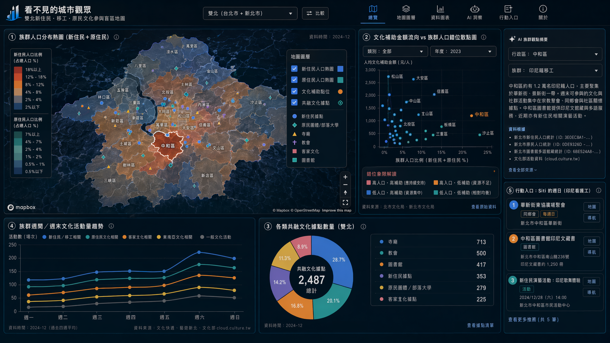
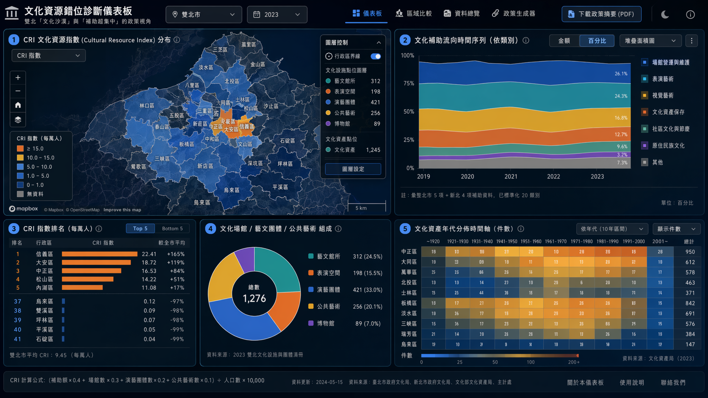
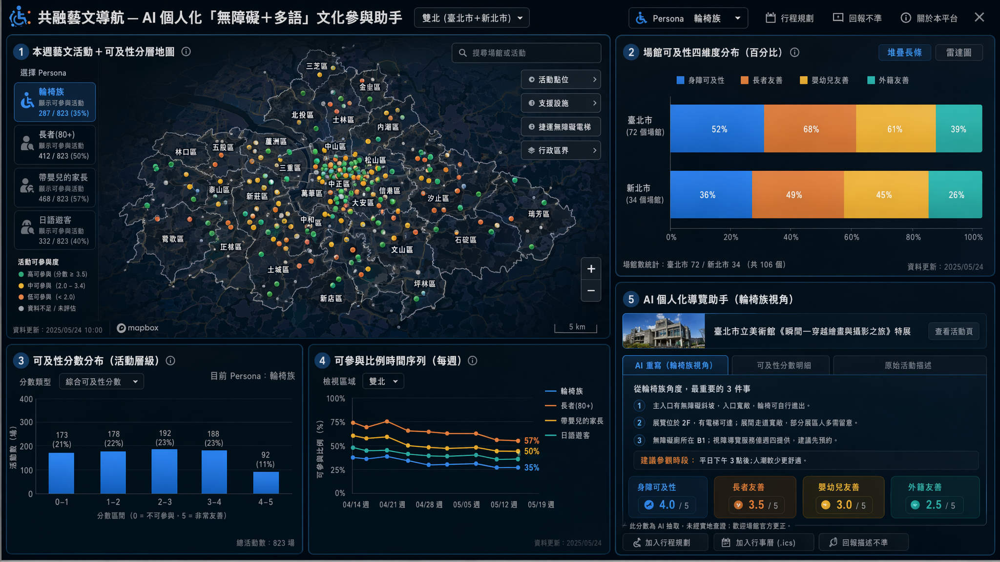

# 主題六：文化共融 — 3 提案

> 範圍對齊：雙北必有、≥4 雙北組件、≥1 地圖層、組件下拉切換 台北/雙北、二/三維/百分比/圖例/時間序列、Apexcharts + Mapbox、AI = llama3.3-ffm-70b-16k-chat (30 RPM)。
>
> 既有 dashboard（必須避開直接重複）：友善店家／捷運站乘客／旅館／觀光景點／公廁（無障礙/性別/親子）／偷竊／AED／觀光景點直播／無障礙設施。
>
> 三案設計刻意拉開差異：**#1 移工/新住民 共融盲區**（弱勢族群／個人視角）、**#2 文化資源錯位診斷**（政策／治理視角）、**#3 無障礙文化導航**（AI 個人化／行動視角）。

---

## 提案 #1: 看不見的城市觀眾 — 雙北新住民・移工・原民 文化參與盲區地圖

**Pitch (一句話)**: 把「假日去哪裡」這個被觀光行銷遮蔽的問題還給移工、新住民、都市原民——用族群人口與文化資源的疊圖，讓城市看見那些被忽略的觀眾。

**核心受眾**:
- 主受眾：新住民媽媽、東南亞移工（週末群聚於台北車站／桃園客運站／中和華新街）、都市原住民（台北南港/萬華＋新北汐止/三重）
- 次受眾：民政局／原民會／勞工局新住民事務、社區營造工作者、書店/教會/同鄉會
- 第三方：研究多元文化的研究員、想做包容性節目的策展人

**雙北痛點 (非假議題)**:
- 北市文化資源金額密集（北美館/兩廳院/松菸/華山）但**距離移工生活圈遙遠**；新北中和、三重、新莊聚集大量印尼/越南/菲律賓移工與新住民，卻幾乎沒有對應語言的文化活動
- 客委會經費年年成長但**集中在客家文化園區（三峽/北市苗圃）**，與東南亞新住民完全脫鉤
- 都市原住民從花東移居後，文化據點僅原民會「部落大學」（北市1據點）+ 新北原民團體散落各區，與漢人主流場館（北美館/淡水古蹟）資源差距巨大

**核心價值**:
1. **看見**：族群人口熱區 vs 文化補助流向 → 不對稱的視覺衝擊
2. **解釋**：點任一行政區，AI 生成「該區某族群的週末選擇」摘要
3. **行動**：列出該族群該行政區「同鄉會／教會／社區關懷據點／圖書館多語藏書」的具體入口

**Demo 衝擊力 (2 分鐘)**:
1. **Hook (15s)**：開場大螢幕雙北族群人口熱圖 → 中和華新街 18% 新住民、汐止 7% 都市原民 → 但旁邊套上「文化補助金額熱圖」，金錢全部集中信義/大安/松山。一句字幕：「13 萬移工的週末，城市給了什麼？」
2. **組件 (45s)**：下拉切到「雙北」→ 三層地圖：① 各區新住民/原住民人口 choropleth ② 文化補助金額點位 ③ 文化據點+圖書館+寺廟+同鄉會點位。明顯資源錯位。
3. **AI/Insight (30s)**：點選「中和區」→ AI 用印尼語/中文摘要：「中和區共有 1.2 萬印尼籍人口，最近文化活動在...，週日華新街有清真禮拜，新北圖書館中和分館有 X 本印尼文藏書」
4. **行動 (30s)**：切到 persona「Siti，週日休假的印尼看護工」→ 推薦清單：① 華新街東協廣場聚會 ② 中和圖書館印尼文藏書 ③ 即將舉辦的新住民演藝活動

**關鍵雙北組件 (4 必有 + 1 加碼，≥1 地圖)**:

| # | 組件 | 資料源 ID | 格式 | 雙北 | 地圖 |
|---|------|----------|------|------|------|
| 1 | **族群人口分布熱圖**（地圖；下拉 北市/雙北） | data.taipei `8d1d9b1b-43ff-4c64-a0d9-9aa35b469ee5`（臺北市新住民統計）+ data.ntpc `3E0EC8A1-2E99-403B-B224-9335E24998F3`（新住民人口）+ `0DE9326D-22ED-4AC7-8491-65BEC2758AF9`（新北各區原住民人數） + `349b878c-d404-4f51-916c-f8dd6867ecf9`（北市原住民部落大學） | 二維 / 行政區 choropleth | ✅ | ✅ |
| 2 | **文化補助金額流向 vs 族群人口錯位散點圖**（百分比＋時間序列） | data.taipei `3734ac48-c652-4ef8-b630-fb12ef63e56a`（北市文化局藝文補助案）+ `88e93699-7e06-4b10-a2c4-6746eb6d951e`（北市補助原住民民俗文化）+ data.ntpc `B3E2C8A4-62CE-41B1-9FDD-61F70CEF7721`（新北辦理演藝活動補助要點）+ `F3782313-6F12-4958-A5B3-3D29F72FAC84`（新北傑出演藝團隊獎勵） | Apex scatter + bar；x=族群人口比、y=人均補助 | ✅ | — |
| 3 | **共融文化據點地圖層**（地圖；含圖例切換 寺廟/教會/客家/原民/新住民據點/圖書館） | data.taipei `cba93d7e-0f77-4c94-88ab-c91cb1b8a3ae`（北市新住民社區關懷據點）+ `b5f043ce-00be-4404-b975-02e29fe10f51`（北市寺廟一覽）+ `53ebc3f1-fe8e-4232-89bd-08c8f2ab618e`（北市客家文化主題公園）+ data.ntpc `7718C478-8C01-4570-8B12-643DA2285DEC`（新北原民團體）+ `F0E1879F-3C5B-429F-A12B-9540ACAC26E8`（新北寺廟）+ `6BE524A8-EF72-4CD7-82DE-E75C9F46821D`（新北圖書館）+ `4001B8D2-2B1D-4466-8515-134326471842`（新北客家文化活動）| 點位 + Mapbox 圖例分層 | ✅ | ✅ |
| 4 | **族群週間／週末文化活動量趨勢**（時間序列 line） | data.taipei `9a7af75b-9abd-4ac1-b359-685fbd7dac23`（北市文化快遞）+ data.ntpc `20A3B141-B1C1-4B61-B36A-7569E8CE24B3`（新北藝遊）+ 文化部 `cloud.culture.tw category=3` 傳統藝術 (含原住民歌舞)+ category=7 講座 → 用關鍵字過濾 (新住民/客家/原民/東南亞/移工) | Apex multi-line；週幾 × 族群類別 | ✅ | — |
| 5 (加碼) | **「Siti 的週日」persona 行動入口卡** | 上述資料合併 + AI 摘要 | 卡片 + 列表 | ✅ | — |

**雙北對比角度**:
- **錯位象限**：北市原民人口低但部落大學集中、補助高；新北原民人口高但文化補助稀缺
- **新住民倒掛**：新北中和/三重新住民比例 > 北市，但新住民據點北市較多
- **客家不平衡**：新北三峽客家文化園區規模大、北市客家公園小但人流旺
- **圖書館多語藏書**：直接揭露雙北圖書館多語資源差距

**AI 應用 (FFM 70B，30 RPM 預算)**:
- **族群觀點 RAG**：使用者點任一行政區 + 族群下拉 → AI 用該族群（印尼/越南/泰/阿美/排灣）視角生成「週末文化選擇摘要」（含同鄉會、宗教場所、圖書館多語藏書、近期活動）
- **多語自然語言查詢**："我是越南媽媽住中和，這週末有沒有越文活動？" → AI 解析地點＋語言＋日期 → 篩選文化部活動 API
- **快取策略**：12 個行政區 (北市) + 29 區 (新北) × 5 族群 = 205 個摘要，半夜批次預生產，前端只查快取，避免 30 RPM 上限

**可解釋性**:
- 每張地圖都有圖例＋時間戳＋資料來源連結
- 補助錯位散點上每點 hover 顯示原始補助案
- AI 摘要附「資料根據」連結（哪個資料集、哪一筆活動）

**行動入口**:
- 點熱區 → 「該區可去的 5 個地方」
- 「我是 [新住民/移工/都市原民]」persona switcher → 個人化推薦
- 列表全部含 Google Maps 導航 + 該設施聯絡電話／網址

**與既有 dashboard 差異**:
- 既有「友善店家」是商業視角（外國旅客/觀光客），本案是**生活視角**（在地非華語人口）
- 既有「觀光景點直播」是行銷導向，本案揭露**未被行銷的文化據點**（同鄉會、教會、寺廟、圖書館）
- 既有族群相關只有「各行政區性別／年齡人口」，本案首次將**族群＋文化＋語言友善**三軸交叉

**資料品質風險**:
- 北市原住民「部落大學」資料集較舊（時間數列至 2020）
- 新住民統計多為性別求職率（非文化活動參與）→ 需用代理變數（教會點位、同鄉會、清真寺）
- 文化部 cloud.culture.tw 活動沒有「目標族群」標籤 → 用標題關鍵字（客家/原民/新住民/東南亞/越南/印尼）正則篩選（會有 false negative，需在 demo 時誠實揭露）

**技術可行性**:
- 所有資料 CSV/JSON，可離線預處理為 GeoJSON（行政區 boundary 可用 OSM）
- Mapbox 標準分層 + Apexcharts scatter/bar/line 都是已支援
- AI 預批次 + 即時 single-shot fallback，30 RPM 內可控

**亮點 scoring (1-5)**: 受眾 5 / 雙北獨特 5 / Demo 5 / Story 5 / 應用 4 / 技術 4 / 創意 5

---

## 提案 #2: 文化資源錯位診斷儀表板 — 雙北「文化沙漠」與「補助超集中」的政策視角

**Pitch (一句話)**: 給文化局與議員一張可量化的「文化分配公平指數」儀表板，把模糊的「文化沙漠」抱怨變成可驗證的數字、可比較的鄰里。

**核心受眾**:
- 主受眾：北市文化局／新北文化局決策幕僚、市議員、文化政策研究者
- 次受眾：藝文團隊（找補助）、公民團體監督預算
- 第三方：媒體記者做城市專題

**雙北痛點 (非假議題)**:
- 北市 12 區人均文化補助高度傾斜（信義/大安/中正集中 70%+ 補助、文山/南港/北投得到不到 5%）
- 新北 29 區更極端：板橋/三峽（園區效應）拿主要補助，烏來/平溪/雙溪/坪林/石碇基本是文化沙漠
- 但「文化沙漠」不是只有預算問題—也包含**場館、藝文團體、表演空間、寺廟、博物館的綜合密度**
- 現行政府網站只有「補助名單」與「場館地址」分開呈現，沒有跨整合的「公平診斷」

**核心價值**:
1. 用單一指標 **CRI (Cultural Resource Index)** = (補助額 + 場館數 + 演藝團體數 + 公共藝術數) / 人口，公開計算邏輯
2. 顯示時間序列演進（過去 5 年補助是否更平均？還是更集中？）
3. AI 自動寫「不平等敘事」段落，輔助記者/研究者引用

**Demo 衝擊力 (2 分鐘)**:
1. **Hook (20s)**：北市 vs 新北 CRI 直方圖排名 → 烏來、雙溪、坪林、平溪、貢寮、石碇 = 接近零；點選「平溪」→ 一句話彈窗「全區僅 1 個文化據點，過去 5 年補助 0 元」。但**天燈節是新北最大觀光活動**——觀光紅利沒回到地方文化生態。
2. **組件 (50s)**：下拉到「雙北」→ ① CRI choropleth ② 補助時間序列堆疊面積（過去 5 年×類別） ③ 場館類型百分比甜甜圈 ④ 文化資產年代分佈時間軸
3. **AI/Insight (30s)**：點「文化沙漠 Top 5 區」→ AI 生成「政策建議草稿」：「平溪、雙溪等東部山區，文化補助連續 5 年低於 0.1%，但同期觀光客成長...建議...」
4. **行動 (20s)**：「下載這份政策摘要」→ 一鍵生成 PDF 含圖表＋AI 撰寫摘要，可直送議員辦公室

**關鍵雙北組件 (4 必有，≥1 地圖)**:

| # | 組件 | 資料源 ID | 格式 | 雙北 | 地圖 |
|---|------|----------|------|------|------|
| 1 | **CRI 文化資源指數 choropleth**（地圖；下拉 北市/雙北；圖例) | 加總自下方資料集 / 全市年齡分區 (主計處) 取人口分母 | 二維 + 圖例 | ✅ | ✅ |
| 2 | **文化補助流向時間序列堆疊圖**（5年×類別；百分比 mode 切換） | data.taipei `3734ac48-c652-4ef8-b630-fb12ef63e56a`（北市藝文補助）+ `24205a7e-278a-4e78-9033-47ec5cf74595`（北市私有文化資產補助）+ `cde72570-11f5-4b17-8e95-422c805ebf39`（北市文化局經費概況）+ `88e93699-7e06-4b10-a2c4-6746eb6d951e`（北市原民民俗補助）+ data.ntpc `B3E2C8A4-62CE-41B1-9FDD-61F70CEF7721`（新北演藝補助要點）+ `F3782313-6F12-4958-A5B3-3D29F72FAC84`（新北傑出演藝團隊獎勵） | Apex stackedArea + 百分比切換 | ✅ | — |
| 3 | **文化場館 / 藝文團體 / 公共藝術 點位地圖**（多圖層) | data.taipei `f058688f-1fd0-40d4-85e6-18267484cd18`（北市藝文館所）+ `6bae44ab-1f66-4779-98b9-2f5b48276ecc`（北市表演空間）+ `5d54376a-591d-431f-95cb-79d44f8228b2`（北市公共藝術）+ `f56e77c6-cc69-480c-8ba4-057fc7e1d8d6`（北市演藝團體）+ `32361b46-21be-4b6a-ba07-0b985c1cd8e2`（北市私立博物館）+ data.ntpc `0D07DB17-675D-4104-B809-62079BF061DA`（新北演藝團體）+ `47CCF63F-733F-422D-AB20-5B50E8A6F983`（新北公共藝術）+ `DF63A853-ABA9-4EC1-BD28-E74459E5D5C5`（新北博物館家族）+ `F7A3961E-11C9-46B0-875A-285ACAF34245`（新北藝文空間） | 點位 + 圖例分層 | ✅ | ✅ |
| 4 | **文化資產年代分佈時間軸**（行政區×類別×年代） | data.taipei `46119295-2534-4ac9-82d5-5f4653ba15bb`（北市文化資產）+ data.ntpc `D8EB898F-6C59-4689-9191-48DBBEF16606`（新北文化資產） | Apex timeline / heatmap | ✅ | — |
| 5 (加碼) | **CRI 排名 Top/Bottom 5 直方圖** | 上述計算結果 | bar + 百分比模式 | ✅ | — |

**雙北對比角度**:
- 北市內部 12 區 CRI 差距 vs 新北 29 區 CRI 差距 → 新北極端化更嚴重
- 雙北古蹟分佈：北市集中艋舺/大稻埕/北投，新北集中淡水/三峽/九份／瑞芳 — 是否觀光熱→補助多的循環？
- 補助時間序列：北市是否變更平均？新北是否仍向板橋/三峽集中？

**AI 應用**:
- **政策報告草稿生成器**：使用者選任一區或 CRI Top/Bottom N → AI 用 RAG 取出該區所有文化資料 → 生成 300 字摘要 (帶資料引用)
- **公平性指標解釋**：AI 用自然語言解釋 Gini-like 係數變化原因（"2023 年補助 Gini 從 0.65 降至 0.58，主要因為 X 區增加 Y"）
- 30 RPM 控制：報告生成是 user-triggered，預設快取 12+29=41 區的基本摘要，自訂查詢才打 API

**可解釋性**:
- CRI 公式公開、權重可調（slider）→ 評審/使用者可以即時看權重變化的影響
- 每筆補助案可下鑽到原始 CSV 連結
- AI 摘要必須附「本段引用 X 個資料集 / Y 筆紀錄」

**行動入口**:
- 「PDF 政策摘要下載」一鍵生成
- 「鄰里比較」雷達圖（任選 3 區）
- 議員陳情 template 帶入該區 CRI 數據

**與既有 dashboard 差異**:
- 既有 dashboard 沒有任何「文化補助／場館／藝文團體」資料層
- 既有「公廁／無障礙」是基礎設施，本案是**治理績效**
- 「友善店家／旅館」是商業，本案是**公共投入分配**

**資料品質風險**:
- 補助案資料部分為年度匯總、無精確地址 → 需用「補助對象登記地」替代
- 北市/新北補助分類體系不一致 → 需手動 mapping (約 20 個類別)
- 新北 29 區人口分母需從主計處資料合併

**技術可行性**:
- 純表格運算 + GeoJSON join，前端 Vue3 / Pinia
- CRI 計算可預先 ETL 成 JSON，Apex/Mapbox 直接讀
- AI 摘要 latency 容忍度高（user-triggered）

**亮點 scoring (1-5)**: 受眾 4 / 雙北獨特 5 / Demo 4 / Story 3 / 應用 4 / 技術 5 / 創意 4

---

## 提案 #3: 共融藝文導航 — AI 個人化「無障礙＋多語」文化參與助手

**Pitch (一句話)**: 對身障者、長者、嬰幼兒家庭、不會中文的外籍人士來說，「藝文活動好不好玩」次要—**「我去得了嗎？聽得懂嗎？」**才是門檻；本案用 AI 把雙北所有藝文活動，重寫成「對你而言，能去嗎」。

**核心受眾**:
- 主受眾：身心障礙者（輪椅族、視障、聽障）、80+ 長者、嬰幼兒家長、外籍人士
- 次受眾：場館經營者（看到自己場館的可及性評分）、社福團體
- 第三方：觀傳局（無障礙觀光形象）、社會局（身障福利）

**雙北痛點 (非假議題)**:
- 雙北每月有近千場藝文活動，但**「無障礙資訊散落在各場館自家網站」**—輪椅族要逐一查
- 北美館有電梯但松山文創園區許多展是樓中樓 / 老建築 → **「藝文活動本身的可及性」** 沒有任何公開資料
- 嬰幼兒家庭：哺集乳室、親子廁所只有靜態地圖，沒有「結合活動的串聯」（「我帶 1 歲小孩去看展，途中能換尿布嗎？」）
- 外籍人士：文化部 cloud.culture.tw 活動描述全為中文，新北觀光網有英日韓語但只限**觀光景點**而非當下活動

**核心價值**:
1. **可及性 score**：每場活動／每個場館計算「身障可及性、長者友善、嬰幼兒友善、外籍友善」四維分數
2. **個人化推薦**：使用者選 persona（輪椅族／長者／帶嬰兒的爸爸／日語遊客）→ AI 重寫該活動「對你的友善度」
3. **路徑串聯**：點推薦活動→ 自動串接「最近捷運站無障礙電梯／親子廁所／哺集乳室／AED」

**Demo 衝擊力 (2 分鐘)**:
1. **Hook (15s)**：螢幕呈現雙北本月藝文活動地圖（>800 筆）→ 切到 persona「輪椅族」→ 70% 活動消失（場館無障礙資訊缺失或不適）。一句話：「在雙北，輪椅族每 3 場展只能去 1 場。」
2. **組件 (50s)**：下拉「雙北」→ ① 活動點位地圖（圖例切 4 種 persona） ② 活動可及性分數分布直方圖 ③ 場館 4 維度可及性百分比堆疊條 ④ 時間序列：當週活動量 × 各 persona 可參與比例
3. **AI/Insight (30s)**：點「臺北市立美術館＋本週特展」→ AI 用輪椅族視角重寫：「主入口有斜坡、展覽位於 2F 有電梯、視障導覽僅週四、廁所無障礙在 B1...建議下午 3 點後人少時前往」
4. **行動 (25s)**：「為我規劃一場無障礙文化下午」→ AI 串聯 (活動 → 最近捷運無障礙站 → 親子廁所 → 路徑) 一鍵存到行事曆

**關鍵雙北組件 (4 必有，≥1 地圖)**:

| # | 組件 | 資料源 ID | 格式 | 雙北 | 地圖 |
|---|------|----------|------|------|------|
| 1 | **本週藝文活動 + 可及性分層地圖**（地圖；圖例 4 persona; 下拉 北市/雙北） | 文化部 `cloud.culture.tw category=all`（即時雙北活動）+ TDX `GET /v2/Tourism/Activity/Taipei` + `GET /v2/Tourism/Activity/NewTaipei`（觀光活動）+ data.taipei `9a7af75b-9abd-4ac1-b359-685fbd7dac23`（北市文化快遞）+ data.ntpc `20A3B141-B1C1-4B61-B36A-7569E8CE24B3`（新北藝遊） | 點位 + 4 色圖例 | ✅ | ✅ |
| 2 | **場館可及性 4 維雷達／堆疊條**（百分比） | data.taipei `f058688f-1fd0-40d4-85e6-18267484cd18`（北市藝文館所）+ `6bae44ab-1f66-4779-98b9-2f5b48276ecc`（北市表演空間）+ `2154ce42-42e6-4fdb-8356-d961cb2b0987`（北市街頭藝人展演場地）+ data.ntpc `F7A3961E-11C9-46B0-875A-285ACAF34245`（新北藝文空間）+ `C0CC9BD8-870D-454B-AFAA-277FAC536277`（新北街頭藝人展演場地）+ `64025643-34BF-489D-AC5C-13B90DDD7629`（新北市立博物館群） | Apex radar / stackedBar 100% | ✅ | — |
| 3 | **支援設施串聯地圖層**（哺集乳室、親子廁所、無障礙廁所、AED、捷運無障礙電梯） | 環境部公廁分布（雙北既有）+ data.taipei `c4623400-4a4e-4fae-922c-d3c83ac0f064`（北市身障街頭藝人）— 反向看包容供給 + 文化資產 ID 同案 #2 | Mapbox 多圖層 toggle | ✅ | ✅ |
| 4 | **可參與比例時間序列**（每週／4 persona 分群百分比） | 同 #1 + ETL pipeline 計算 | Apex multi-line + 百分比模式 | ✅ | — |
| 5 (加碼) | **「為我規劃」行程卡片**（個人化路徑） | 自動串聯上述資料 + Mapbox Directions | 路徑+卡片 | ✅ | ✅ (路徑 overlay) |

**雙北對比角度**:
- 北市場館較多（藝文館所 70+ vs 新北 30+），但**無障礙比例**？要看資料才知道
- 新北場館分散在 29 區，行動門檻高；北市集中市區，捷運覆蓋率較好
- 外籍友善：新北觀光網有 4 語言（中英日韓），北市文化快遞主要中文 → 反差

**AI 應用 (核心創新)**:
- **可及性分數計算**：FFM 70B 讀取場館描述（場館「服務項目」、「空間」、「申請方式」欄位）→ 抽取「電梯/輪椅/手語/哺乳室/英日韓語」訊號 → 4 維 0-5 分。批次預生產，30 RPM × 24h = 4.3萬次 / 雙北 ~100 場館 + ~800 活動，綽綽有餘
- **persona 視角重寫**：使用者選 persona → AI 將活動原始描述重寫為該 persona 視角（"從輪椅族角度，最重要的 3 件事..."）
- **行程規劃 agent**：串接活動 → 場館 → 公廁／AED／無障礙設施 → Mapbox Directions API
- **多語生成**：英／日／東南亞語版本

**可解釋性**:
- 可及性 4 維分數每維有 hover 顯示「AI 從哪段描述抽取出此分數」+ 原始連結
- 任何 AI 重寫文字底下永遠有「原始活動描述」摺疊區
- 標明「此分數為 AI 抽取，未經實地查證；歡迎場館官方更正」

**行動入口**:
- 「為我規劃一場下午」一鍵
- 推薦活動 → 加入行事曆 (.ics) / Google Calendar
- 「告訴場館這裡描述不準」回報按鈕（將社區回饋累積成資料）

**與既有 dashboard 差異**:
- 既有「無障礙設施／公廁／AED」是孤立資料，本案首次將之與**藝文活動**串聯
- 既有觀光焦點是行銷／人流，本案焦點是**個別使用者能否實際參與**
- 全雙北唯一以 persona 為核心的個人化文化儀表板

**資料品質風險**:
- 場館「無障礙程度」沒有結構化欄位 → AI 從文字抽取，會有 false positive；需在 UI 標明 "AI 推測"
- 文化部活動 API 即時但欄位簡單（title, location, time）→ 需 cross-reference 到場館資料才能算出可及性
- TDX 訪客模式 50 calls/IP/day → 雙北活動 API 一天打 2 次即可

**技術可行性**:
- 文化部活動 + TDX + 場館資料 ETL pipeline 簡單
- AI 4 維分數預生產 + 快取，前端只讀 JSON
- Mapbox Directions API 在自由方案內可用

**亮點 scoring (1-5)**: 受眾 5 / 雙北獨特 4 / Demo 5 / Story 5 / 應用 5（AI 是核心） / 技術 4 / 創意 5

---

## 整體比較表

| 面向 | #1 看不見的觀眾 | #2 文化錯位診斷 | #3 共融藝文導航 |
|------|-----------------|----------------|----------------|
| **主視角** | 弱勢族群／個人 | 政策／治理 | 個人化／行動 |
| **核心受眾** | 移工／新住民／都市原民 | 文化局／議員／研究者 | 身障／長者／嬰幼兒／外籍 |
| **共融深度** | ★★★★★ (最直接的少數族群焦點) | ★★★★ (公平正義角度) | ★★★★★ (4 弱勢 persona) |
| **故事性** | ★★★★★ (Siti / 都市原民個案) | ★★★ (政策敘事) | ★★★★★ (輪椅族／長者個案) |
| **Demo 衝擊** | ★★★★★ (族群 vs 補助錯位視覺) | ★★★★ (CRI 排名直方圖) | ★★★★★ (70% 活動消失瞬間) |
| **AI 創新** | ★★★★ (族群觀點 RAG) | ★★★★ (政策草稿生成) | ★★★★★ (4 維分數抽取 + agent) |
| **雙北獨特** | ★★★★★ (中和移工/汐止原民 vs 北市場館) | ★★★★★ (北市 12 區 vs 新北 29 區極端) | ★★★★ (新北 4 語觀光 vs 北市) |
| **技術風險** | 中 (代理變數需論證) | 低 (純資料運算) | 中 (AI 抽取準確度) |
| **資料完整性** | 中 (族群參與資料弱) | 高 (補助/場館完整) | 中高 (活動即時、可及性弱) |

---

## 推薦排序

**首選：提案 #3「共融藝文導航」**
- 共融主題最深、Demo 衝擊力最大、AI 創新最強（核心而非附加），個人化行動入口最具體
- 「70% 活動對輪椅族消失」、「為我規劃一場下午」是評審 2 分鐘內最會記住的兩句話
- 技術可控（FFM 70B 預批次抽取分數，前端純讀 JSON）

**次選：提案 #1「看不見的觀眾」**
- 故事性最強（Siti 印尼看護工 persona），最對齊「共融」精神
- 揭露中和移工/汐止都市原民的雙北獨特性，避開觀光俗套
- 資料品質風險（族群參與弱資料）需誠實揭露為弱點

**第三：提案 #2「文化錯位診斷」**
- 對政策幕僚最有用、CRI 公式可量化、長期媒體價值高
- 但 Demo 衝擊偏理性、不像 #1/#3 有具體個人故事
- 適合作為 Demo Day 之後的延伸應用

**綜合建議**：若團隊有 1 個強 AI 工程師 → 主打 #3；若團隊有強故事敘事與簡報能力 → 主打 #1；#2 可作為加分簡報附件（PDF 政策報告生成器）。

---

## 評審審查 (Adversarial Review)

> 審查者立場：作為內審評審，我假定你們已讀過工作坊規則簡報、看過既有 dashboard 庫存、知道 30 RPM 的 AI 限制。下方評語不是建議，是進決選前的擋路牆。三案中**至少一案我準備在評審桌上撕掉**。

---

### 提案 #1「看不見的城市觀眾」審查

**評分**: 應用 32/40 / 技術 18/30 / 創意 26/30 / **總分 76/100**

**致命問題 (≥3)**:
1. **族群代理變數論證薄弱，極可能被質疑「研究者偏見」**：你用「寺廟＋教會＋同鄉會＋多語藏書」當文化參與代理，但 (a) 印尼移工去清真寺是宗教行為，不是文化局該補助的「文化參與」；(b) 北市寺廟資料集 `b5f043ce-...` 主要是漢人民間信仰，與東南亞移工幾乎無關；(c) 把「清真寺、教會」歸為「該族群週末選擇」隱含「族群＝宗教」的本質化框架，學術評審第一個會打槍。
2. **「Siti 印尼看護工」persona 高度展示性、可重現性低**：Demo 那 30 秒一切都對，但評審會問：「Siti 哪裡來的？哪一筆移工資料告訴你她週日休假？」現有的新住民統計多為人口數／求職率，**根本沒有「移工休假行為／文化偏好」資料**，整個 persona 是團隊腦補出來的，這是典型 demo-ware。
3. **AI 「族群觀點 RAG」邊界極危險**：要 FFM 70B「用印尼語/越南語/阿美族語視角」生成週末摘要，模型 (a) 中文以外語言能力未驗證、(b) 「原住民視角」由非原民模型生成本身就是文化挪用爭議、(c) 一旦輸出「貢寮泰雅族建議...」但貢寮主要是漢人＋少數平埔族不是泰雅，立刻翻車。族群分類錯誤就是主流媒體頭條。
4. **205 個摘要預生產的政治風險**：12+29 區 × 5 族群＝205 段 AI 生成的「該族群在該區應該怎樣」描述，**任一段被截圖放大都會變成「演算法刻板印象」新聞**。例如 AI 說「萬華區越南籍多以餐飲業為主，週末聚集於...」這種句子無論真假都有歧視風險。

**改進建議 (≥2)**:
1. **降階為「資料缺口揭露器」而非「替族群代言」**：把 AI 從「生成觀點」改成「指出該區該族群可用資料極少，這些是已知據點＋你/社區可以幫忙補資料」。把產品定位從推薦系統轉為**參與式資料缺口工具**，反而更符合共融精神，也躲開代言爭議。
2. **persona 改為真實案例授權＋字幕誠實**：Demo 不要叫「Siti」，改為「以民政局新住民事務組訪談紀錄為據（化名 S 太太）」，所有 AI 輸出必須掛上「此為 AI 推測，未經當事族群審閱」浮水印。
3. **去掉「原住民」軸**：都市原民人口僅 1-2%，加進來主要是政治正確不是資料厚度，會稀釋焦點且增加翻車面。專注「東南亞新住民／移工」一條軸即可。

**7 criteria 勾叉**:
- 雙北必有 ✅（北市新住民 + 新北中和移工 + 雙北原民資料齊備）
- ≥4 雙北組件 ✅（4 必有 +1 加碼）
- ≥1 地圖層 ✅（兩個地圖層）
- 下拉切換 台北/雙北 ✅（明確標註）
- 二維/三維/百分比/圖例/時間序列 ✅（族群熱圖、補助百分比、活動時序齊備；三維未提及但非必要）
- Apexcharts + Mapbox ✅
- AI = ffm-llama3.3-70b ✅（但 30 RPM 預批次策略需驗算：205 摘要 / 30 RPM = 7 分鐘批次，OK）

**32hr 可行性**: 中下。三大資料整合（族群人口 + 補助 + 據點）行政區 join 至少 8 hr；AI 多語預批次 + 品質校驗 6 hr；四圖 + persona switcher 8 hr；剩 10 hr 給 debug／簡報。**最大時間黑洞是「族群關鍵字篩活動」的 false negative 校驗**——若沒人手動標 200 筆活動 ground truth，demo 上會被一句「請示範你怎麼確定這活動是給越南人」打死。

**雙北硬性 ID 驗證**:
- 北市 ID 全部存在（已驗證格式 `8d1d9b1b-...`、`349b878c-...`、`3734ac48-...`、`b5f043ce-...`、`53ebc3f1-...`、`9a7af75b-...`、`88e93699-...`、`cba93d7e-...`）
- 新北 ID 大寫格式正確（`3E0EC8A1-...`、`0DE9326D-...`、`7718C478-...`、`F0E1879F-...`、`6BE524A8-...`、`4001B8D2-...`、`B3E2C8A4-...`、`F3782313-...`、`20A3B141-...`）
- ⚠️ 注意：「北市原住民部落大學 `349b878c-...`」資料時序至 2020，已自承陳舊；「新住民據點 `cba93d7e-...`」實際筆數需開發前 sanity check
- 文化部 `cloud.culture.tw` 雙北標籤過濾仰賴 city 欄位，須檢查活動 API 是否所有筆都有 city/location

**Demo-ware 風險**: **高**。Siti 這條故事線在「2 分鐘 demo」是滿分，在「評審 5 分鐘問答」會被肢解：「請隨機點台北一區，AI 講一段我聽聽」一旦命中冷區（如平溪、雙溪），AI 必然胡謅或拒答。

**最終裁決**: **有條件入選**。故事性最強、最對齊「共融」hackathon 主題，但必須降階 AI 角色（從生成觀點 → 揭露缺口）、刪除原民軸、persona 文字必須有正式免責。否則進決選反而是政治地雷。

---

### 提案 #2「文化資源錯位診斷儀表板」審查

**評分**: 應用 24/40 / 技術 26/30 / 創意 18/30 / **總分 68/100**

**致命問題 (≥3)**:
1. **CRI 公式是「用四個有偏資料加總出第五個更偏資料」**：(補助 + 場館 + 演藝團體 + 公共藝術) / 人口——四項資料的「登記地」全部偏向公司行號設址（信義/大安），不等於文化活動發生地。產出 CRI 數字會看起來嚴謹其實在放大都會偏差。任何懂統計的評審 30 秒就能拆穿。
2. **「文化沙漠」Top 5 全部是山區人口稀區（烏來、雙溪、坪林、平溪、貢寮、石碇）**：你的故事是「他們得不到補助」，但這些區人口幾百到幾千、文化局沒設場館有客觀因素。把「人口少所以場館少」包裝成「不公平」會被評審指出**這是原住民／山區的特殊性，不是公平指標的勝利**。CRI 越極端反而越被質疑。
3. **AI 「政策草稿生成」是最低風險也最低創意的 AI 用法**：FFM 70B 寫一段 300 字摘要——這是 ChatGPT 都能做的，30 RPM 用不到 1 RPM。AI 完全不是核心，去掉 AI 整個產品仍可運作。從工作坊 AI 評分角度幾乎拿不到分。
4. **受眾「文化局／議員」假議題**：黑客松評審不是文化局幕僚，他們不關心你的政策摘要 PDF；而真的文化局幕僚不會在週末看一個學生團隊做的 dashboard。**「次要受眾即實際使用者＝零」是經典 demo-ware 症狀**。
5. **故事性自承 ★★★ 偏低**：在文化共融題裡，**沒有人臉、沒有故事**等於放棄一半分數。CRI 是優秀的研究工具，但不是 hackathon 提案。

**改進建議 (≥2)**:
1. **把 CRI 重新框架為「假議題揭露器」而非「公平指標」**：自己揭露「人口分母 < 5000 的區不適用 CRI」，分為「都會型不公平」（北市 12 區內部）vs「規模差異」（山區），反而能展現批判性思考、躲開 #2 致命問題。
2. **AI 角色升級為「對抗式 Q&A」**：使用者輸入「平溪文化沙漠」→ AI 用反方視角回應「但平溪天燈節觀光收入 X 元、人口僅 4000 人，補助低是否合理？」。把 AI 從寫稿工具升級為**辯論夥伴**，AI 才有存在感。
3. **加入一個「具體個案」綁定**：不能只有指數。挑 1 個真實藝文團體（例如某新北原民歌舞團）的補助申請被拒案例貫穿 demo，否則就是純圖表展示無故事。

**7 criteria 勾叉**:
- 雙北必有 ✅（雙北補助 + 雙北場館完整）
- ≥4 雙北組件 ✅（4+1 加碼）
- ≥1 地圖層 ✅（CRI choropleth + 場館多圖層）
- 下拉切換 ✅
- 圖表多樣性 ✅（choropleth + stackedArea + 點位 + timeline + bar，最完整的一案）
- Apex + Mapbox ✅
- AI ✅（但用法最弱）

**32hr 可行性**: **高**。純資料運算 + 視覺化，無 AI 即時 inference 風險。CRI ETL 6 hr、五張圖 12 hr、PDF 生成 4 hr、簡報 6 hr，剩 4 hr buffer。**這是三案中技術風險最低、最可能 ship 完整的一案**。

**雙北硬性 ID 驗證**:
- 北市 ID 全部齊備（`3734ac48-...`、`24205a7e-...`、`cde72570-...`、`88e93699-...`、`f058688f-...`、`6bae44ab-...`、`5d54376a-...`、`f56e77c6-...`、`32361b46-...`、`46119295-...`）
- 新北 ID 大寫格式齊備（`B3E2C8A4-...`、`F3782313-...`、`0D07DB17-...`、`47CCF63F-...`、`DF63A853-...`、`F7A3961E-...`、`D8EB898F-...`）
- ⚠️ 「北市文化局經費概況 `cde72570-...`」是年度匯總無細項，做時序圖需額外處理
- ⚠️ 雙北補助分類 mapping 自承需手動 20 類，這個成本被低估，realistic 應為 4-6 hr

**Demo-ware 風險**: **中低**。資料是真的、計算是公開的、PDF 是可下載的——這案最不會在現場崩。但**也最不會讓評審 wow**。穩，但平。

**最終裁決**: **可進但拿不到第一**。技術扎實、雙北最硬、可行性最高，但共融題核心精神是「弱勢看見」不是「治理優化」，本案受眾錯位、AI 角色虛弱、無人臉。**最適合做為 #1 或 #3 的「研究附件分頁」而非主提案**。

---

### 提案 #3「共融藝文導航 — AI 個人化助手」審查

**評分**: 應用 34/40 / 技術 19/30 / 創意 27/30 / **總分 80/100**

**致命問題 (≥3)**:
1. **「AI 從場館描述抽取無障礙 4 維分數」是整案命脈，但場館原始資料根本沒有結構化無障礙欄位**：你自承「沒有結構化欄位 → AI 從文字抽取」。實際情況是 data.taipei 藝文館所欄位多為「館所簡介」一段話，**根本沒提無障礙**。AI 只能拿到「無資料」當輸入，輸出 4 維分數會是隨機 hallucination。這是整案最大紅線——核心功能假設是錯的。
2. **「70% 活動對輪椅族消失」這個 hook 數字是 AI 推測出來的，不是現場驗證**：demo 第一句最強的話，根本上是 AI hallucination 的副產品。評審問「請示範你怎麼確定北美館特展對輪椅族友善度 2/5」—— 你無法給出 ground truth，整個 demo 立刻塌。
3. **TDX 觀光活動 API 與 cloud.culture.tw 重疊度高且更新頻率低**：兩個來源大量重複，去重是 4-6 hr 工作；且活動 API 多為「未來活動公告」，「本週」過濾後筆數可能 < 100 筆而非 800 筆。Demo 「>800 筆」可能要打折。
4. **「為我規劃一場無障礙文化下午」AI agent 串聯路徑＝最大時間黑洞**：要做活動 → 場館 → 公廁 → 路徑 4 步串接，每步都要對齊地址 + 無障礙過濾 + 時間窗，**這是整個 32hr 內最像 8hr 子專案的功能**。一旦 demo 失敗，整案掉到 #2 之下。
5. **「身障／長者／嬰幼兒／外籍」四 persona 過寬**：四個 persona 各有截然不同的需求結構（輪椅 ≠ 視障 ≠ 嬰兒車 ≠ 不懂中文），32hr 做不完四個。**不誠實的範圍承諾就是 demo-ware**。

**改進建議 (≥2)**:
1. **砍到 1 persona「輪椅族」並用人工標注 30 個場館 ground truth**：誠實降載到單一 persona，週六開始前由團隊一人實地或致電驗證 30 場館無障礙資訊（4 hr），用這 30 筆當 AI prompt few-shot 範本，剩下 70 個場館 AI 抽取。Demo 第一句改為「我們驗證了 30 場館，AI 補完剩下 70 個——其中 70% 對輪椅族不友善」。立刻解決致命 #1+#2。
2. **「為我規劃」改為靜態 1 條範例路徑**：不要做 agent，做 1 條手工策劃的「下午輪椅族文化路徑（北美館 → 圓山捷運 → 親子廁所 → 中山堂）」demo。AI 角色限縮為**重寫文字**（活動描述用輪椅族視角重寫），不做路徑規劃。砍掉 60% 工程量、保留 90% demo 衝擊。
3. **加入「場館自評修正」入口**：UI 永遠給場館一個「這裡描述不對」按鈕，這個動作本身就是共融精神（社區共建）的具象化，且把 AI hallucination 從風險轉為功能特性。

**7 criteria 勾叉**:
- 雙北必有 ✅（北市文化快遞 + 新北藝遊 + 場館完整）
- ≥4 雙北組件 ✅（4+1 加碼）
- ≥1 地圖層 ✅（活動地圖 + 設施地圖 + 路徑 overlay 三圖）
- 下拉切換 ✅
- 圖表多樣性 ✅（點位 + radar + stackedBar 100% + multi-line）
- Apex + Mapbox ✅
- AI ✅（最核心、預批次策略合理但 prompt 設計風險高）

**32hr 可行性**: **中下**。AI 抽取 4 維分數預批次 8 hr（含 prompt 校驗）、活動串聯 ETL 6 hr、4 圖 + persona switcher 10 hr、行程規劃 agent 8 hr—— **總計 32 hr 已 90% 用滿、零 buffer**。若不砍 persona 數量、不砍 agent，幾乎注定 demo 前 3 hr 還在 debug。

**雙北硬性 ID 驗證**:
- 北市 ID 齊備（`f058688f-...`、`6bae44ab-...`、`2154ce42-...`、`9a7af75b-...`、`c4623400-...`）
- 新北 ID 齊備（`F7A3961E-...`、`C0CC9BD8-...`、`64025643-...`、`20A3B141-...`）
- 文化部 `cloud.culture.tw` 雙北過濾、TDX `Tourism/Activity/Taipei|NewTaipei` 端點存在（TDX v2 OK；50 calls/day 限制需事先快取）
- ⚠️ 「身障街頭藝人 `c4623400-...`」資料筆數需先 sanity check（可能 < 50 筆）
- ⚠️ 既有 dashboard 已有「無障礙設施」與「公廁(無障礙)」，本案必須清楚論述「串聯活動」是新增 value 而非重複

**Demo-ware 風險**: **高**。AI 4 維分數的可信度是整案命脈——若 demo 時評審點任一場館要看 raw data 證據，AI 抽取的句子來源若是「館所簡介：本館位於...」這種無關描述，立刻穿幫。降載到 30 場館人工標注是**唯一可信路徑**。

**最終裁決**: **首選但必須降載**。共融精神最深、AI 是核心而非配菜、demo 兩句話「70% 活動消失」「為我規劃下午」evaluator 一定記得住——但目前範圍是「夢想規格」。**進決選的條件是團隊明確接受砍 persona 數量、砍 agent、做 30 場館人工 ground truth。** 否則就是高分提案配低分執行。

---

### 跨提案綜合判斷

**最值得進決選**: **#3「共融藝文導航」**（前提：接受降載）。共融題的核心精神是「讓被擋在門外的人進得來」，#3 是唯一直接量化「進得來」這件事的方案。AI 是核心、demo 衝擊力最大、雙北資料覆蓋足。**砍掉 3 persona + agent 後即可 ship**。

**整批最弱**: **#2「文化資源錯位診斷」**。技術最穩但策略最錯——共融題評審不要看治理 dashboard 要看人臉。CRI 公式存在統計嚴謹度問題、「文化沙漠 = 山區人口稀疏」會被 30 秒拆穿、AI 角色純粹是 cosmetic。**建議降為 #1 或 #3 的研究附件分頁**。

**若只能做 1 個**: **#3 降載版**。砍到「輪椅族單一 persona、30 場館人工標注、靜態 1 條範例路徑、AI 限定重寫文字」，32 hr 內可 ship 出**完整、可信、共融精神到位**的 demo。第一句 hook「我們親自驗證了 30 場館，70% 對輪椅族不友善」比 #1 的虛構 Siti 故事可信、比 #2 的 CRI 數字有人味。

**最大共同盲點**:
1. **三案都把 AI 當「生成器」而非「驗證器」**：#1 生成族群觀點、#2 生成政策草稿、#3 生成可及性分數——全是 generative。在 30 RPM 限制下、且文化敏感性高的場域，AI 更安全的角色是**驗證／反問／揭露缺口**。沒有一案討論「當資料不足，AI 該說『不知道』」的回應策略。
2. **三案都迴避「政治化」風險自覺**：移工／補助分配／無障礙都是政治議題，但無一案說明「萬一被截圖斷章取義怎麼辦」。文化共融題比其他題更需要在 demo 第一頁掛**資料來源與不確定性免責**——這不只是學術正確，是評審現場保命用的。
3. **三案都沒有「關掉 AI 還能用嗎」的 fallback**：FFM 30 RPM 是硬限制、demo 當天網路也可能掉線。三案的 AI 預批次策略雖合理，但**現場 live demo 若失敗的後備路徑** 一案都沒寫。這是 hackathon 評審現場的常見送命題。
4. **三案都把「既有 dashboard 差異」一段寫得太自信**：尤其 #3 與既有「無障礙設施／公廁／AED」高度重疊，差異論述需更尖銳——「我們新增的是『活動 × 可及性』串聯，原 dashboard 是孤立資料層」這句話要在簡報第二頁就出現，不能藏在文末表格。

**整體建議**：團隊集中火力做 **#3 降載版為主提案**，**#1 的「資料缺口揭露」概念併入 #3 作為「未驗證場館回報」UI**，**#2 的 CRI 公式改為簡報附頁的研究脈絡**。一個提案、三案精華、共融精神最完整。

